# 시퀀스 다이어그램 - 고객 서비스

> 모든 시퀀스는 기존 Layered Architecture 패턴(Controller → Facade → Service → Repository)을 따른다.
> 인증이 필요한 API는 MemberAuthInterceptor에서 `X-Loopers-LoginId`, `X-Loopers-LoginPw` 헤더를 검증하고, @LoginMember ArgumentResolver를 통해 Controller에 Member 객체를 주입한다.
> Facade는 인증에 관여하지 않으며, 인증된 Member를 파라미터로 받아 서비스 조율에만 집중한다.

---

## (1) 브랜드 정보 조회

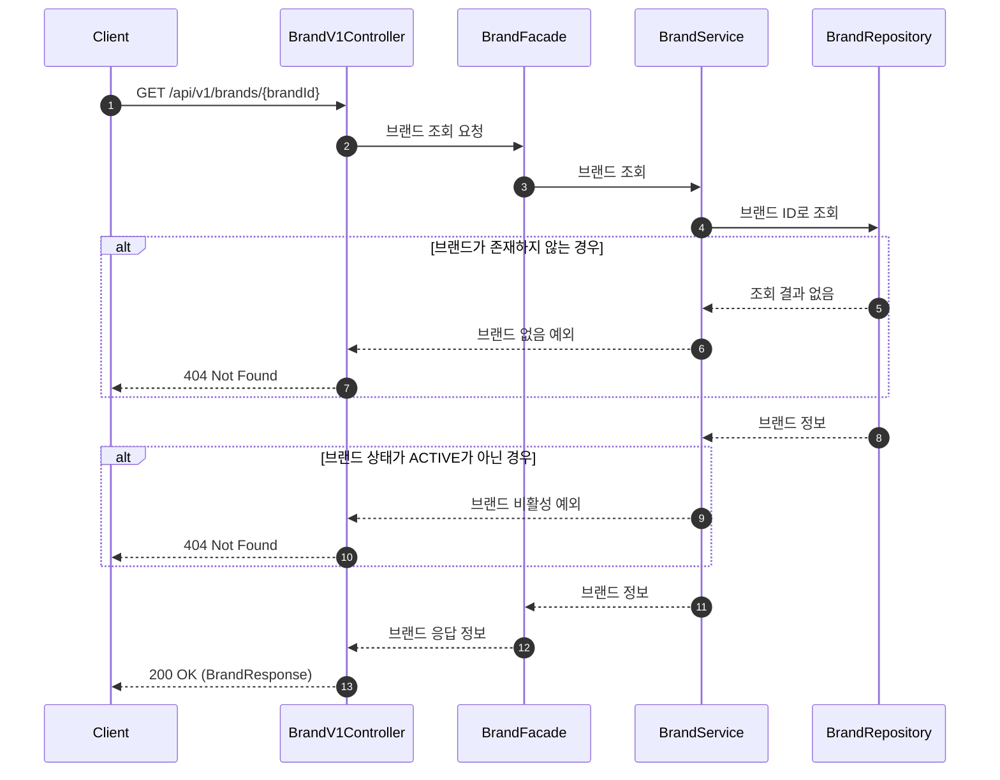
```mermaid
sequenceDiagram
    autonumber
    participant Client
    participant Controller as BrandV1Controller
    participant Facade as BrandFacade
    participant Service as BrandService
    participant Repository as BrandRepository

    Client->>Controller: GET /api/v1/brands/{brandId}
    Controller->>Facade: 브랜드 조회 요청
    Facade->>Service: 브랜드 조회
    Service->>Repository: 브랜드 ID로 조회

    alt 브랜드가 존재하지 않는 경우
        Repository-->>Service: 조회 결과 없음
        Service-->>Controller: 브랜드 없음 예외
        Controller-->>Client: 404 Not Found
    end

    Repository-->>Service: 브랜드 정보

    alt 브랜드 상태가 ACTIVE가 아닌 경우
        Service-->>Controller: 브랜드 비활성 예외
        Controller-->>Client: 404 Not Found
    end

    Service-->>Facade: 브랜드 정보
    Facade-->>Controller: 브랜드 응답 정보
    Controller-->>Client: 200 OK (BrandResponse)
```

**설계 포인트**
- Controller에 별도 검증 로직 없음. brandId 타입 검증은 Spring 파라미터 바인딩에 위임
- 존재 여부 판단은 Service(도메인 레이어)의 책임 → NOT_FOUND 예외 발생 주체
- ACTIVE가 아닌 브랜드(PENDING/WITHDRAWN)는 고객에게 404로 응답하여 존재 여부 비노출
- Facade: Brand → BrandInfo 변환만 담당, 비즈니스 로직 없음

---

## (2) 상품 목록 조회

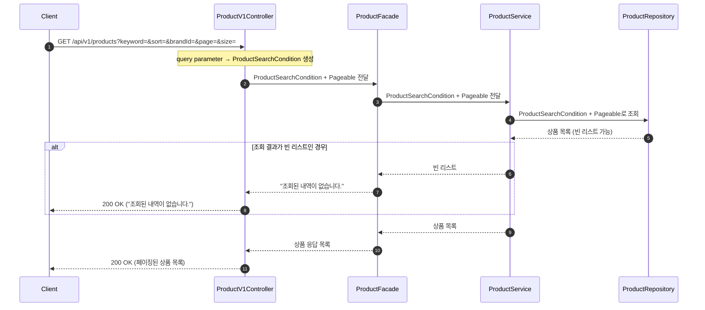
```mermaid
sequenceDiagram
    autonumber
    participant Client
    participant Controller as ProductV1Controller
    participant Facade as ProductFacade
    participant Service as ProductService
    participant Repository as ProductRepository

    Client->>Controller: GET /api/v1/products?keyword=&sort=&brandId=&page=&size=
    Note over Controller: query parameter → ProductSearchCondition 생성
    Controller->>Facade: ProductSearchCondition + Pageable 전달
    Facade->>Service: ProductSearchCondition + Pageable 전달
    Service->>Repository: ProductSearchCondition + Pageable로 조회
    Repository-->>Service: 상품 목록 (빈 리스트 가능)

    alt 조회 결과가 빈 리스트인 경우
        Service-->>Facade: 빈 리스트
        Facade-->>Controller: "조회된 내역이 없습니다."
        Controller-->>Client: 200 OK ("조회된 내역이 없습니다.")
    end

    Service-->>Facade: 상품 목록
    Facade-->>Controller: 상품 응답 목록
    Controller-->>Client: 200 OK (페이징된 상품 목록)
```

**설계 포인트**
- 결과 0건이어도 200 반환, 메시지로 "조회된 내역이 없습니다." 응답
- 검색 파라미터(keyword, sort, brandId)를 `ProductSearchCondition` 객체로 묶어 전달
- keyword는 상품명 대상, sort는 latest/price_asc/like_desc
- Product.likeCount 비정규화 필드로 좋아요수 정렬 시 별도 집계 쿼리 불필요

---

## (3) 상품 정보 조회

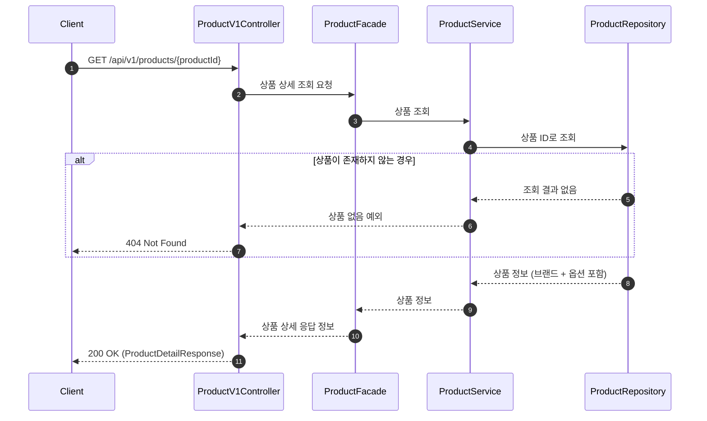
```mermaid
sequenceDiagram
    autonumber
    participant Client
    participant Controller as ProductV1Controller
    participant Facade as ProductFacade
    participant Service as ProductService
    participant Repository as ProductRepository

    Client->>Controller: GET /api/v1/products/{productId}
    Controller->>Facade: 상품 상세 조회 요청
    Facade->>Service: 상품 조회
    Service->>Repository: 상품 ID로 조회

    alt 상품이 존재하지 않는 경우
        Repository-->>Service: 조회 결과 없음
        Service-->>Controller: 상품 없음 예외
        Controller-->>Client: 404 Not Found
    end

    Repository-->>Service: 상품 정보 (브랜드 + 옵션 포함)
    Service-->>Facade: 상품 정보
    Facade-->>Controller: 상품 상세 응답 정보
    Controller-->>Client: 200 OK (ProductDetailResponse)
```

**설계 포인트**
- Product가 Brand를 직접 포함 (ManyToOne 연관관계). 별도 BrandService 호출 없이 한 번의 조회로 해결
- ProductOption 목록도 함께 응답 (옵션명, 재고 등)
- 목록 조회의 ProductInfo와 별도로 ProductDetailInfo 사용 (브랜드 상세 + 옵션 목록 포함)

---

## (4) 좋아요 등록

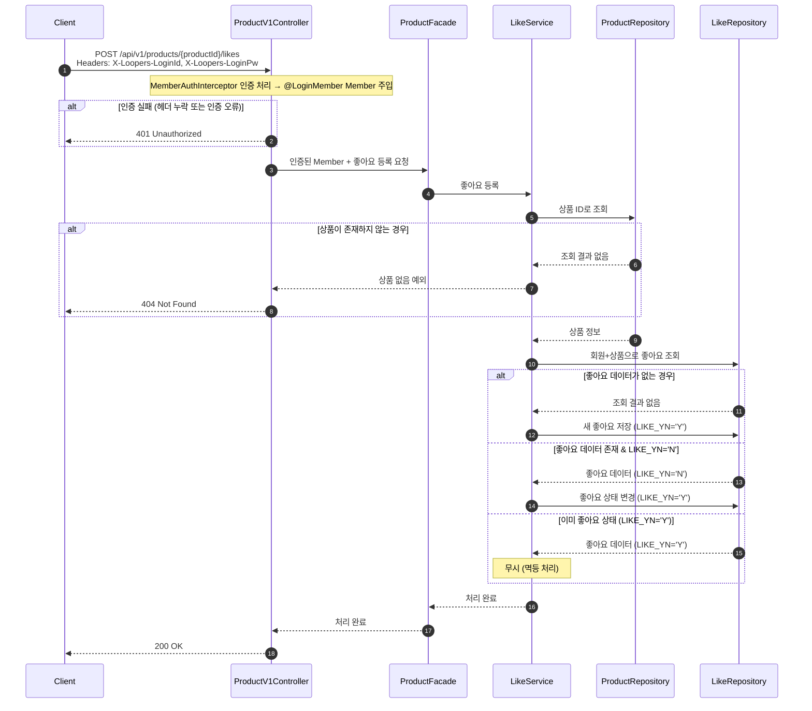
```mermaid
sequenceDiagram
    autonumber
    participant Client
    participant Controller as ProductV1Controller
    participant Facade as ProductFacade
    participant LikeService as LikeService
    participant ProductRepository as ProductRepository
    participant LikeRepository as LikeRepository

    Client->>Controller: POST /api/v1/products/{productId}/likes<br/>Headers: X-Loopers-LoginId, X-Loopers-LoginPw

    Note over Controller: MemberAuthInterceptor 인증 처리 → @LoginMember Member 주입
    alt 인증 실패 (헤더 누락 또는 인증 오류)
        Controller-->>Client: 401 Unauthorized
    end

    Controller->>Facade: 인증된 Member + 좋아요 등록 요청
    Facade->>LikeService: 좋아요 등록
    LikeService->>ProductRepository: 상품 ID로 조회

    alt 상품이 존재하지 않는 경우
        ProductRepository-->>LikeService: 조회 결과 없음
        LikeService-->>Controller: 상품 없음 예외
        Controller-->>Client: 404 Not Found
    end

    ProductRepository-->>LikeService: 상품 정보

    LikeService->>LikeRepository: 회원+상품으로 좋아요 조회

    alt 좋아요 데이터가 없는 경우
        LikeRepository-->>LikeService: 조회 결과 없음
        LikeService->>LikeRepository: 새 좋아요 저장 (LIKE_YN='Y')
    else 좋아요 데이터 존재 & LIKE_YN='N'
        LikeRepository-->>LikeService: 좋아요 데이터 (LIKE_YN='N')
        LikeService->>LikeRepository: 좋아요 상태 변경 (LIKE_YN='Y')
    else 이미 좋아요 상태 (LIKE_YN='Y')
        LikeRepository-->>LikeService: 좋아요 데이터 (LIKE_YN='Y')
        Note over LikeService: 무시 (멱등 처리)
    end

    LikeService-->>Facade: 처리 완료
    Facade-->>Controller: 처리 완료
    Controller-->>Client: 200 OK
```

**설계 포인트**
- MemberAuthInterceptor에서 인증 처리 후 @LoginMember로 Member 주입
- LikeService → ProductRepository 의존 발생: 상품 존재 검증을 위해 수용하는 트레이드오프
- LIKE_YN 컬럼으로 soft delete 방식 관리 (Insert / Update 분기)
- 이미 좋아요 상태면 멱등 처리 (에러 없이 성공)

---

## (5) 좋아요 취소

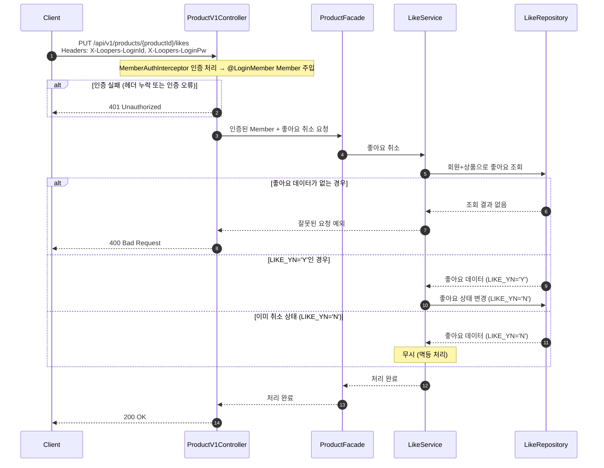
```mermaid
sequenceDiagram
    autonumber
    participant Client
    participant Controller as ProductV1Controller
    participant Facade as ProductFacade
    participant LikeService as LikeService
    participant LikeRepository as LikeRepository

    Client->>Controller: PUT /api/v1/products/{productId}/likes<br/>Headers: X-Loopers-LoginId, X-Loopers-LoginPw

    Note over Controller: MemberAuthInterceptor 인증 처리 → @LoginMember Member 주입
    alt 인증 실패 (헤더 누락 또는 인증 오류)
        Controller-->>Client: 401 Unauthorized
    end

    Controller->>Facade: 인증된 Member + 좋아요 취소 요청
    Facade->>LikeService: 좋아요 취소
    LikeService->>LikeRepository: 회원+상품으로 좋아요 조회

    alt 좋아요 데이터가 없는 경우
        LikeRepository-->>LikeService: 조회 결과 없음
        LikeService-->>Controller: 잘못된 요청 예외
        Controller-->>Client: 400 Bad Request
    else LIKE_YN='Y'인 경우
        LikeRepository-->>LikeService: 좋아요 데이터 (LIKE_YN='Y')
        LikeService->>LikeRepository: 좋아요 상태 변경 (LIKE_YN='N')
    else 이미 취소 상태 (LIKE_YN='N')
        LikeRepository-->>LikeService: 좋아요 데이터 (LIKE_YN='N')
        Note over LikeService: 무시 (멱등 처리)
    end

    LikeService-->>Facade: 처리 완료
    Facade-->>Controller: 처리 완료
    Controller-->>Client: 200 OK
```

**설계 포인트**
- (4)와 비대칭 정책: 데이터 없음 → 등록은 Insert, 취소는 400 Bad Request
- 이미 취소 상태(LIKE_YN='N')는 멱등 처리
- 요구사항의 HTTP Method "UPDATE"는 존재하지 않으므로 PUT으로 표현. 구현 시 DELETE도 고려 가능

---

## (6) 좋아요한 상품 목록 조회

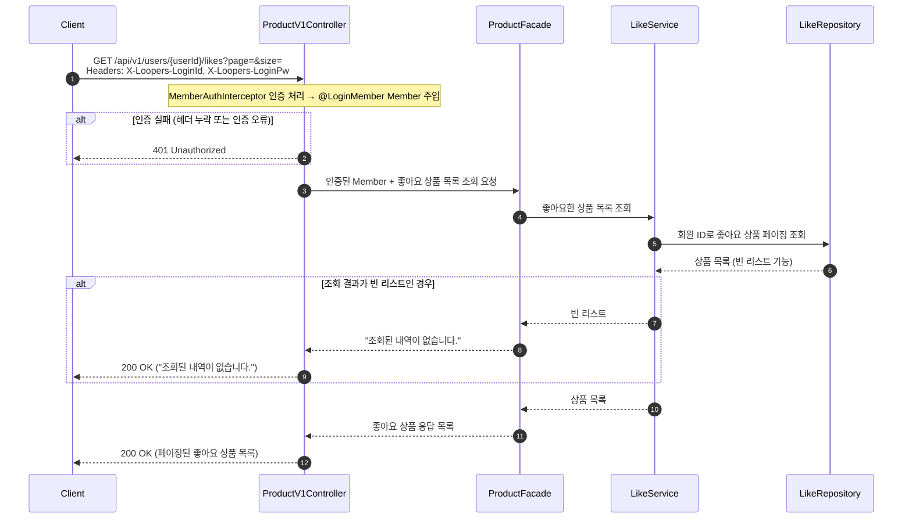
```mermaid
sequenceDiagram
    autonumber
    participant Client
    participant Controller as ProductV1Controller
    participant Facade as ProductFacade
    participant LikeService as LikeService
    participant LikeRepository as LikeRepository

    Client->>Controller: GET /api/v1/users/{userId}/likes?page=&size=<br/>Headers: X-Loopers-LoginId, X-Loopers-LoginPw

    Note over Controller: MemberAuthInterceptor 인증 처리 → @LoginMember Member 주입
    alt 인증 실패 (헤더 누락 또는 인증 오류)
        Controller-->>Client: 401 Unauthorized
    end

    Controller->>Facade: 인증된 Member + 좋아요 상품 목록 조회 요청
    Facade->>LikeService: 좋아요한 상품 목록 조회
    LikeService->>LikeRepository: 회원 ID로 좋아요 상품 페이징 조회
    LikeRepository-->>LikeService: 상품 목록 (빈 리스트 가능)

    alt 조회 결과가 빈 리스트인 경우
        LikeService-->>Facade: 빈 리스트
        Facade-->>Controller: "조회된 내역이 없습니다."
        Controller-->>Client: 200 OK ("조회된 내역이 없습니다.")
    end

    LikeService-->>Facade: 상품 목록
    Facade-->>Controller: 좋아요 상품 응답 목록
    Controller-->>Client: 200 OK (페이징된 좋아요 상품 목록)
```

**설계 포인트**
- LIKE_YN='Y'인 Like를 기준으로 Product(+Brand)를 join 조회. QueryDSL 활용 포인트
- 결과 0건이어도 200 반환, 메시지로 "조회된 내역이 없습니다." 응답
- URI의 userId는 무시하고 인증된 memberId로 조회 (타인의 좋아요 목록 접근 방지)
- 페이징 적용

---

## (7) 장바구니 담기

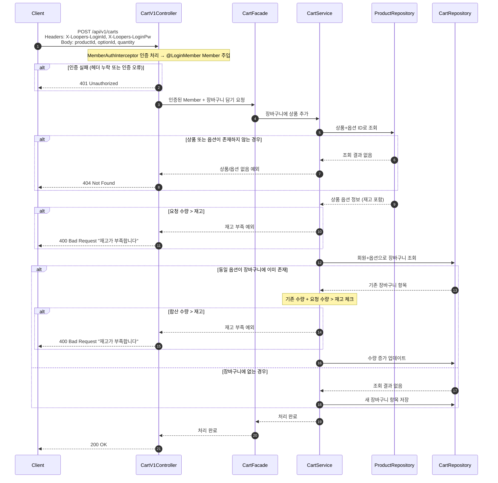
```mermaid
sequenceDiagram
    autonumber
    participant Client
    participant Controller as CartV1Controller
    participant Facade as CartFacade
    participant CartService as CartService
    participant ProductRepository as ProductRepository
    participant CartRepository as CartRepository

    Client->>Controller: POST /api/v1/carts<br/>Headers: X-Loopers-LoginId, X-Loopers-LoginPw<br/>Body: productId, optionId, quantity

    Note over Controller: MemberAuthInterceptor 인증 처리 → @LoginMember Member 주입
    alt 인증 실패 (헤더 누락 또는 인증 오류)
        Controller-->>Client: 401 Unauthorized
    end

    Controller->>Facade: 인증된 Member + 장바구니 담기 요청
    Facade->>CartService: 장바구니에 상품 추가
    CartService->>ProductRepository: 상품+옵션 ID로 조회

    alt 상품 또는 옵션이 존재하지 않는 경우
        ProductRepository-->>CartService: 조회 결과 없음
        CartService-->>Controller: 상품/옵션 없음 예외
        Controller-->>Client: 404 Not Found
    end

    ProductRepository-->>CartService: 상품 옵션 정보 (재고 포함)

    alt 요청 수량 > 재고
        CartService-->>Controller: 재고 부족 예외
        Controller-->>Client: 400 Bad Request "재고가 부족합니다"
    end

    CartService->>CartRepository: 회원+옵션으로 장바구니 조회

    alt 동일 옵션이 장바구니에 이미 존재
        CartRepository-->>CartService: 기존 장바구니 항목
        Note over CartService: 기존 수량 + 요청 수량 > 재고 체크
        alt 합산 수량 > 재고
            CartService-->>Controller: 재고 부족 예외
            Controller-->>Client: 400 Bad Request "재고가 부족합니다"
        end
        CartService->>CartRepository: 수량 증가 업데이트
    else 장바구니에 없는 경우
        CartRepository-->>CartService: 조회 결과 없음
        CartService->>CartRepository: 새 장바구니 항목 저장
    end

    CartService-->>Facade: 처리 완료
    Facade-->>Controller: 처리 완료
    Controller-->>Client: 200 OK
```

**설계 포인트**
- 재고 검증이 두 번 발생: 신규 담기 시 `요청 수량 > 재고`, 기존 상품 병합 시 `합산 수량 > 재고`
- 장바구니 단위는 **상품+옵션 조합**: 같은 상품이라도 옵션이 다르면 별도 CartItem
- 동일 옵션이 이미 있으면 수량만 증가 (옵션 없는 구조이므로 수량 병합)
- CartService → ProductRepository 의존: 재고 확인을 위해 필요

---

## (8) 주문 요청

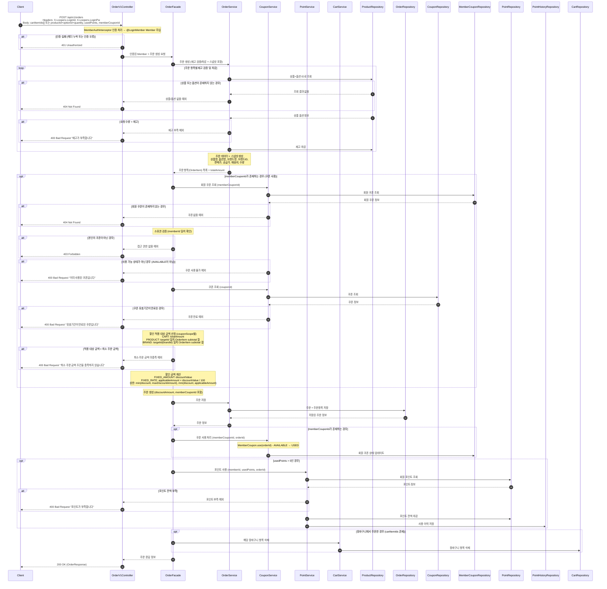
```mermaid
sequenceDiagram
    autonumber
    participant Client
    participant Controller as OrderV1Controller
    participant Facade as OrderFacade
    participant OrderService as OrderService
    participant CouponService as CouponService
    participant PointService as PointService
    participant CartService as CartService
    participant ProductRepository as ProductRepository
    participant OrderRepository as OrderRepository
    participant CouponRepository as CouponRepository
    participant MemberCouponRepository as MemberCouponRepository
    participant PointRepository as PointRepository
    participant PointHistoryRepository as PointHistoryRepository
    participant CartRepository as CartRepository

    Client->>Controller: POST /api/v1/orders<br/>Headers: X-Loopers-LoginId, X-Loopers-LoginPw<br/>Body: cartItemIds[] 또는 productId+optionId+quantity, usedPoints, memberCouponId

    Note over Controller: MemberAuthInterceptor 인증 처리 → @LoginMember Member 주입
    alt 인증 실패 (헤더 누락 또는 인증 오류)
        Controller-->>Client: 401 Unauthorized
    end

    Controller->>Facade: 인증된 Member + 주문 생성 요청
    Facade->>OrderService: 주문 생성 (재고 검증/차감 + 스냅샷 포함)

    loop 주문 항목별 재고 검증 및 차감
        OrderService->>ProductRepository: 상품+옵션 ID로 조회

        alt 상품 또는 옵션이 존재하지 않는 경우
            ProductRepository-->>OrderService: 조회 결과 없음
            OrderService-->>Controller: 상품/옵션 없음 예외
            Controller-->>Client: 404 Not Found
        end

        ProductRepository-->>OrderService: 상품 옵션 정보

        alt 요청 수량 > 재고
            OrderService-->>Controller: 재고 부족 예외
            Controller-->>Client: 400 Bad Request "재고가 부족합니다"
        end

        OrderService->>ProductRepository: 재고 차감
    end

    Note over OrderService: 주문 데이터 + 스냅샷 생성<br/>상품명, 옵션명, 브랜드명, 브랜드ID,<br/>판매가, 공급가, 배송비, 수량

    OrderService-->>Facade: 주문 항목(OrderItem) 목록 + totalAmount

    opt memberCouponId가 존재하는 경우 (쿠폰 사용)
        Facade->>CouponService: 회원 쿠폰 조회 (memberCouponId)
        CouponService->>MemberCouponRepository: 회원 쿠폰 조회
        MemberCouponRepository-->>CouponService: 회원 쿠폰 정보

        alt 회원 쿠폰이 존재하지 않는 경우
            CouponService-->>Controller: 쿠폰 없음 예외
            Controller-->>Client: 404 Not Found
        end

        Note over Facade: 소유권 검증 (memberId 일치 확인)
        alt 본인의 쿠폰이 아닌 경우
            Facade-->>Controller: 접근 권한 없음 예외
            Controller-->>Client: 403 Forbidden
        end

        alt 사용 가능 상태가 아닌 경우 (AVAILABLE이 아님)
            CouponService-->>Controller: 쿠폰 사용 불가 예외
            Controller-->>Client: 400 Bad Request "이미 사용된 쿠폰입니다"
        end

        Facade->>CouponService: 쿠폰 조회 (couponId)
        CouponService->>CouponRepository: 쿠폰 조회
        CouponRepository-->>CouponService: 쿠폰 정보

        alt 쿠폰 유효기간이 만료된 경우
            CouponService-->>Controller: 쿠폰 만료 예외
            Controller-->>Client: 400 Bad Request "유효기간이 만료된 쿠폰입니다"
        end

        Note over Facade: 할인 적용 대상 금액 산정 (couponScope별)<br/>CART: totalAmount<br/>PRODUCT: targetId 일치 OrderItem subtotal 합<br/>BRAND: targetId(brandId) 일치 OrderItem subtotal 합

        alt 적용 대상 금액 < 최소 주문 금액
            Facade-->>Controller: 최소 주문 금액 미충족 예외
            Controller-->>Client: 400 Bad Request "최소 주문 금액 조건을 충족하지 않습니다"
        end

        Note over Facade: 할인 금액 계산<br/>FIXED_AMOUNT: discountValue<br/>FIXED_RATE: applicableAmount × discountValue / 100<br/>상한: min(discount, maxDiscountAmount), min(discount, applicableAmount)
    end

    Note over Facade: 주문 생성 (discountAmount, memberCouponId 포함)
    Facade->>OrderService: 주문 저장
    OrderService->>OrderRepository: 주문 + 주문항목 저장
    OrderRepository-->>OrderService: 저장된 주문 정보
    OrderService-->>Facade: 주문 정보

    opt memberCouponId가 존재하는 경우
        Facade->>CouponService: 쿠폰 사용 처리 (memberCouponId, orderId)
        Note over CouponService: MemberCoupon.use(orderId) - AVAILABLE → USED
        CouponService->>MemberCouponRepository: 회원 쿠폰 상태 업데이트
    end

    opt usedPoints > 0인 경우
        Facade->>PointService: 포인트 사용 (memberId, usedPoints, orderId)
        PointService->>PointRepository: 회원 포인트 조회
        PointRepository-->>PointService: 포인트 정보

        alt 포인트 잔액 부족
            PointService-->>Controller: 포인트 부족 예외
            Controller-->>Client: 400 Bad Request "포인트가 부족합니다"
        end

        PointService->>PointRepository: 포인트 잔액 차감
        PointService->>PointHistoryRepository: 사용 이력 저장
    end

    opt 장바구니에서 주문한 경우 (cartItemIds 존재)
        Facade->>CartService: 해당 장바구니 항목 삭제
        CartService->>CartRepository: 장바구니 항목 삭제
    end

    Facade-->>Controller: 주문 응답 정보
    Controller-->>Client: 200 OK (OrderResponse)
```

**설계 포인트**
- 결제 없이 주문 단계에서 완료: 재고 검증 → 차감 → 쿠폰 검증/할인 계산 → 주문 생성 → 쿠폰 사용 → 포인트 사용 → 장바구니 삭제
- 실결제금액 = totalAmount - discountAmount - usedPoints
- 단건/장바구니 주문 통합 엔드포인트: body 내용으로 분기 (cartItemIds[] 또는 productId+optionId+quantity)
- 실패 시 @Transactional 롤백으로 재고 + 쿠폰 + 포인트 자동 복원 (명시적 보상 로직 불필요)
- 스냅샷 필드: 상품명, 옵션명, 브랜드명, 브랜드ID, 판매가, 공급가, 배송비, 수량
- **장바구니 삭제는 Facade에서 CartService를 호출하여 처리**: OrderService는 주문 생성에만 집중, 크로스 도메인 조율은 Facade 책임
- **포인트 사용은 Facade에서 PointService를 호출하여 처리**: usedPoints > 0인 경우에만 포인트 차감 수행
- **쿠폰 검증/적용은 Facade에서 CouponService를 호출하여 처리**: memberCouponId가 존재하는 경우에만 쿠폰 할인 적용
- 주문당 쿠폰 1장만 사용 가능 (포인트와 중복 사용은 가능)
- OrderService 의존 범위: ProductRepository(재고 검증/차감, 원자적 트랜잭션), OrderRepository(주문 저장)

### 할인 금액 계산 로직
```
1. applicableAmount 산정 (couponScope별):
   - CART: totalAmount (전체 주문 금액)
   - PRODUCT: targetId와 일치하는 OrderItem들의 subtotal 합
   - BRAND: targetId(brandId)와 일치하는 OrderItem들의 subtotal 합
2. discount 계산 (discountType별):
   - FIXED_AMOUNT: discount = discountValue
   - FIXED_RATE: discount = applicableAmount × discountValue / 100
3. 상한 적용:
   - FIXED_RATE이면: discount = min(discount, maxDiscountAmount)
   - 공통: discount = min(discount, applicableAmount)
```

### 잠재 리스크
- **트랜잭션 비대화**: 재고 차감 ~ 주문 저장 ~ 쿠폰 사용 ~ 포인트 차감이 하나의 트랜잭션. 현재 단계에서는 단일 트랜잭션으로 진행하되, 추후 트래픽 증가 시 분리 고려

---

## (9) 주문 목록 조회

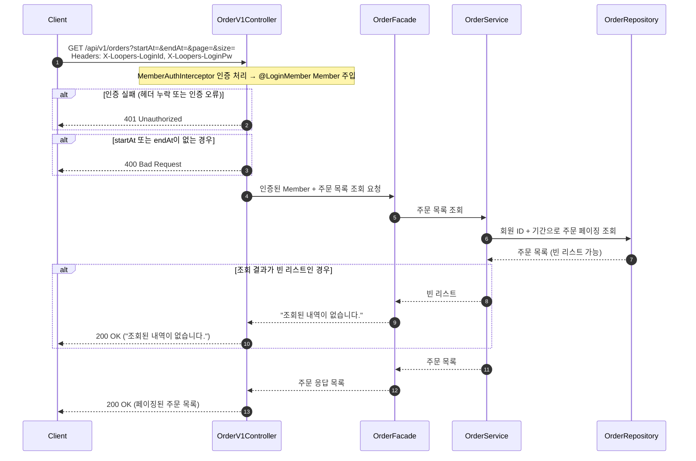
```mermaid
sequenceDiagram
    autonumber
    participant Client
    participant Controller as OrderV1Controller
    participant Facade as OrderFacade
    participant OrderService as OrderService
    participant OrderRepository as OrderRepository

    Client->>Controller: GET /api/v1/orders?startAt=&endAt=&page=&size=<br/>Headers: X-Loopers-LoginId, X-Loopers-LoginPw

    Note over Controller: MemberAuthInterceptor 인증 처리 → @LoginMember Member 주입
    alt 인증 실패 (헤더 누락 또는 인증 오류)
        Controller-->>Client: 401 Unauthorized
    end

    alt startAt 또는 endAt이 없는 경우
        Controller-->>Client: 400 Bad Request
    end

    Controller->>Facade: 인증된 Member + 주문 목록 조회 요청
    Facade->>OrderService: 주문 목록 조회
    OrderService->>OrderRepository: 회원 ID + 기간으로 주문 페이징 조회
    OrderRepository-->>OrderService: 주문 목록 (빈 리스트 가능)

    alt 조회 결과가 빈 리스트인 경우
        OrderService-->>Facade: 빈 리스트
        Facade-->>Controller: "조회된 내역이 없습니다."
        Controller-->>Client: 200 OK ("조회된 내역이 없습니다.")
    end

    OrderService-->>Facade: 주문 목록
    Facade-->>Controller: 주문 응답 목록
    Controller-->>Client: 200 OK (페이징된 주문 목록)
```

**설계 포인트**
- startAt, endAt 필수 파라미터. 없으면 400 Bad Request
- Controller에서 날짜 파라미터 검증 (@RequestParam required=true)
- 결과 0건이어도 200 반환, 메시지로 "조회된 내역이 없습니다." 응답
- 페이징 적용

---

## (10) 주문건에 대한 상세 정보 조회

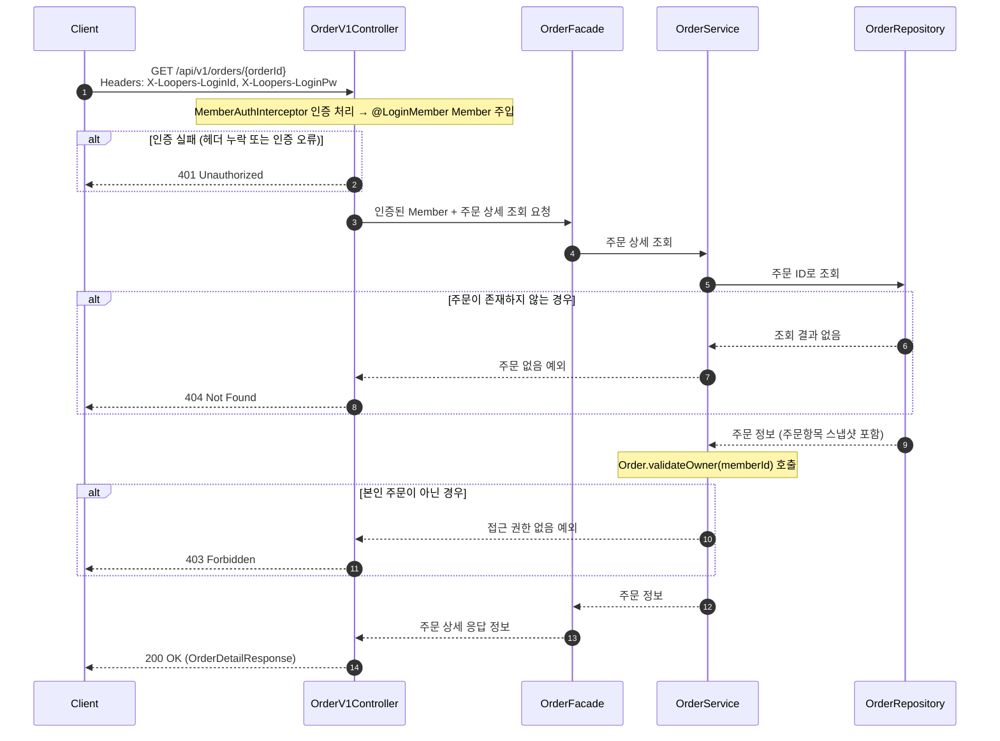
```mermaid
sequenceDiagram
    autonumber
    participant Client
    participant Controller as OrderV1Controller
    participant Facade as OrderFacade
    participant OrderService as OrderService
    participant OrderRepository as OrderRepository

    Client->>Controller: GET /api/v1/orders/{orderId}<br/>Headers: X-Loopers-LoginId, X-Loopers-LoginPw

    Note over Controller: MemberAuthInterceptor 인증 처리 → @LoginMember Member 주입
    alt 인증 실패 (헤더 누락 또는 인증 오류)
        Controller-->>Client: 401 Unauthorized
    end

    Controller->>Facade: 인증된 Member + 주문 상세 조회 요청
    Facade->>OrderService: 주문 상세 조회
    OrderService->>OrderRepository: 주문 ID로 조회

    alt 주문이 존재하지 않는 경우
        OrderRepository-->>OrderService: 조회 결과 없음
        OrderService-->>Controller: 주문 없음 예외
        Controller-->>Client: 404 Not Found
    end

    OrderRepository-->>OrderService: 주문 정보 (주문항목 스냅샷 포함)

    Note over OrderService: Order.validateOwner(memberId) 호출
    alt 본인 주문이 아닌 경우
        OrderService-->>Controller: 접근 권한 없음 예외
        Controller-->>Client: 403 Forbidden
    end

    OrderService-->>Facade: 주문 정보
    Facade-->>Controller: 주문 상세 응답 정보
    Controller-->>Client: 200 OK (OrderDetailResponse)
```

**설계 포인트**
- 조회와 인가를 분리: `findById`로 조회 후 `Order.validateOwner(memberId)`로 소유권 검증
- 존재하지 않으면 404, 본인 주문이 아니면 403 — 인가 의도가 코드에 명시적으로 드러남
- 도메인 객체가 자기 보호 책임을 가짐 (Order가 소유권 검증 로직 보유)
- Order + OrderItem(스냅샷) 함께 조회하여 응답

---

## (11) 쿠폰 목록 조회

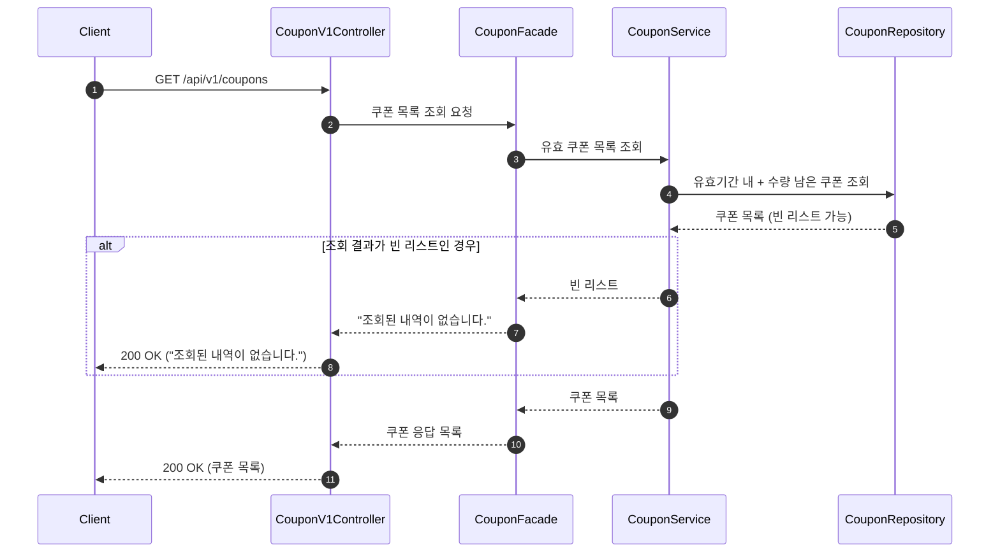
```mermaid
sequenceDiagram
    autonumber
    participant Client
    participant Controller as CouponV1Controller
    participant Facade as CouponFacade
    participant Service as CouponService
    participant Repository as CouponRepository

    Client->>Controller: GET /api/v1/coupons

    Controller->>Facade: 쿠폰 목록 조회 요청
    Facade->>Service: 유효 쿠폰 목록 조회
    Service->>Repository: 유효기간 내 + 수량 남은 쿠폰 조회
    Repository-->>Service: 쿠폰 목록 (빈 리스트 가능)

    alt 조회 결과가 빈 리스트인 경우
        Service-->>Facade: 빈 리스트
        Facade-->>Controller: "조회된 내역이 없습니다."
        Controller-->>Client: 200 OK ("조회된 내역이 없습니다.")
    end

    Service-->>Facade: 쿠폰 목록
    Facade-->>Controller: 쿠폰 응답 목록
    Controller-->>Client: 200 OK (쿠폰 목록)
```

**설계 포인트**
- 인증 불필요: 누구나 조회 가능
- 유효기간 내(`validFrom ≤ now ≤ validTo`) + 잔여 수량(`issuedQuantity < totalQuantity`)이 있는 쿠폰만 반환
- 결과 0건이어도 200 반환, 메시지로 "조회된 내역이 없습니다." 응답

---

## (12) 쿠폰 다운로드

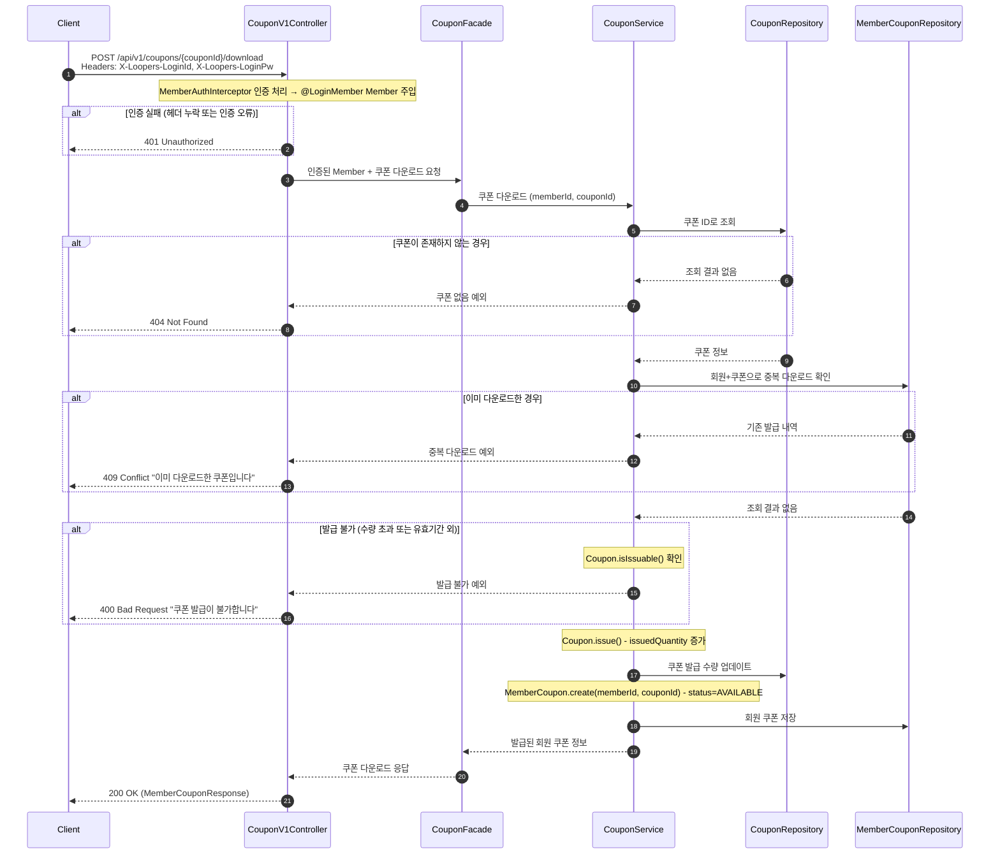
```mermaid
sequenceDiagram
    autonumber
    participant Client
    participant Controller as CouponV1Controller
    participant Facade as CouponFacade
    participant Service as CouponService
    participant CouponRepo as CouponRepository
    participant MemberCouponRepo as MemberCouponRepository

    Client->>Controller: POST /api/v1/coupons/{couponId}/download<br/>Headers: X-Loopers-LoginId, X-Loopers-LoginPw

    Note over Controller: MemberAuthInterceptor 인증 처리 → @LoginMember Member 주입
    alt 인증 실패 (헤더 누락 또는 인증 오류)
        Controller-->>Client: 401 Unauthorized
    end

    Controller->>Facade: 인증된 Member + 쿠폰 다운로드 요청
    Facade->>Service: 쿠폰 다운로드 (memberId, couponId)
    Service->>CouponRepo: 쿠폰 ID로 조회

    alt 쿠폰이 존재하지 않는 경우
        CouponRepo-->>Service: 조회 결과 없음
        Service-->>Controller: 쿠폰 없음 예외
        Controller-->>Client: 404 Not Found
    end

    CouponRepo-->>Service: 쿠폰 정보

    Service->>MemberCouponRepo: 회원+쿠폰으로 중복 다운로드 확인
    alt 이미 다운로드한 경우
        MemberCouponRepo-->>Service: 기존 발급 내역
        Service-->>Controller: 중복 다운로드 예외
        Controller-->>Client: 409 Conflict "이미 다운로드한 쿠폰입니다"
    end

    MemberCouponRepo-->>Service: 조회 결과 없음

    alt 발급 불가 (수량 초과 또는 유효기간 외)
        Note over Service: Coupon.isIssuable() 확인
        Service-->>Controller: 발급 불가 예외
        Controller-->>Client: 400 Bad Request "쿠폰 발급이 불가합니다"
    end

    Note over Service: Coupon.issue() - issuedQuantity 증가
    Service->>CouponRepo: 쿠폰 발급 수량 업데이트

    Note over Service: MemberCoupon.create(memberId, couponId) - status=AVAILABLE
    Service->>MemberCouponRepo: 회원 쿠폰 저장

    Service-->>Facade: 발급된 회원 쿠폰 정보
    Facade-->>Controller: 쿠폰 다운로드 응답
    Controller-->>Client: 200 OK (MemberCouponResponse)
```

**설계 포인트**
- 인증 필요: 로그인한 회원만 다운로드 가능
- 중복 다운로드 방지: `member_id + coupon_id` UNIQUE 제약 + 애플리케이션 레벨 검증 (409 Conflict)
- 발급 가능 여부: `Coupon.isIssuable()`에서 수량(`issuedQuantity < totalQuantity`) + 유효기간(`validFrom ≤ now ≤ validTo`) 확인
- `Coupon.issue()`: issuedQuantity 증가. 동시성은 추후 optimistic locking 또는 DB 원자적 업데이트로 개선
- MemberCoupon 생성 시 status는 AVAILABLE

---

## (13) 내 쿠폰 목록 조회

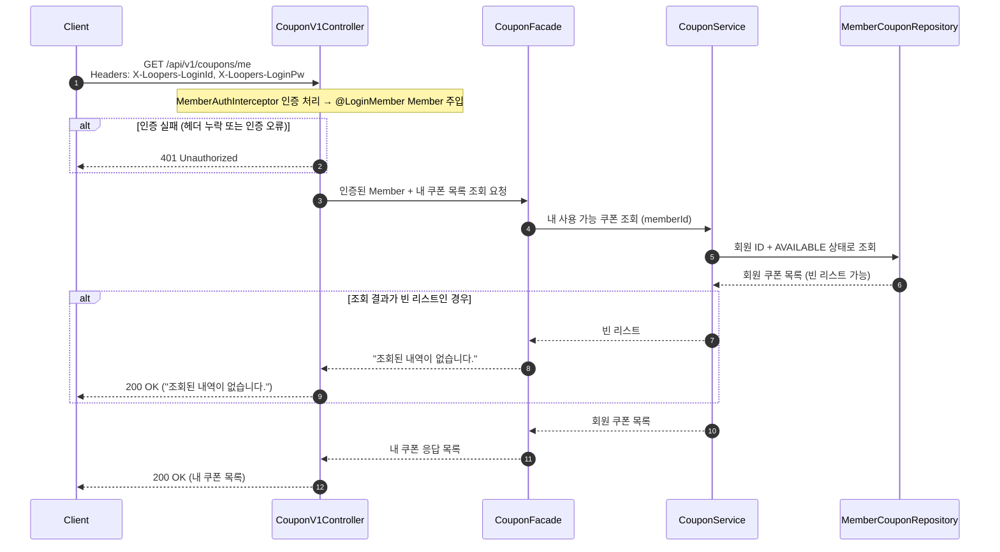
```mermaid
sequenceDiagram
    autonumber
    participant Client
    participant Controller as CouponV1Controller
    participant Facade as CouponFacade
    participant Service as CouponService
    participant Repository as MemberCouponRepository

    Client->>Controller: GET /api/v1/coupons/me<br/>Headers: X-Loopers-LoginId, X-Loopers-LoginPw

    Note over Controller: MemberAuthInterceptor 인증 처리 → @LoginMember Member 주입
    alt 인증 실패 (헤더 누락 또는 인증 오류)
        Controller-->>Client: 401 Unauthorized
    end

    Controller->>Facade: 인증된 Member + 내 쿠폰 목록 조회 요청
    Facade->>Service: 내 사용 가능 쿠폰 조회 (memberId)
    Service->>Repository: 회원 ID + AVAILABLE 상태로 조회
    Repository-->>Service: 회원 쿠폰 목록 (빈 리스트 가능)

    alt 조회 결과가 빈 리스트인 경우
        Service-->>Facade: 빈 리스트
        Facade-->>Controller: "조회된 내역이 없습니다."
        Controller-->>Client: 200 OK ("조회된 내역이 없습니다.")
    end

    Service-->>Facade: 회원 쿠폰 목록
    Facade-->>Controller: 내 쿠폰 응답 목록
    Controller-->>Client: 200 OK (내 쿠폰 목록)
```

**설계 포인트**
- 인증 필요: 로그인한 회원의 쿠폰만 조회
- AVAILABLE 상태의 쿠폰만 반환 (USED 제외)
- 결과 0건이어도 200 반환, 메시지로 "조회된 내역이 없습니다." 응답
- 쿠폰 정보(쿠폰명, 할인 유형, 할인 값, 유효기간 등)를 함께 반환하여 주문 시 선택에 활용

---
---

# 시퀀스 다이어그램 - 어드민 서비스

> 어드민 API는 `/api-admin/v1` prefix를 사용한다.
> 인증은 AdminAuthInterceptor에서 `X-Loopers-Ldap` 헤더를 검증하고, @LoginAdmin ArgumentResolver를 통해 Controller에 Admin 객체를 주입한다.
> LdapAuthService는 인터페이스로 정의하고, Fake 구현에서 헤더 값 검증만 수행한다.
> Controller는 고객 서비스와 분리된 별도 어드민 컨트롤러를 사용한다.

---

## 어드민 (1) 브랜드 목록 조회

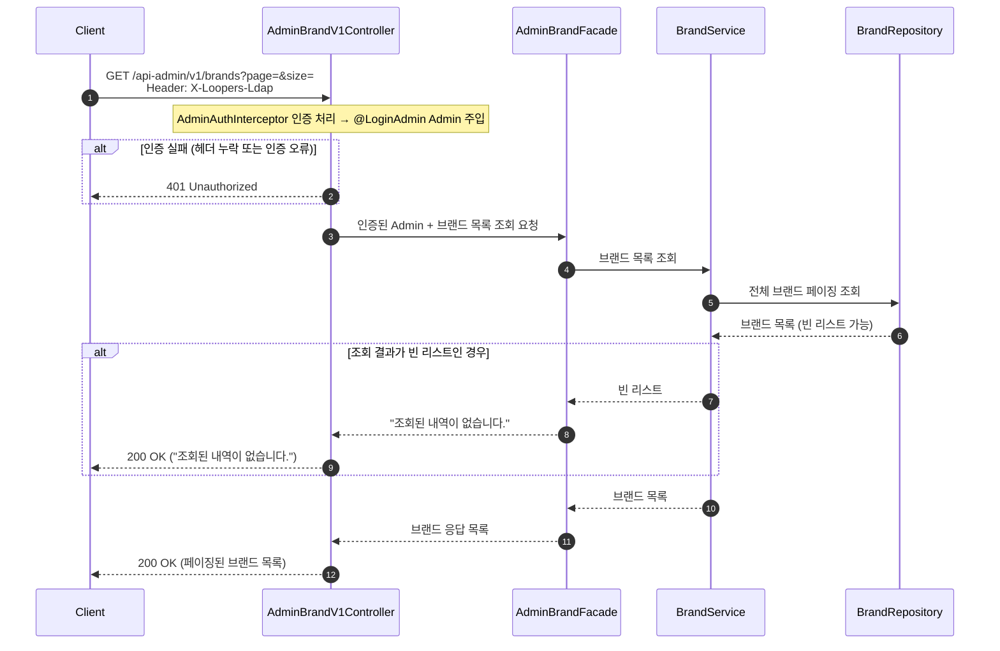
```mermaid
sequenceDiagram
    autonumber
    participant Client
    participant Controller as AdminBrandV1Controller
    participant Facade as AdminBrandFacade
    participant Service as BrandService
    participant Repository as BrandRepository

    Client->>Controller: GET /api-admin/v1/brands?page=&size=<br/>Header: X-Loopers-Ldap

    Note over Controller: AdminAuthInterceptor 인증 처리 → @LoginAdmin Admin 주입
    alt 인증 실패 (헤더 누락 또는 인증 오류)
        Controller-->>Client: 401 Unauthorized
    end

    Controller->>Facade: 인증된 Admin + 브랜드 목록 조회 요청
    Facade->>Service: 브랜드 목록 조회
    Service->>Repository: 전체 브랜드 페이징 조회
    Repository-->>Service: 브랜드 목록 (빈 리스트 가능)

    alt 조회 결과가 빈 리스트인 경우
        Service-->>Facade: 빈 리스트
        Facade-->>Controller: "조회된 내역이 없습니다."
        Controller-->>Client: 200 OK ("조회된 내역이 없습니다.")
    end

    Service-->>Facade: 브랜드 목록
    Facade-->>Controller: 브랜드 응답 목록
    Controller-->>Client: 200 OK (페이징된 브랜드 목록)
```

**설계 포인트**
- AdminAuthInterceptor에서 LDAP 인증 처리 후 @LoginAdmin으로 Admin 주입
- 고객 서비스와 BrandService 공유. 어드민 Facade만 별도
- 결과 0건이어도 200 반환, 메시지로 "조회된 내역이 없습니다." 응답

---

## 어드민 (2) 브랜드 상세 조회

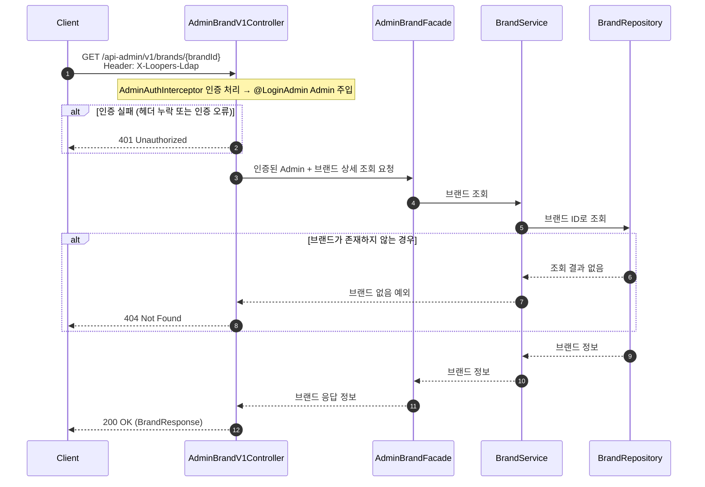
```mermaid
sequenceDiagram
    autonumber
    participant Client
    participant Controller as AdminBrandV1Controller
    participant Facade as AdminBrandFacade
    participant Service as BrandService
    participant Repository as BrandRepository

    Client->>Controller: GET /api-admin/v1/brands/{brandId}<br/>Header: X-Loopers-Ldap

    Note over Controller: AdminAuthInterceptor 인증 처리 → @LoginAdmin Admin 주입
    alt 인증 실패 (헤더 누락 또는 인증 오류)
        Controller-->>Client: 401 Unauthorized
    end

    Controller->>Facade: 인증된 Admin + 브랜드 상세 조회 요청
    Facade->>Service: 브랜드 조회
    Service->>Repository: 브랜드 ID로 조회

    alt 브랜드가 존재하지 않는 경우
        Repository-->>Service: 조회 결과 없음
        Service-->>Controller: 브랜드 없음 예외
        Controller-->>Client: 404 Not Found
    end

    Repository-->>Service: 브랜드 정보
    Service-->>Facade: 브랜드 정보
    Facade-->>Controller: 브랜드 응답 정보
    Controller-->>Client: 200 OK (BrandResponse)
```

**설계 포인트**
- 고객 서비스 (1) 브랜드 조회와 동일 구조. 인증만 LDAP으로 변경

---

## 어드민 (3) 브랜드 등록

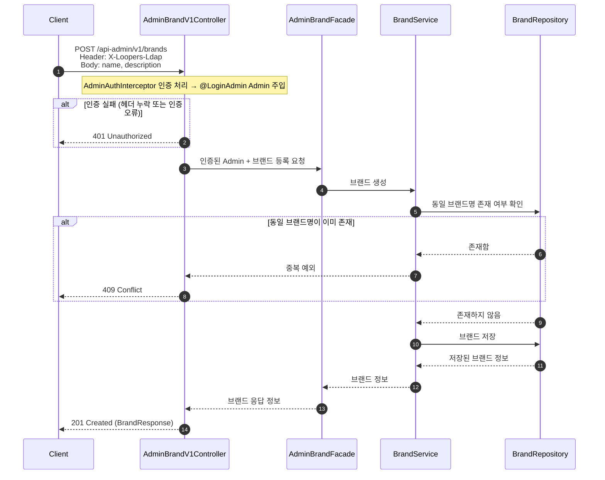
```mermaid
sequenceDiagram
    autonumber
    participant Client
    participant Controller as AdminBrandV1Controller
    participant Facade as AdminBrandFacade
    participant Service as BrandService
    participant Repository as BrandRepository

    Client->>Controller: POST /api-admin/v1/brands<br/>Header: X-Loopers-Ldap<br/>Body: name, description

    Note over Controller: AdminAuthInterceptor 인증 처리 → @LoginAdmin Admin 주입
    alt 인증 실패 (헤더 누락 또는 인증 오류)
        Controller-->>Client: 401 Unauthorized
    end

    Controller->>Facade: 인증된 Admin + 브랜드 등록 요청
    Facade->>Service: 브랜드 생성
    Service->>Repository: 동일 브랜드명 존재 여부 확인

    alt 동일 브랜드명이 이미 존재
        Repository-->>Service: 존재함
        Service-->>Controller: 중복 예외
        Controller-->>Client: 409 Conflict
    end

    Repository-->>Service: 존재하지 않음
    Service->>Repository: 브랜드 저장
    Repository-->>Service: 저장된 브랜드 정보
    Service-->>Facade: 브랜드 정보
    Facade-->>Controller: 브랜드 응답 정보
    Controller-->>Client: 201 Created (BrandResponse)
```

**설계 포인트**
- 브랜드명 중복 검증: existsByName 확인 후 CONFLICT
- 201 Created 반환

---

## 어드민 (4) 브랜드 정보 수정

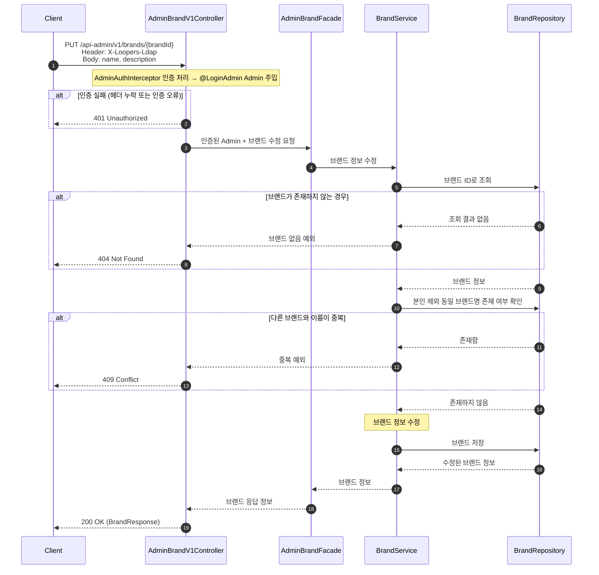
```mermaid
sequenceDiagram
    autonumber
    participant Client
    participant Controller as AdminBrandV1Controller
    participant Facade as AdminBrandFacade
    participant Service as BrandService
    participant Repository as BrandRepository

    Client->>Controller: PUT /api-admin/v1/brands/{brandId}<br/>Header: X-Loopers-Ldap<br/>Body: name, description

    Note over Controller: AdminAuthInterceptor 인증 처리 → @LoginAdmin Admin 주입
    alt 인증 실패 (헤더 누락 또는 인증 오류)
        Controller-->>Client: 401 Unauthorized
    end

    Controller->>Facade: 인증된 Admin + 브랜드 수정 요청
    Facade->>Service: 브랜드 정보 수정
    Service->>Repository: 브랜드 ID로 조회

    alt 브랜드가 존재하지 않는 경우
        Repository-->>Service: 조회 결과 없음
        Service-->>Controller: 브랜드 없음 예외
        Controller-->>Client: 404 Not Found
    end

    Repository-->>Service: 브랜드 정보

    Service->>Repository: 본인 제외 동일 브랜드명 존재 여부 확인

    alt 다른 브랜드와 이름이 중복
        Repository-->>Service: 존재함
        Service-->>Controller: 중복 예외
        Controller-->>Client: 409 Conflict
    end

    Repository-->>Service: 존재하지 않음
    Note over Service: 브랜드 정보 수정
    Service->>Repository: 브랜드 저장
    Repository-->>Service: 수정된 브랜드 정보
    Service-->>Facade: 브랜드 정보
    Facade-->>Controller: 브랜드 응답 정보
    Controller-->>Client: 200 OK (BrandResponse)
```

**설계 포인트**
- 본인 제외 중복 검증: `existsByNameAndIdNot(name, brandId)`
- 존재 확인 → 중복 확인 → 수정 순서

---

## 어드민 (5) 브랜드 삭제

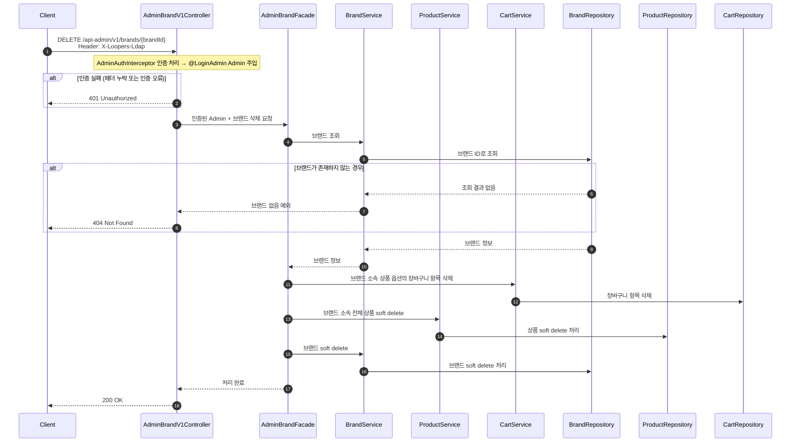
```mermaid
sequenceDiagram
    autonumber
    participant Client
    participant Controller as AdminBrandV1Controller
    participant Facade as AdminBrandFacade
    participant BrandService as BrandService
    participant ProductService as ProductService
    participant CartService as CartService
    participant BrandRepo as BrandRepository
    participant ProductRepo as ProductRepository
    participant CartRepo as CartRepository

    Client->>Controller: DELETE /api-admin/v1/brands/{brandId}<br/>Header: X-Loopers-Ldap

    Note over Controller: AdminAuthInterceptor 인증 처리 → @LoginAdmin Admin 주입
    alt 인증 실패 (헤더 누락 또는 인증 오류)
        Controller-->>Client: 401 Unauthorized
    end

    Controller->>Facade: 인증된 Admin + 브랜드 삭제 요청

    Facade->>BrandService: 브랜드 조회
    BrandService->>BrandRepo: 브랜드 ID로 조회

    alt 브랜드가 존재하지 않는 경우
        BrandRepo-->>BrandService: 조회 결과 없음
        BrandService-->>Controller: 브랜드 없음 예외
        Controller-->>Client: 404 Not Found
    end

    BrandRepo-->>BrandService: 브랜드 정보
    BrandService-->>Facade: 브랜드 정보

    Facade->>CartService: 브랜드 소속 상품 옵션의 장바구니 항목 삭제
    CartService->>CartRepo: 장바구니 항목 삭제

    Facade->>ProductService: 브랜드 소속 전체 상품 soft delete
    ProductService->>ProductRepo: 상품 soft delete 처리

    Facade->>BrandService: 브랜드 soft delete
    BrandService->>BrandRepo: 브랜드 soft delete 처리

    Facade-->>Controller: 처리 완료
    Controller-->>Client: 200 OK
```

**설계 포인트**
- **Facade가 크로스 도메인 조율 담당**: AdminBrandFacade가 BrandService + ProductService + CartService를 조율
- 삭제 전파: 브랜드 → 상품 → 장바구니. 좋아요는 유지
- 상품/브랜드는 soft delete (deletedAt), 장바구니는 hard delete
- 각 Domain Service는 자기 도메인 Repository만 의존

### 잠재 리스크
- 트랜잭션 비대화: 상품이 많은 브랜드 삭제 시 트랜잭션이 커질 수 있음

---

## 어드민 (6) 상품 목록 조회

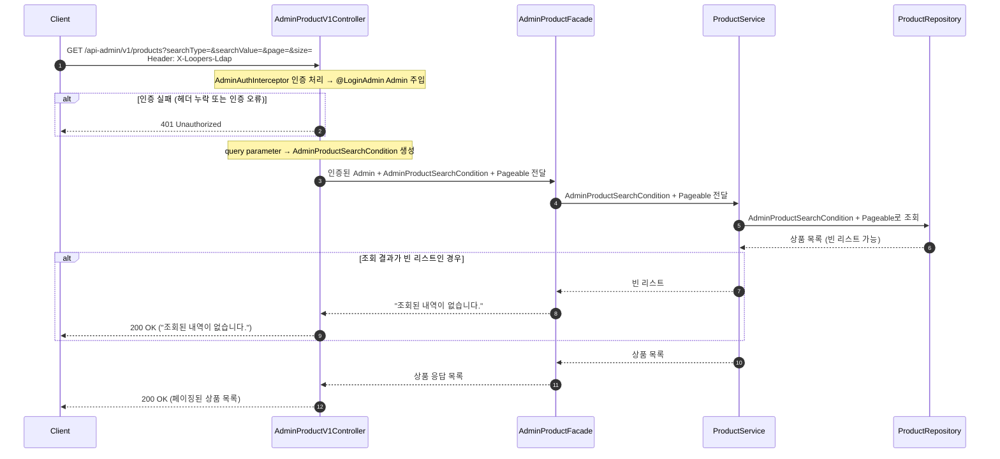
```mermaid
sequenceDiagram
    autonumber
    participant Client
    participant Controller as AdminProductV1Controller
    participant Facade as AdminProductFacade
    participant Service as ProductService
    participant Repository as ProductRepository

    Client->>Controller: GET /api-admin/v1/products?searchType=&searchValue=&page=&size=<br/>Header: X-Loopers-Ldap

    Note over Controller: AdminAuthInterceptor 인증 처리 → @LoginAdmin Admin 주입
    alt 인증 실패 (헤더 누락 또는 인증 오류)
        Controller-->>Client: 401 Unauthorized
    end

    Note over Controller: query parameter → AdminProductSearchCondition 생성
    Controller->>Facade: 인증된 Admin + AdminProductSearchCondition + Pageable 전달
    Facade->>Service: AdminProductSearchCondition + Pageable 전달
    Service->>Repository: AdminProductSearchCondition + Pageable로 조회
    Repository-->>Service: 상품 목록 (빈 리스트 가능)

    alt 조회 결과가 빈 리스트인 경우
        Service-->>Facade: 빈 리스트
        Facade-->>Controller: "조회된 내역이 없습니다."
        Controller-->>Client: 200 OK ("조회된 내역이 없습니다.")
    end

    Service-->>Facade: 상품 목록
    Facade-->>Controller: 상품 응답 목록
    Controller-->>Client: 200 OK (페이징된 상품 목록)
```

**설계 포인트**
- searchType(PRODUCT_ID, PRODUCT_NAME, BRAND_ID, STATUS, DISPLAY_YN) + searchValue 하나로 검색
- 예: searchType=STATUS&searchValue=ON_SALE, searchType=DISPLAY_YN&searchValue=Y
- ProductService 재사용

---

## 어드민 (7) 상품 상세 조회

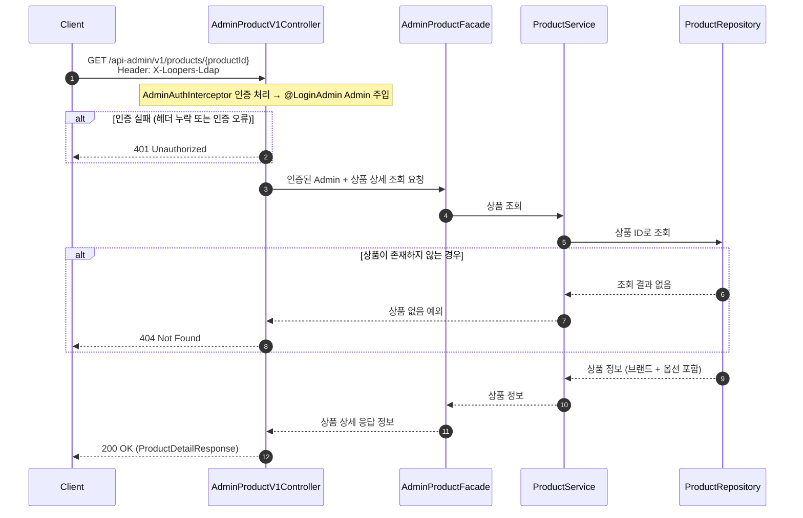
```mermaid
sequenceDiagram
    autonumber
    participant Client
    participant Controller as AdminProductV1Controller
    participant Facade as AdminProductFacade
    participant Service as ProductService
    participant Repository as ProductRepository

    Client->>Controller: GET /api-admin/v1/products/{productId}<br/>Header: X-Loopers-Ldap

    Note over Controller: AdminAuthInterceptor 인증 처리 → @LoginAdmin Admin 주입
    alt 인증 실패 (헤더 누락 또는 인증 오류)
        Controller-->>Client: 401 Unauthorized
    end

    Controller->>Facade: 인증된 Admin + 상품 상세 조회 요청
    Facade->>Service: 상품 조회
    Service->>Repository: 상품 ID로 조회

    alt 상품이 존재하지 않는 경우
        Repository-->>Service: 조회 결과 없음
        Service-->>Controller: 상품 없음 예외
        Controller-->>Client: 404 Not Found
    end

    Repository-->>Service: 상품 정보 (브랜드 + 옵션 포함)
    Service-->>Facade: 상품 정보
    Facade-->>Controller: 상품 상세 응답 정보
    Controller-->>Client: 200 OK (ProductDetailResponse)
```

**설계 포인트**
- 고객 서비스 (3)과 동일 구조. 인증만 LDAP으로 변경

---

## 어드민 (8) 상품 등록

```mermaid
sequenceDiagram
    autonumber
    participant Client
    participant Controller as AdminProductV1Controller
    participant Facade as AdminProductFacade
    participant BrandService as BrandService
    participant ProductService as ProductService
    participant BrandRepo as BrandRepository
    participant ProductRepo as ProductRepository

    Client->>Controller: POST /api-admin/v1/products<br/>Header: X-Loopers-Ldap<br/>Body: brandId, name, price, marginType, marginValue, discountPrice, shippingFee, description, options[]

    Note over Controller: AdminAuthInterceptor 인증 처리 → @LoginAdmin Admin 주입
    alt 인증 실패 (헤더 누락 또는 인증 오류)
        Controller-->>Client: 401 Unauthorized
    end

    Controller->>Facade: 인증된 Admin + 상품 등록 요청

    Facade->>BrandService: 브랜드 조회
    BrandService->>BrandRepo: 브랜드 ID로 조회

    alt 브랜드가 존재하지 않는 경우
        BrandRepo-->>BrandService: 조회 결과 없음
        BrandService-->>Controller: 브랜드 없음 예외
        Controller-->>Client: 404 Not Found
    end

    BrandRepo-->>BrandService: 브랜드 정보
    BrandService-->>Facade: 브랜드 정보

    Facade->>ProductService: 상품 생성 (Brand 전달)

    ProductService->>ProductRepo: 같은 브랜드 내 상품명 중복 확인

    alt 같은 브랜드 내 상품명 중복
        ProductRepo-->>ProductService: 존재함
        ProductService-->>Controller: 중복 예외
        Controller-->>Client: 409 Conflict
    end

    ProductRepo-->>ProductService: 존재하지 않음

    Note over ProductService: marginType에 따라 supplyPrice 자동 계산<br/>AMOUNT: price - marginValue<br/>RATE: price - (price × marginRate / 100)
    Note over ProductService: 상품 + 상품옵션 생성
    ProductService->>ProductRepo: 상품 저장 (옵션 포함)
    ProductRepo-->>ProductService: 저장된 상품 정보
    ProductService-->>Facade: 상품 정보
    Facade-->>Controller: 상품 상세 응답 정보
    Controller-->>Client: 201 Created (ProductDetailResponse)
```

**설계 포인트**
- **Facade가 브랜드 존재 확인을 BrandService에 위임 후 ProductService에 Brand를 전달**: ProductService는 BrandRepository에 의존하지 않음
- supplyPrice는 입력받지 않고 marginType + marginValue로 자동 계산 (Service 책임)
- 상품 + 옵션 한 번에 저장 (cascade)
- 같은 브랜드 내 상품명 중복 검증

---

## 어드민 (9) 상품 정보 수정

```mermaid
sequenceDiagram
    autonumber
    participant Client
    participant Controller as AdminProductV1Controller
    participant Facade as AdminProductFacade
    participant Service as ProductService
    participant ProductRepo as ProductRepository

    Client->>Controller: PUT /api-admin/v1/products/{productId}<br/>Header: X-Loopers-Ldap<br/>Body: name, price, supplyPrice, shippingFee, description, options[]

    Note over Controller: AdminAuthInterceptor 인증 처리 → @LoginAdmin Admin 주입
    alt 인증 실패 (헤더 누락 또는 인증 오류)
        Controller-->>Client: 401 Unauthorized
    end

    Controller->>Facade: 인증된 Admin + 상품 수정 요청
    Facade->>Service: 상품 정보 수정
    Service->>ProductRepo: 상품 ID로 조회

    alt 상품이 존재하지 않는 경우
        ProductRepo-->>Service: 조회 결과 없음
        Service-->>Controller: 상품 없음 예외
        Controller-->>Client: 404 Not Found
    end

    ProductRepo-->>Service: 상품 정보

    Service->>ProductRepo: 본인 제외 같은 브랜드 내 상품명 중복 확인

    alt 같은 브랜드 내 상품명 중복
        ProductRepo-->>Service: 존재함
        Service-->>Controller: 중복 예외
        Controller-->>Client: 409 Conflict
    end

    ProductRepo-->>Service: 존재하지 않음

    Note over Service: 상품 정보 수정 + 옵션 추가/삭제/수정
    Service->>ProductRepo: 상품 저장 (옵션 포함)
    ProductRepo-->>Service: 수정된 상품 정보
    Service-->>Facade: 상품 정보
    Facade-->>Controller: 상품 상세 응답 정보
    Controller-->>Client: 200 OK (ProductDetailResponse)
```

**설계 포인트**
- brandId는 DTO에서 제외: 브랜드 변경 시도 원천 차단
- 중복 검증 시 brandId는 기존 상품에서 추출
- 옵션 일괄 수정: 기존 옵션 목록을 새 옵션 목록으로 교체

---

## 어드민 (10) 상품 삭제

```mermaid
sequenceDiagram
    autonumber
    participant Client
    participant Controller as AdminProductV1Controller
    participant Facade as AdminProductFacade
    participant ProductService as ProductService
    participant CartService as CartService
    participant ProductRepo as ProductRepository
    participant CartRepo as CartRepository

    Client->>Controller: DELETE /api-admin/v1/products/{productId}<br/>Header: X-Loopers-Ldap

    Note over Controller: AdminAuthInterceptor 인증 처리 → @LoginAdmin Admin 주입
    alt 인증 실패 (헤더 누락 또는 인증 오류)
        Controller-->>Client: 401 Unauthorized
    end

    Controller->>Facade: 인증된 Admin + 상품 삭제 요청

    Facade->>ProductService: 상품 조회
    ProductService->>ProductRepo: 상품 ID로 조회

    alt 상품이 존재하지 않는 경우
        ProductRepo-->>ProductService: 조회 결과 없음
        ProductService-->>Controller: 상품 없음 예외
        Controller-->>Client: 404 Not Found
    end

    ProductRepo-->>ProductService: 상품 정보 (옵션 목록 포함)
    ProductService-->>Facade: 상품 정보

    Facade->>CartService: 해당 상품 옵션의 장바구니 항목 삭제
    CartService->>CartRepo: 장바구니 항목 삭제

    Facade->>ProductService: 상품 soft delete
    Note over ProductService: 상품 옵션 soft delete
    Note over ProductService: 상품 soft delete
    ProductService->>ProductRepo: 상품 soft delete 처리

    Facade-->>Controller: 처리 완료
    Controller-->>Client: 200 OK
```

**설계 포인트**
- **Facade가 크로스 도메인 조율 담당**: AdminProductFacade가 ProductService + CartService를 조율
- 브랜드 삭제 (5)와 동일 정책: 장바구니 hard delete, 좋아요 유지, 상품+옵션 soft delete
- 각 Domain Service는 자기 도메인 Repository만 의존

---

## 어드민 (11) 포인트 지급

```mermaid
sequenceDiagram
    autonumber
    participant Client
    participant Controller as AdminPointV1Controller
    participant Facade as AdminPointFacade
    participant PointService as PointService
    participant PointRepository as PointRepository
    participant PointHistoryRepository as PointHistoryRepository

    Client->>Controller: POST /api-admin/v1/points<br/>Header: X-Loopers-Ldap<br/>Body: memberId, amount, description

    Note over Controller: AdminAuthInterceptor 인증 처리 → @LoginAdmin Admin 주입
    alt 인증 실패 (헤더 누락 또는 인증 오류)
        Controller-->>Client: 401 Unauthorized
    end

    alt 금액이 0 이하인 경우
        Controller-->>Client: 400 Bad Request "충전 금액은 양수여야 합니다"
    end

    Controller->>Facade: 인증된 Admin + 포인트 지급 요청
    Facade->>PointService: 포인트 충전 (memberId, amount, description)
    PointService->>PointRepository: 회원 포인트 조회

    alt 회원 포인트가 존재하지 않는 경우
        PointRepository-->>PointService: 조회 결과 없음
        PointService-->>Controller: 회원 없음 예외
        Controller-->>Client: 404 Not Found
    end

    PointRepository-->>PointService: 포인트 정보
    Note over PointService: Point.charge(amount) - 잔액 증가
    PointService->>PointRepository: 포인트 잔액 업데이트
    PointService->>PointHistoryRepository: 충전 이력 저장

    PointService-->>Facade: 처리 완료
    Facade-->>Controller: 처리 완료
    Controller-->>Client: 200 OK
```

**설계 포인트**
- AdminPointFacade는 PointService에 단순 위임
- 금액 검증: 0 이하 금액은 400 Bad Request
- 회원이 존재하지 않으면 (Point 데이터가 없으면) 404 Not Found
- 충전 이력을 POINT_HISTORY에 기록하여 감사 추적 가능

---

## 어드민 (12) 쿠폰 생성

```mermaid
sequenceDiagram
    autonumber
    participant Client
    participant Controller as AdminCouponV1Controller
    participant Facade as AdminCouponFacade
    participant Service as CouponService
    participant Repository as CouponRepository

    Client->>Controller: POST /api-admin/v1/coupons<br/>Header: X-Loopers-Ldap<br/>Body: name, couponScope, targetId, discountType, discountValue, minOrderAmount, maxDiscountAmount, totalQuantity, validFrom, validTo

    Note over Controller: AdminAuthInterceptor 인증 처리 → @LoginAdmin Admin 주입
    alt 인증 실패 (헤더 누락 또는 인증 오류)
        Controller-->>Client: 401 Unauthorized
    end

    alt 입력값 검증 실패
        Note over Controller: CART일 때 targetId가 있으면 실패<br/>PRODUCT/BRAND일 때 targetId가 없으면 실패<br/>FIXED_RATE일 때 maxDiscountAmount가 없으면 실패
        Controller-->>Client: 400 Bad Request
    end

    Controller->>Facade: 인증된 Admin + 쿠폰 생성 요청
    Facade->>Service: 쿠폰 생성
    Note over Service: Coupon.create(...) - 정적 팩토리 메서드로 생성
    Service->>Repository: 쿠폰 저장
    Repository-->>Service: 저장된 쿠폰 정보
    Service-->>Facade: 쿠폰 정보
    Facade-->>Controller: 쿠폰 응답 정보
    Controller-->>Client: 201 Created (CouponResponse)
```

**설계 포인트**
- 입력값 검증: couponScope에 따른 targetId 필수/null 검증, discountType에 따른 maxDiscountAmount 필수 검증
- Coupon.create() 정적 팩토리 메서드로 도메인 객체 생성
- issuedQuantity는 0으로 초기화
- 201 Created 반환

---

## 어드민 (13) 쿠폰 목록 조회

```mermaid
sequenceDiagram
    autonumber
    participant Client
    participant Controller as AdminCouponV1Controller
    participant Facade as AdminCouponFacade
    participant Service as CouponService
    participant Repository as CouponRepository

    Client->>Controller: GET /api-admin/v1/coupons?page=&size=<br/>Header: X-Loopers-Ldap

    Note over Controller: AdminAuthInterceptor 인증 처리 → @LoginAdmin Admin 주입
    alt 인증 실패 (헤더 누락 또는 인증 오류)
        Controller-->>Client: 401 Unauthorized
    end

    Controller->>Facade: 인증된 Admin + 쿠폰 목록 조회 요청
    Facade->>Service: 쿠폰 목록 조회
    Service->>Repository: 전체 쿠폰 페이징 조회
    Repository-->>Service: 쿠폰 목록 (빈 리스트 가능)

    alt 조회 결과가 빈 리스트인 경우
        Service-->>Facade: 빈 리스트
        Facade-->>Controller: "조회된 내역이 없습니다."
        Controller-->>Client: 200 OK ("조회된 내역이 없습니다.")
    end

    Service-->>Facade: 쿠폰 목록
    Facade-->>Controller: 쿠폰 응답 목록
    Controller-->>Client: 200 OK (페이징된 쿠폰 목록)
```

**설계 포인트**
- 전체 쿠폰 페이징 조회 (유효기간 무관)
- 발급 현황(totalQuantity, issuedQuantity) 포함
- 결과 0건이어도 200 반환, 메시지로 "조회된 내역이 없습니다." 응답

---

## 어드민 (14) 쿠폰 상세 조회

```mermaid
sequenceDiagram
    autonumber
    participant Client
    participant Controller as AdminCouponV1Controller
    participant Facade as AdminCouponFacade
    participant Service as CouponService
    participant Repository as CouponRepository

    Client->>Controller: GET /api-admin/v1/coupons/{couponId}<br/>Header: X-Loopers-Ldap

    Note over Controller: AdminAuthInterceptor 인증 처리 → @LoginAdmin Admin 주입
    alt 인증 실패 (헤더 누락 또는 인증 오류)
        Controller-->>Client: 401 Unauthorized
    end

    Controller->>Facade: 인증된 Admin + 쿠폰 상세 조회 요청
    Facade->>Service: 쿠폰 조회
    Service->>Repository: 쿠폰 ID로 조회

    alt 쿠폰이 존재하지 않는 경우
        Repository-->>Service: 조회 결과 없음
        Service-->>Controller: 쿠폰 없음 예외
        Controller-->>Client: 404 Not Found
    end

    Repository-->>Service: 쿠폰 정보
    Service-->>Facade: 쿠폰 정보
    Facade-->>Controller: 쿠폰 상세 응답 정보 (발급 현황 포함)
    Controller-->>Client: 200 OK (CouponDetailResponse)
```

**설계 포인트**
- targetId, totalQuantity, issuedQuantity 등 어드민 전용 상세 정보 포함
- 존재하지 않으면 404 Not Found
