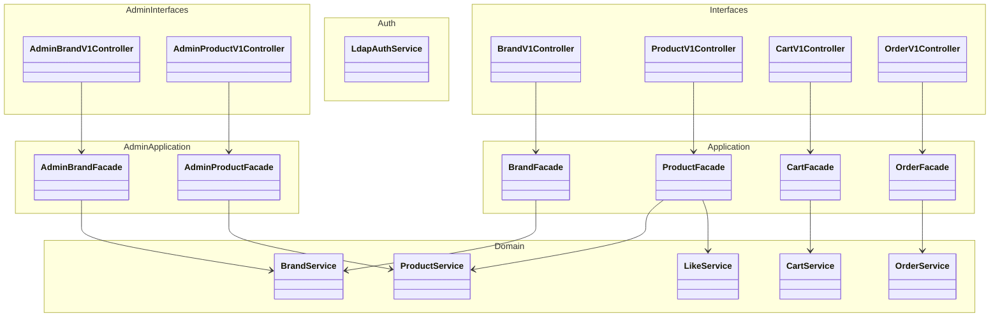
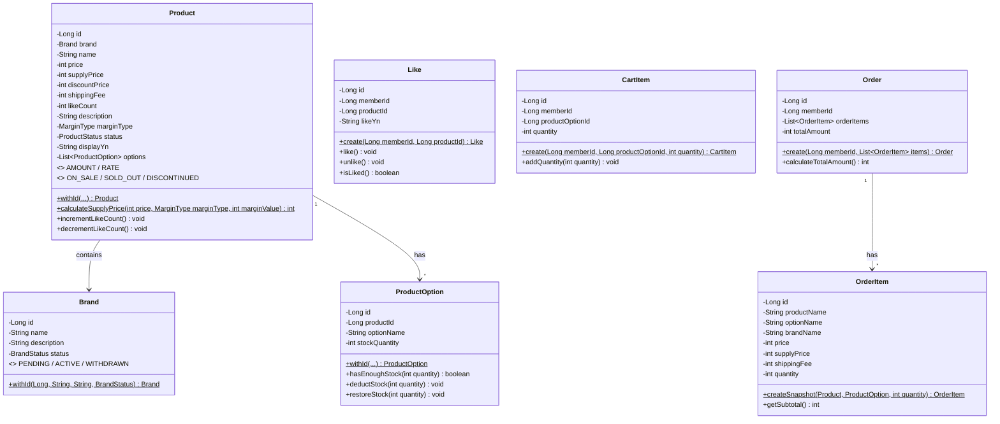
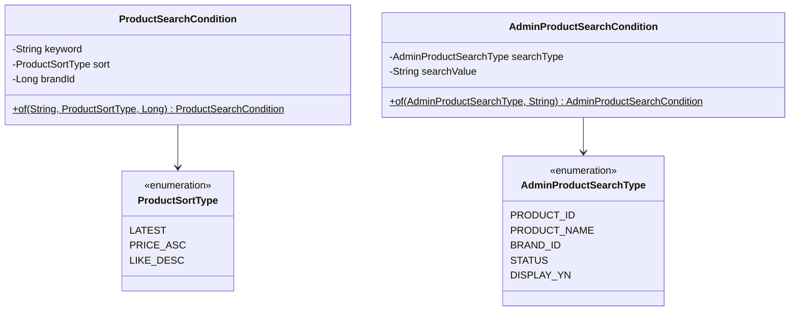
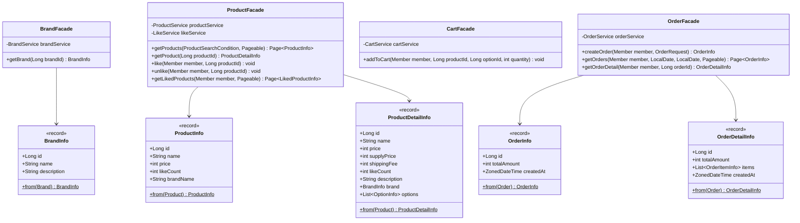
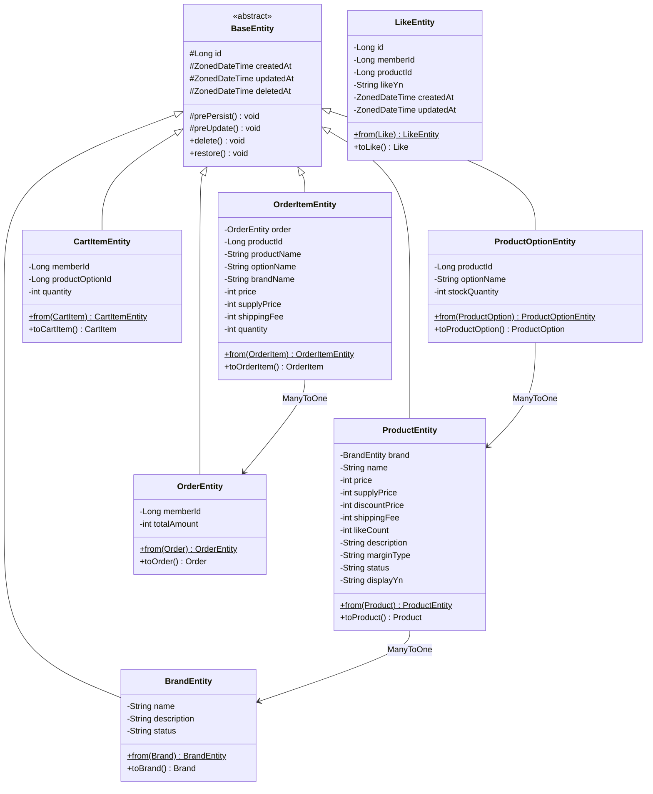
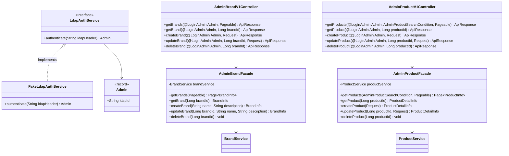

# 클래스 다이어그램 - 고객 서비스 + 어드민 서비스

> 기존 Layered Architecture 패턴을 따르며, 도메인 모델과 JPA 엔티티를 분리한다.
> 각 클래스는 단일 책임을 가지며, 도메인 모델에 비즈니스 로직을 배치한다.

---

## 전체 구조 Overview

---

## Domain 모델

> 도메인 모델은 JPA에 의존하지 않는 순수 객체이며, 비즈니스 로직을 포함한다.

**설계 포인트**
- **Product → Brand 직접 참조**: 상품 상세 조회 시 별도 BrandService 호출 없이 한 번에 조회
- **ProductOption에 재고 로직 배치**: `hasEnoughStock()`, `deductStock()`, `restoreStock()`으로 재고 관련 비즈니스 로직을 도메인 모델이 책임
- **Like.likeYn**: LIKE_YN 컬럼 기반 soft delete. `like()`, `unlike()`으로 상태 전환
- **OrderItem.createSnapshot()**: Product + ProductOption 정보를 스냅샷으로 복사하는 팩토리 메서드
- **CartItem.addQuantity()**: 동일 옵션 장바구니 병합 시 수량 증가

---

## Domain 검색 조건

---

## Domain Service

```mermaid
classDiagram
    direction TB

    class BrandService {
        -BrandRepository brandRepository
        +getBrand(Long brandId) Brand
    }

    class ProductService {
        -ProductRepository productRepository
        +getProducts(ProductSearchCondition, Pageable) Page~Product~
        +getProduct(Long productId) Product
    }

    class LikeService {
        -LikeRepository likeRepository
        -ProductRepository productRepository
        +like(Long memberId, Long productId) void
        +unlike(Long memberId, Long productId) void
        +getLikedProducts(Long memberId, Pageable) Page~Product~
    }

    class CartService {
        -CartRepository cartRepository
        -ProductRepository productRepository
        +addToCart(Long memberId, Long productId, Long optionId, int quantity) void
    }

    class OrderService {
        -OrderRepository orderRepository
        -ProductRepository productRepository
        -CartRepository cartRepository
        +createOrder(Member member, List orderItems) Order
        +getOrders(Long memberId, LocalDate startAt, LocalDate endAt, Pageable) Page~Order~
        +getOrderDetail(Long memberId, Long orderId) Order
    }

    class BrandRepository {
        <<interface>>
        +findById(Long id) Optional~Brand~
    }

    class ProductRepository {
        <<interface>>
        +findAll(ProductSearchCondition, Pageable) Page~Product~
        +findById(Long id) Optional~Product~
        +findOptionById(Long productId, Long optionId) Optional~ProductOption~
    }

    class LikeRepository {
        <<interface>>
        +findByMemberIdAndProductId(Long, Long) Optional~Like~
        +findLikedProductsByMemberId(Long, Pageable) Page~Product~
        +save(Like) Like
    }

    class CartRepository {
        <<interface>>
        +findByMemberIdAndOptionId(Long, Long) Optional~CartItem~
        +save(CartItem) CartItem
        +deleteByIds(List~Long~) void
    }

    class OrderRepository {
        <<interface>>
        +save(Order) Order
        +findByMemberIdAndDateRange(Long, LocalDate, LocalDate, Pageable) Page~Order~
        +findByIdAndMemberId(Long, Long) Optional~Order~
    }

    BrandService --> BrandRepository
    ProductService --> ProductRepository
    LikeService --> LikeRepository
    LikeService --> ProductRepository
    CartService --> CartRepository
    CartService --> ProductRepository
    OrderService --> OrderRepository
    OrderService --> ProductRepository
    OrderService --> CartRepository
```

**설계 포인트**
- **Repository는 도메인 레이어에 인터페이스로 정의**: DIP 준수. 구현체는 Infrastructure
- **LikeService → ProductRepository 의존**: 좋아요 등록 시 상품 존재 검증
- **CartService → ProductRepository 의존**: 장바구니 담기 시 재고 검증
- **OrderService 의존 범위가 가장 넓음**: ProductRepository(재고), OrderRepository(주문), CartRepository(장바구니 삭제)

---

## Application Layer (Facade + Info)

**설계 포인트**
- **Facade는 서비스 조율 + 변환 담당**: 인증은 Interceptor/ArgumentResolver에서 처리. Facade는 인증된 Member/Admin을 파라미터로 받음
- **Info 객체는 record**: 불변. 도메인 모델 → 응답용 데이터 변환을 `from()` 팩토리로 수행
- **ProductInfo vs ProductDetailInfo 분리**: 목록용(간략)과 상세용(브랜드+옵션 포함) 구분

---

## Infrastructure Layer

**설계 포인트**
- **모든 Entity는 BaseEntity 상속**: id, createdAt, updatedAt, deletedAt 공통 관리. 단, **LikeEntity는 예외** — LIKE_YN으로 상태 관리하므로 soft delete 불필요, BaseEntity 상속 없이 독립 관리
- **Entity ↔ Domain 변환**: `from()` / `toXxx()` 메서드로 양방향 변환
- **JPA 연관관계**: ProductEntity → BrandEntity (ManyToOne), ProductOptionEntity → ProductEntity (ManyToOne), OrderItemEntity → OrderEntity (ManyToOne)
- **LikeEntity, CartItemEntity**: memberId를 Long으로 보유 (Member 엔티티와 직접 연관관계 대신 ID 참조)

---

## 어드민 전용 레이어 (Interfaces + Application)

> 어드민은 별도 Controller와 Facade를 가지며, Service/Repository는 고객 서비스와 공유한다.
> 인증은 LdapAuthService 인터페이스를 통해 처리한다.

**설계 포인트**
- **LdapAuthService 인터페이스**: DIP 준수. Fake 구현에서 헤더 값(`loopers.admin`) 검증만 수행. AdminAuthInterceptor에서 호출
- **Service/Repository 공유**: 어드민과 고객 서비스가 동일한 BrandService, ProductService 사용. 비즈니스 로직 중복 없음
- **AdminFacade는 인증 무관**: Interceptor에서 인증 완료 후 Controller가 @LoginAdmin Admin을 받고, Facade에는 비즈니스 파라미터만 전달
