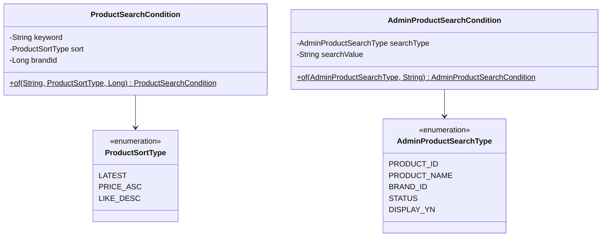
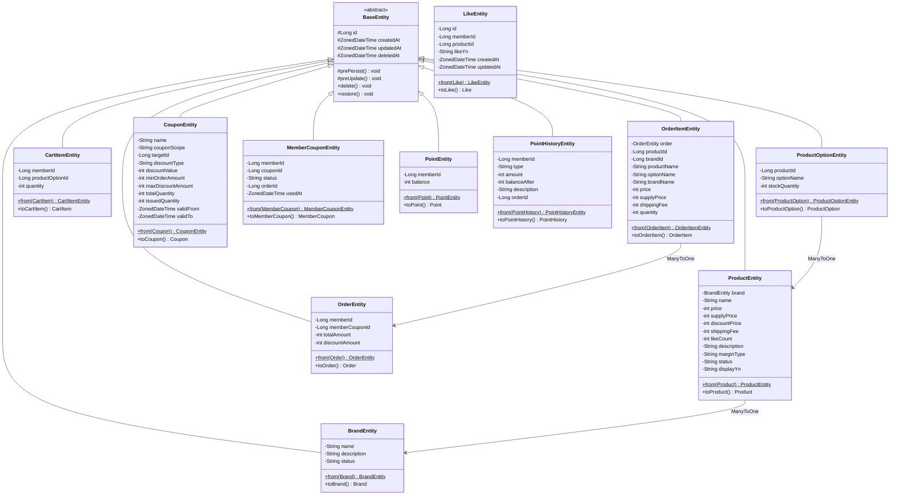

# 클래스 다이어그램 - 고객 서비스 + 어드민 서비스

> 기존 Layered Architecture 패턴을 따르며, 도메인 모델과 JPA 엔티티를 분리한다.
> 각 클래스는 단일 책임을 가지며, 도메인 모델에 비즈니스 로직을 배치한다.

---

## 전체 구조 Overview

```mermaid
classDiagram
    direction TB

    namespace Interfaces {
        class BrandV1Controller
        class ProductV1Controller
        class CartV1Controller
        class OrderV1Controller
        class CouponV1Controller
    }

    namespace Application {
        class BrandFacade
        class ProductFacade
        class CartFacade
        class OrderFacade
        class MemberFacade
        class CouponFacade
    }

    namespace Domain {
        class BrandService
        class ProductService
        class LikeService
        class CartService
        class OrderService
        class PointService
        class CouponService
    }

    namespace AdminInterfaces {
        class AdminBrandV1Controller
        class AdminProductV1Controller
        class AdminPointV1Controller
        class AdminCouponV1Controller
    }

    namespace AdminApplication {
        class AdminBrandFacade
        class AdminProductFacade
        class AdminPointFacade
        class AdminCouponFacade
    }

    namespace Auth {
        class LdapAuthService
    }

    BrandV1Controller --> BrandFacade
    ProductV1Controller --> ProductFacade
    CartV1Controller --> CartFacade
    OrderV1Controller --> OrderFacade
    CouponV1Controller --> CouponFacade

    BrandFacade --> BrandService
    ProductFacade --> ProductService
    ProductFacade --> LikeService
    CartFacade --> CartService
    OrderFacade --> OrderService
    OrderFacade --> CartService
    OrderFacade --> PointService
    OrderFacade --> CouponService
    MemberFacade --> PointService
    CouponFacade --> CouponService

    AdminBrandV1Controller --> AdminBrandFacade
    AdminProductV1Controller --> AdminProductFacade
    AdminPointV1Controller --> AdminPointFacade
    AdminCouponV1Controller --> AdminCouponFacade

    AdminBrandFacade --> BrandService
    AdminBrandFacade --> ProductService
    AdminBrandFacade --> CartService
    AdminProductFacade --> ProductService
    AdminProductFacade --> BrandService
    AdminProductFacade --> CartService
    AdminPointFacade --> PointService
    AdminCouponFacade --> CouponService
```

---

## Domain 모델

> 도메인 모델은 JPA에 의존하지 않는 순수 객체이며, 비즈니스 로직을 포함한다.

```mermaid
classDiagram
    direction TB

    class Brand {
        -Long id
        -String name
        -String description
        -BrandStatus status
        +withId(Long, String, String, BrandStatus) Brand$
        <<BrandStatus>> PENDING / ACTIVE / WITHDRAWN
    }

    class Product {
        -Long id
        -Brand brand
        -String name
        -int price
        -int supplyPrice
        -int discountPrice
        -int shippingFee
        -int likeCount
        -String description
        -MarginType marginType
        -ProductStatus status
        -String displayYn
        -List~ProductOption~ options
        +withId(...) Product$
        +calculateSupplyPrice(int price, MarginType marginType, int marginValue) int$
        +incrementLikeCount() void
        +decrementLikeCount() void
        <<MarginType>> AMOUNT / RATE
        <<ProductStatus>> ON_SALE / SOLD_OUT / DISCONTINUED
    }

    class ProductOption {
        -Long id
        -Long productId
        -String optionName
        -int stockQuantity
        +withId(...) ProductOption$
        +hasEnoughStock(int quantity) boolean
        +deductStock(int quantity) void
        +restoreStock(int quantity) void
    }

    class Like {
        -Long id
        -Long memberId
        -Long productId
        -String likeYn
        +create(Long memberId, Long productId) Like$
        +like() void
        +unlike() void
        +isLiked() boolean
    }

    class CartItem {
        -Long id
        -Long memberId
        -Long productOptionId
        -int quantity
        +create(Long memberId, Long productOptionId, int quantity) CartItem$
        +addQuantity(int quantity) void
    }

    class Order {
        -Long id
        -Long memberId
        -List~OrderItem~ orderItems
        -int totalAmount
        -int discountAmount
        -Long memberCouponId
        -int usedPoints
        +create(Long memberId, List~OrderItem~ items, int discountAmount, Long memberCouponId, int usedPoints) Order$
        +calculateTotalAmount() int
        +getPaymentAmount() int
        +validateOwner(Long memberId) void
    }

    class OrderItem {
        -Long id
        -Long brandId
        -String productName
        -String optionName
        -String brandName
        -int price
        -int supplyPrice
        -int shippingFee
        -int quantity
        +createSnapshot(Product, ProductOption, int quantity) OrderItem$
        +getSubtotal() int
    }

    class Point {
        -Long id
        -Long memberId
        -int balance
        +create(Long memberId, int initialBalance) Point$
        +charge(int amount) void
        +use(int amount) void
    }

    class PointHistory {
        -Long id
        -Long memberId
        -PointType type
        -int amount
        -int balanceAfter
        -String description
        -Long orderId
        +createCharge(Long memberId, int amount, int balanceAfter, String description) PointHistory$
        +createUse(Long memberId, int amount, int balanceAfter, String description, Long orderId) PointHistory$
    }

    class PointType {
        <<enumeration>>
        CHARGE
        USE
    }

    class Coupon {
        -Long id
        -String name
        -CouponScope couponScope
        -Long targetId
        -DiscountType discountType
        -int discountValue
        -int minOrderAmount
        -int maxDiscountAmount
        -int totalQuantity
        -int issuedQuantity
        -ZonedDateTime validFrom
        -ZonedDateTime validTo
        +create(...) Coupon$
        +withId(...) Coupon$
        +isIssuable() boolean
        +isValid() boolean
        +issue() void
        +calculateDiscount(int applicableAmount) int
    }

    class MemberCoupon {
        -Long id
        -Long memberId
        -Long couponId
        -MemberCouponStatus status
        -Long orderId
        -ZonedDateTime usedAt
        +create(Long memberId, Long couponId) MemberCoupon$
        +use(Long orderId) void
        +isAvailable() boolean
    }

    class CouponScope {
        <<enumeration>>
        PRODUCT
        BRAND
        CART
    }

    class DiscountType {
        <<enumeration>>
        FIXED_AMOUNT
        FIXED_RATE
    }

    class MemberCouponStatus {
        <<enumeration>>
        AVAILABLE
        USED
    }

    Product --> Brand : contains
    Product "1" --> "*" ProductOption : has
    Order "1" --> "*" OrderItem : has
    PointHistory --> PointType : has
    Coupon --> CouponScope : has
    Coupon --> DiscountType : has
    MemberCoupon --> MemberCouponStatus : has
```

**설계 포인트**
- **Product → Brand 직접 참조**: 상품 상세 조회 시 별도 BrandService 호출 없이 한 번에 조회
- **ProductOption에 재고 로직 배치**: `hasEnoughStock()`, `deductStock()`, `restoreStock()`으로 재고 관련 비즈니스 로직을 도메인 모델이 책임
- **Like.likeYn**: LIKE_YN 컬럼 기반 soft delete. `like()`, `unlike()`으로 상태 전환
- **OrderItem.createSnapshot()**: Product + ProductOption 정보를 스냅샷으로 복사하는 팩토리 메서드
- **CartItem.addQuantity()**: 동일 옵션 장바구니 병합 시 수량 증가
- **Point.charge()/use()**: 잔액 증감 로직을 도메인 모델이 책임. use() 시 잔액 부족이면 예외 발생
- **PointHistory 정적 팩토리**: createCharge/createUse로 충전/사용 이력 생성을 명시적으로 구분
- **Order.usedPoints**: 주문 시 사용한 포인트. 0이면 포인트 미사용
- **Order.discountAmount / memberCouponId**: 쿠폰 할인 금액과 사용된 회원쿠폰 ID. 쿠폰 미사용 시 0 / null
- **Order.getPaymentAmount()**: 실결제금액 = totalAmount - discountAmount - usedPoints
- **OrderItem.brandId**: 브랜드 ID 스냅샷. 브랜드 쿠폰 적용 대상 판별에 사용
- **Coupon.issue()**: 발급 수량 증가. 수량 초과 또는 유효기간 외이면 예외 발생
- **Coupon.calculateDiscount(applicableAmount)**: 적용 대상 금액에 대한 할인 금액 계산. FIXED_RATE 시 maxDiscountAmount 상한 적용, 적용 대상 금액 초과 방지
- **MemberCoupon.use(orderId)**: AVAILABLE → USED 상태 전환. 이미 사용된 쿠폰이면 예외 발생
- **CouponScope**: PRODUCT(특정 상품), BRAND(특정 브랜드), CART(장바구니 전체) 3단계 적용 범위

---

## Domain 검색 조건

---

## Domain Service

```mermaid
classDiagram
    direction TB

    class BrandService {
        -BrandRepository brandRepository
        +getBrand(Long brandId) Brand
    }

    class ProductService {
        -ProductRepository productRepository
        +getProducts(ProductSearchCondition, Pageable) Page~Product~
        +getProduct(Long productId) Product
    }

    class LikeService {
        -LikeRepository likeRepository
        -ProductRepository productRepository
        +like(Long memberId, Long productId) void
        +unlike(Long memberId, Long productId) void
        +getLikedProducts(Long memberId, Pageable) Page~Product~
    }

    class CartService {
        -CartRepository cartRepository
        -ProductRepository productRepository
        +addToCart(Long memberId, Long productId, Long optionId, int quantity) void
    }

    class OrderService {
        -OrderRepository orderRepository
        -ProductRepository productRepository
        +createOrder(Member member, List orderItems) Order
        +getOrders(Long memberId, LocalDate startAt, LocalDate endAt, Pageable) Page~Order~
        +getOrderDetail(Long memberId, Long orderId) Order
    }

    class BrandRepository {
        <<interface>>
        +findById(Long id) Optional~Brand~
    }

    class ProductRepository {
        <<interface>>
        +findAll(ProductSearchCondition, Pageable) Page~Product~
        +findById(Long id) Optional~Product~
        +findOptionById(Long productId, Long optionId) Optional~ProductOption~
    }

    class LikeRepository {
        <<interface>>
        +findByMemberIdAndProductId(Long, Long) Optional~Like~
        +findLikedProductsByMemberId(Long, Pageable) Page~Product~
        +save(Like) Like
    }

    class CartRepository {
        <<interface>>
        +findByMemberIdAndOptionId(Long, Long) Optional~CartItem~
        +save(CartItem) CartItem
        +deleteByIds(List~Long~) void
    }

    class OrderRepository {
        <<interface>>
        +save(Order) Order
        +findByMemberIdAndDateRange(Long, LocalDate, LocalDate, Pageable) Page~Order~
        +findByIdAndMemberId(Long, Long) Optional~Order~
    }

    class PointService {
        -PointRepository pointRepository
        -PointHistoryRepository pointHistoryRepository
        +chargePoint(Long memberId, int amount, String description) void
        +usePoint(Long memberId, int amount, Long orderId) void
        +getBalance(Long memberId) int
        +createInitialPoint(Long memberId) void
    }

    class PointRepository {
        <<interface>>
        +findByMemberId(Long memberId) Optional~Point~
        +save(Point) Point
    }

    class PointHistoryRepository {
        <<interface>>
        +save(PointHistory) PointHistory
    }

    class CouponService {
        -CouponRepository couponRepository
        -MemberCouponRepository memberCouponRepository
        +createCoupon(Coupon) Coupon
        +getCoupons(Pageable) Page~Coupon~
        +getCoupon(Long couponId) Coupon
        +getAvailableCoupons() List~Coupon~
        +downloadCoupon(Long memberId, Long couponId) MemberCoupon
        +getMyAvailableCoupons(Long memberId) List~MemberCoupon~
        +getMemberCoupon(Long memberCouponId) MemberCoupon
        +useCoupon(Long memberCouponId, Long orderId) void
    }

    class CouponRepository {
        <<interface>>
        +findById(Long id) Optional~Coupon~
        +findAllValid() List~Coupon~
        +findAll(Pageable) Page~Coupon~
        +save(Coupon) Coupon
    }

    class MemberCouponRepository {
        <<interface>>
        +findById(Long id) Optional~MemberCoupon~
        +findByMemberIdAndCouponId(Long, Long) Optional~MemberCoupon~
        +findByMemberIdAndStatus(Long, MemberCouponStatus) List~MemberCoupon~
        +save(MemberCoupon) MemberCoupon
    }

    BrandService --> BrandRepository
    ProductService --> ProductRepository
    LikeService --> LikeRepository
    LikeService --> ProductRepository
    CartService --> CartRepository
    CartService --> ProductRepository
    OrderService --> OrderRepository
    OrderService --> ProductRepository
    PointService --> PointRepository
    PointService --> PointHistoryRepository
    CouponService --> CouponRepository
    CouponService --> MemberCouponRepository
```

**설계 포인트**
- **Repository는 도메인 레이어에 인터페이스로 정의**: DIP 준수. 구현체는 Infrastructure
- **Domain Service는 자기 도메인 Repository만 의존하는 것을 원칙으로 함**: 크로스 도메인 조율은 Facade에서 처리
- **LikeService → ProductRepository 의존**: 좋아요 등록 시 상품 존재 검증 (읽기 전용 검증이므로 허용)
- **CartService → ProductRepository 의존**: 장바구니 담기 시 재고 검증 (읽기 전용 검증이므로 허용)
- **OrderService → ProductRepository 의존**: 재고 검증/차감이 주문 생성과 원자적 트랜잭션으로 묶여야 하므로 허용. 장바구니 삭제는 Facade에서 처리
- **PointService**: 포인트 충전/사용/조회를 담당. 자기 도메인 Repository(PointRepository, PointHistoryRepository)만 의존
- **포인트 사용은 Facade에서 PointService를 호출하여 처리**: OrderFacade가 OrderService + PointService를 조율
- **CouponService**: 쿠폰 생성/조회/발급/사용을 담당. CouponRepository + MemberCouponRepository 의존
- **쿠폰 사용은 Facade에서 CouponService를 호출하여 처리**: OrderFacade가 OrderService + CouponService + PointService를 조율

---

## Application Layer (Facade + Info)

```mermaid
classDiagram
    direction TB

    class BrandFacade {
        -BrandService brandService
        +getBrand(Long brandId) BrandInfo
    }

    class ProductFacade {
        -ProductService productService
        -LikeService likeService
        +getProducts(ProductSearchCondition, Pageable) Page~ProductInfo~
        +getProduct(Long productId) ProductDetailInfo
        +like(Member member, Long productId) void
        +unlike(Member member, Long productId) void
        +getLikedProducts(Member member, Pageable) Page~LikedProductInfo~
    }

    class CartFacade {
        -CartService cartService
        +addToCart(Member member, Long productId, Long optionId, int quantity) void
    }

    class OrderFacade {
        -OrderService orderService
        -CartService cartService
        -PointService pointService
        -CouponService couponService
        +createOrder(Member member, OrderRequest) OrderInfo
        +getOrders(Member member, LocalDate, LocalDate, Pageable) Page~OrderInfo~
        +getOrderDetail(Member member, Long orderId) OrderDetailInfo
    }

    class CouponFacade {
        -CouponService couponService
        +getAvailableCoupons() List~CouponInfo~
        +downloadCoupon(Member member, Long couponId) MemberCouponInfo
        +getMyAvailableCoupons(Member member) List~MyCouponInfo~
    }

    class BrandInfo {
        <<record>>
        +Long id
        +String name
        +String description
        +from(Brand) BrandInfo$
    }

    class ProductInfo {
        <<record>>
        +Long id
        +String name
        +int price
        +int likeCount
        +String brandName
        +from(Product) ProductInfo$
    }

    class ProductDetailInfo {
        <<record>>
        +Long id
        +String name
        +int price
        +int supplyPrice
        +int shippingFee
        +int likeCount
        +String description
        +BrandInfo brand
        +List~OptionInfo~ options
        +from(Product) ProductDetailInfo$
    }

    class OrderInfo {
        <<record>>
        +Long id
        +int totalAmount
        +int discountAmount
        +int usedPoints
        +ZonedDateTime createdAt
        +from(Order) OrderInfo$
    }

    class OrderDetailInfo {
        <<record>>
        +Long id
        +int totalAmount
        +int discountAmount
        +int usedPoints
        +List~OrderItemInfo~ items
        +ZonedDateTime createdAt
        +from(Order) OrderDetailInfo$
    }

    class CouponInfo {
        <<record>>
        +Long id
        +String name
        +CouponScope couponScope
        +DiscountType discountType
        +int discountValue
        +int minOrderAmount
        +int maxDiscountAmount
        +ZonedDateTime validFrom
        +ZonedDateTime validTo
        +int remainingQuantity
        +from(Coupon) CouponInfo$
    }

    class MemberCouponInfo {
        <<record>>
        +Long id
        +Long couponId
        +String couponName
        +MemberCouponStatus status
    }

    class MyCouponInfo {
        <<record>>
        +Long memberCouponId
        +String couponName
        +CouponScope couponScope
        +DiscountType discountType
        +int discountValue
        +int minOrderAmount
        +int maxDiscountAmount
        +ZonedDateTime validTo
    }

    class CouponDetailInfo {
        <<record>>
        +Long id
        +String name
        +CouponScope couponScope
        +Long targetId
        +DiscountType discountType
        +int discountValue
        +int minOrderAmount
        +int maxDiscountAmount
        +int totalQuantity
        +int issuedQuantity
        +ZonedDateTime validFrom
        +ZonedDateTime validTo
    }

    BrandFacade --> BrandInfo
    ProductFacade --> ProductInfo
    ProductFacade --> ProductDetailInfo
    OrderFacade --> OrderInfo
    OrderFacade --> OrderDetailInfo
    CouponFacade --> CouponInfo
    CouponFacade --> MemberCouponInfo
    CouponFacade --> MyCouponInfo
```

**설계 포인트**
- **Facade는 서비스 조율 + 변환 담당**: 인증은 Interceptor/ArgumentResolver에서 처리. Facade는 인증된 Member/Admin을 파라미터로 받음
- **크로스 도메인 조율은 Facade에서 처리**: 주문 시 장바구니 삭제(`OrderFacade` → `CartService`), 주문 시 포인트 사용(`OrderFacade` → `PointService`), 주문 시 쿠폰 검증/적용(`OrderFacade` → `CouponService`), 회원가입 시 초기 포인트 지급(`MemberFacade` → `PointService`), 브랜드/상품 삭제 cascade(`AdminBrandFacade` → `ProductService` + `CartService`) 등
- **Info 객체는 record**: 불변. 도메인 모델 → 응답용 데이터 변환을 `from()` 팩토리로 수행
- **ProductInfo vs ProductDetailInfo 분리**: 목록용(간략)과 상세용(브랜드+옵션 포함) 구분

---

## Infrastructure Layer

**설계 포인트**
- **모든 Entity는 BaseEntity 상속**: id, createdAt, updatedAt, deletedAt 공통 관리. 단, **LikeEntity는 예외** — LIKE_YN으로 상태 관리하므로 soft delete 불필요, BaseEntity 상속 없이 독립 관리
- **Entity ↔ Domain 변환**: `from()` / `toXxx()` 메서드로 양방향 변환
- **JPA 연관관계**: ProductEntity → BrandEntity (ManyToOne), ProductOptionEntity → ProductEntity (ManyToOne), OrderItemEntity → OrderEntity (ManyToOne)
- **LikeEntity, CartItemEntity**: memberId를 Long으로 보유 (Member 엔티티와 직접 연관관계 대신 ID 참조)

---

## 어드민 전용 레이어 (Interfaces + Application)

> 어드민은 별도 Controller와 Facade를 가지며, Service/Repository는 고객 서비스와 공유한다.
> 인증은 LdapAuthService 인터페이스를 통해 처리한다.

```mermaid
classDiagram
    direction TB

    class LdapAuthService {
        <<interface>>
        +authenticate(String ldapHeader) Admin
    }

    class FakeLdapAuthService {
        +authenticate(String ldapHeader) Admin
    }

    class Admin {
        <<record>>
        +String ldapId
    }

    class AdminBrandV1Controller {
        +getBrands(@LoginAdmin Admin, Pageable) ApiResponse
        +getBrand(@LoginAdmin Admin, Long brandId) ApiResponse
        +createBrand(@LoginAdmin Admin, Request) ApiResponse
        +updateBrand(@LoginAdmin Admin, Long brandId, Request) ApiResponse
        +deleteBrand(@LoginAdmin Admin, Long brandId) ApiResponse
    }

    class AdminProductV1Controller {
        +getProducts(@LoginAdmin Admin, AdminProductSearchCondition, Pageable) ApiResponse
        +getProduct(@LoginAdmin Admin, Long productId) ApiResponse
        +createProduct(@LoginAdmin Admin, Request) ApiResponse
        +updateProduct(@LoginAdmin Admin, Long productId, Request) ApiResponse
        +deleteProduct(@LoginAdmin Admin, Long productId) ApiResponse
    }

    class AdminBrandFacade {
        -BrandService brandService
        -ProductService productService
        -CartService cartService
        +getBrands(Pageable) Page~BrandInfo~
        +getBrand(Long brandId) BrandInfo
        +createBrand(String name, String description) BrandInfo
        +updateBrand(Long brandId, String name, String description) BrandInfo
        +deleteBrand(Long brandId) void
    }

    class AdminProductFacade {
        -ProductService productService
        -BrandService brandService
        -CartService cartService
        +getProducts(AdminProductSearchCondition, Pageable) Page~ProductInfo~
        +getProduct(Long productId) ProductDetailInfo
        +createProduct(Request) ProductDetailInfo
        +updateProduct(Long productId, Request) ProductDetailInfo
        +deleteProduct(Long productId) void
    }

    class AdminPointV1Controller {
        +chargePoint(@LoginAdmin Admin, Request) ApiResponse
    }

    class AdminCouponV1Controller {
        +createCoupon(@LoginAdmin Admin, Request) ApiResponse
        +getCoupons(@LoginAdmin Admin, Pageable) ApiResponse
        +getCoupon(@LoginAdmin Admin, Long couponId) ApiResponse
    }

    class AdminPointFacade {
        -PointService pointService
        +chargePoint(Long memberId, int amount, String description) void
    }

    class AdminCouponFacade {
        -CouponService couponService
        +createCoupon(Request) CouponInfo
        +getCoupons(Pageable) Page~CouponInfo~
        +getCoupon(Long couponId) CouponDetailInfo
    }

    class CouponV1Controller {
        +getAvailableCoupons() ApiResponse
        +downloadCoupon(@LoginMember Member, Long couponId) ApiResponse
        +getMyCoupons(@LoginMember Member) ApiResponse
    }

    LdapAuthService <|.. FakeLdapAuthService : implements
    LdapAuthService --> Admin

    AdminBrandV1Controller --> AdminBrandFacade
    AdminProductV1Controller --> AdminProductFacade
    AdminPointV1Controller --> AdminPointFacade
    AdminCouponV1Controller --> AdminCouponFacade

    AdminBrandFacade --> BrandService
    AdminBrandFacade --> ProductService
    AdminBrandFacade --> CartService
    AdminProductFacade --> ProductService
    AdminProductFacade --> BrandService
    AdminProductFacade --> CartService
    AdminPointFacade --> PointService
    AdminCouponFacade --> CouponService
    CouponV1Controller --> CouponFacade
```

**설계 포인트**
- **LdapAuthService 인터페이스**: DIP 준수. Fake 구현에서 헤더 값(`loopers.admin`) 검증만 수행. AdminAuthInterceptor에서 호출
- **Service/Repository 공유**: 어드민과 고객 서비스가 동일한 BrandService, ProductService 사용. 비즈니스 로직 중복 없음
- **AdminFacade는 인증 무관**: Interceptor에서 인증 완료 후 Controller가 @LoginAdmin Admin을 받고, Facade에는 비즈니스 파라미터만 전달
- **AdminFacade가 크로스 도메인 조율 담당**: 브랜드 삭제 시 `AdminBrandFacade`가 BrandService + ProductService + CartService를 조율, 상품 등록 시 `AdminProductFacade`가 BrandService로 브랜드 존재 확인 후 ProductService에 전달
- **AdminPointFacade**: 어드민 포인트 지급 전용. PointService만 의존하여 단순 위임
- **AdminCouponFacade**: 어드민 쿠폰 생성/조회 전용. CouponService만 의존하여 단순 위임
- **CouponV1Controller**: 대고객 쿠폰 목록 조회(인증 불필요), 다운로드/내 쿠폰 조회(인증 필요)
