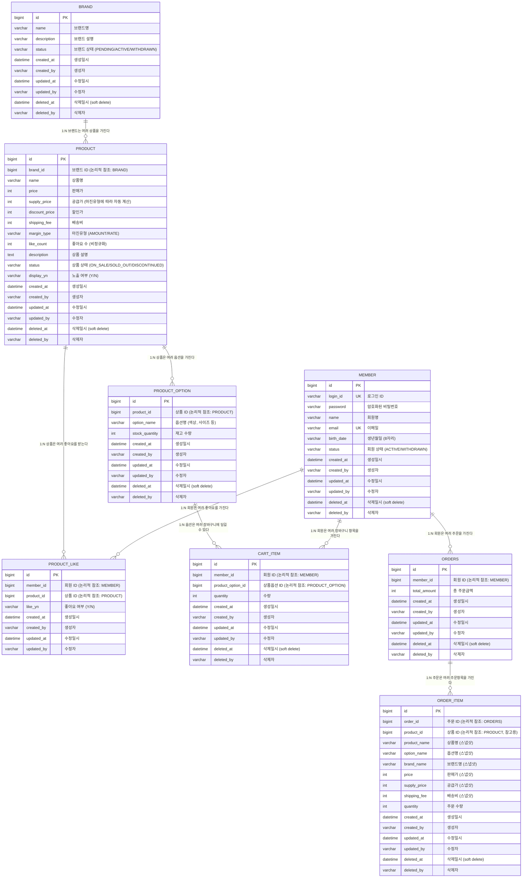

# ERD - 고객 서비스

> 모든 테이블은 BaseEntity 패턴을 따른다 (id, created_at, created_by, updated_at, updated_by, deleted_at, deleted_by).
> Soft Delete 방식: deleted_at이 null이 아니면 삭제된 데이터.
> created_by, updated_by, deleted_by는 해당 작업을 수행한 사용자 식별자를 저장한다.
> **물리적 FK 제약조건은 사용하지 않는다.** 참조 무결성은 애플리케이션 레벨(Service)에서 검증한다. ERD의 관계선은 논리적 참조 관계를 나타낸다.

---

## ERD 다이어그램

---

## 테이블별 설계 해석

### BRAND
- 상품의 소속 브랜드. 어드민에서 CRUD 관리
- `status`: 브랜드 상태 (PENDING: 대기, ACTIVE: 진행중, WITHDRAWN: 퇴점)

### PRODUCT
- `brand_id`로 브랜드에 종속 (논리적 참조, 물리 FK 없음)
- `like_count`: 비정규화 필드. 좋아요 등록/취소 시 증감하여 정렬 성능 확보
- `price`, `supply_price`, `shipping_fee`: 가격 관련 필드를 상품 레벨에서 관리
- `margin_type`: 마진유형 (AMOUNT: 마진액, RATE: 마진율). 상품 등록 시 마진유형과 마진값을 입력받아 공급가를 자동 계산
  - AMOUNT: `supply_price = price - marginValue`
  - RATE: `supply_price = price - (price × marginRate / 100)`
- `discount_price`: 할인가
- `status`: 상품 상태 (ON_SALE: 판매중, SOLD_OUT: 품절, DISCONTINUED: 판매중지)
- `display_yn`: 노출 여부. status와 독립적으로 관리 (판매중이지만 비노출 가능)

### PRODUCT_OPTION
- 상품의 하위 옵션 (색상, 사이즈 등)
- `stock_quantity`: **재고는 옵션 단위로 관리**. 장바구니/주문 시 이 값을 기준으로 검증 및 차감

### PRODUCT_LIKE
- `member_id + product_id` 복합 유니크 제약 권장
- `like_yn`: 'Y'/'N'으로 좋아요 상태 관리. 물리 삭제하지 않고 상태 전환

### CART_ITEM
- `member_id + product_option_id` 복합 유니크 제약 권장
- 동일 회원 + 동일 옵션이면 수량만 증가
- 주문 완료 시 해당 항목 삭제

### ORDERS
- 테이블명 `ORDERS` 사용 (ORDER는 SQL 예약어)
- `total_amount`: 주문 시점의 총 금액

### ORDER_ITEM
- **스냅샷 테이블**: 주문 시점의 상품/옵션/브랜드/가격 정보를 그대로 복사
- 원본 상품이 변경/삭제되어도 주문 이력에 영향 없음
- `product_id`: 참고용 원본 상품 참조. 스냅샷 독립성은 유지하되, 통계/분석/상품 링크에 활용. 물리 FK 없음

---

## 주요 설계 결정

| 항목 | 결정 | 이유 |
|------|------|------|
| **재고 관리 단위** | ProductOption | 같은 상품이라도 옵션별 재고가 다를 수 있음 |
| **좋아요 관리** | LIKE_YN 컬럼 | 이력 보존 + Insert/Update 분기 |
| **좋아요 수** | Product.like_count 비정규화 | 좋아요수 정렬 시 COUNT 집계 쿼리 회피 |
| **주문 스냅샷** | ORDER_ITEM에 필드 복사 | 가격 변경/상품 삭제에 독립적인 주문 이력 |
| **장바구니 단위** | ProductOption 기준 | 같은 상품이라도 옵션이 다르면 별도 항목 |
| **ORDER 테이블명** | ORDERS | SQL 예약어 충돌 회피 |
| **물리 FK 미사용** | 논리적 참조만 유지 | 쓰기 성능 확보, Soft Delete 호환, DB 분리 대비 |
| **ORDER_ITEM 참조** | order_id + product_id (참고용) | 스냅샷 독립성 유지 + 통계/분석/상품 링크 활용 |

---

## 인덱스 권장

| 테이블 | 인덱스 | 용도 |
|--------|--------|------|
| BRAND | status | 브랜드 상태별 조회 (어드민) |
| PRODUCT | brand_id | 브랜드별 상품 필터링 |
| PRODUCT | name | 상품명 검색 (keyword) |
| PRODUCT | status | 상품 상태별 조회 (어드민) |
| PRODUCT | display_yn | 노출 여부별 조회 (어드민) |
| PRODUCT_LIKE | member_id, product_id (UNIQUE) | 중복 좋아요 방지 + 조회 |
| PRODUCT_LIKE | member_id, like_yn | 좋아요한 상품 목록 조회 |
| CART_ITEM | member_id, product_option_id (UNIQUE) | 중복 장바구니 방지 + 조회 |
| ORDERS | member_id, created_at | 기간별 주문 목록 조회 |
| ORDER_ITEM | order_id | 주문 상세 조회 |
