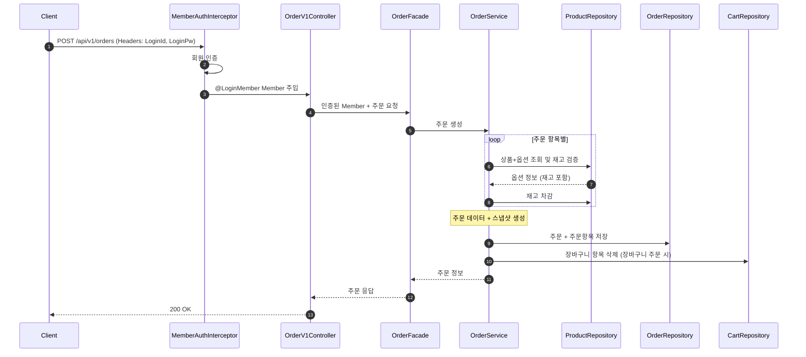

## 📌 Summary

- 배경: 이커머스 고객 서비스(브랜드/상품 조회, 좋아요, 장바구니, 주문) + 어드민 서비스(브랜드/상품 CRUD)의 설계가 필요했다.
- 목표: 요구사항을 분석하고, 시퀀스 다이어그램 / 클래스 다이어그램 / ERD를 작성하여 구현 전 설계를 한다.
- 결과: 요구사항 정의서 1건, 시퀀스 다이어그램 20건(고객 10 + 어드민 10), 클래스 다이어그램(Domain/Application/Infrastructure/Admin), ERD 8개 테이블 설계 완료.

## 💬 리뷰 포인트

1. **인증 처리 위치**: Facade에서 매번 `authenticate()` 호출하던 구조를 Interceptor + ArgumentResolver로 변경했는데, 이 분리가 적절한지 (의사결정 50번)
2. **물리 FK 미사용 + 애플리케이션 레벨 참조 무결성 검증**: Service에서 존재 여부를 확인하는 방식으로 충분한지, 놓치는 케이스가 없는지 (의사결정 35번)
3. **OrderService의 의존 범위**: ProductRepository + OrderRepository + CartRepository를 한 Service가 갖는 구조에서, Application Service 레이어 분리 없이 현행 유지한 판단이 적절한지 (의사결정 36번)

## 🧭 Context & Decision

### 문제 정의
- 현재 동작/제약: 1주차 회원가입/내정보조회/비밀번호변경 기능이 TDD로 구현되어 있으며, Layered Architecture(Controller → Facade → Service → Repository) 패턴이 확립되어 있음
- 문제(또는 리스크): 이커머스 핵심 도메인(브랜드, 상품, 좋아요, 장바구니, 주문)에 대한 설계 없이 구현에 들어가면 요구사항 해석 차이, 레이어 간 책임 혼재, 테이블 구조 변경 등 되돌리기 비용이 큼
- 성공 기준(완료 정의): 시퀀스/클래스/ERD 다이어그램이 요구사항을 빠짐없이 커버하고, 애매한 요구사항에 대한 의사결정이 근거와 함께 기록됨

### 선택지와 결정

**핵심 의사결정 요약 (50건 중 주요)**

| # | 주제 | 선택지 | 결정 | 근거 |
|---|------|--------|------|------|
| 4 | 좋아요수 정렬 | A: Product.likeCount 비정규화 / B: Like 테이블 COUNT 집계 | A (비정규화) | 정렬 성능 확보. COUNT 집계는 상품 수 증가 시 쿼리 비용이 급증 |
| 7 | Product-Brand 관계 | A: Brand 객체 직접 포함 / B: brandId만 보유, Facade에서 조합 | A (직접 포함) | 커머스에서 상품은 항상 브랜드에 속함. 한 번의 조회로 상세 정보 해결 |
| 8 | 상품 옵션 구조 | 단일 상품 구조 / Product-ProductOption 1:N | 1:N 관계 도입 | 재고를 옵션 단위로 관리. 장바구니/주문도 옵션 단위로 처리 |
| 15 | 주문 방식 | A: 단건/장바구니 엔드포인트 분리 / B: 단일 엔드포인트 | B (단일 엔드포인트) | `POST /api/v1/orders` body에 cartItemIds[] 또는 productId+optionId+quantity로 분기 |
| 20 | 타인 주문 접근 방지 | A: Service에서 memberId 비교 검증 / B: Repository 쿼리에서 처리 | B (findByIdAndMemberId) | 한 번의 쿼리로 검증+조회 동시 처리. 타인에게 주문 존재 여부조차 비노출 |
| 26 | 브랜드 삭제 시 연관 데이터 | A: 전체 cascade 삭제 / B: 장바구니만 hard delete, 좋아요 유지 | B (선택적 삭제) | 좋아요 이력은 보존 가치가 있음. 조회 시 삭제된 상품은 필터링 |
| 30 | 상품 수정 시 브랜드 변경 방지 | A: 요청 무시 / B: 에러 반환 / C: DTO에서 필드 제외 | C (DTO에서 제외) | brandId 필드 자체를 받지 않아 원천 차단. 클라이언트가 실수할 여지 없음 |
| 35 | FK 제약조건 | A: 물리 FK 사용 / B: 논리적 참조만 유지 | B (물리 FK 미사용) | 쓰기 성능, Soft Delete 호환, DB 분리 대비. 무결성은 Service 레벨에서 검증 |
| 46 | 상품 가격 정책 | 공급가 직접 입력 / marginType+marginValue로 자동 계산 | 자동 계산 | AMOUNT: price-marginValue, RATE: price-(price×rate/100). 입력 오류 방지 |
| 50 | 인증 처리 위치 | A: Facade에서 authenticate() 호출 / B: Interceptor+ArgumentResolver | B (Interceptor) | 횡단 관심사 분리. 모든 Facade의 인증 코드 중복 제거. 비즈니스 로직에 집중 |

- 트레이드오프: likeCount 비정규화로 정합성 리스크 수용 (동시성 이슈 시 비관적 락 검토 필요), 서비스 간 Repository 의존(LikeService/CartService/OrderService → ProductRepository) 수용, Product→Brand 직접 참조로 도메인 간 결합 수용
- 추후 개선 여지: 주문 트랜잭션 분리(이벤트 기반), likeCount 동시성 처리(비관적 락 또는 별도 집계), 도메인 성장 시 Application Service 레이어 분리 검토

## 🏗️ Design Overview

### 변경 범위
- 영향 받는 모듈/도메인: commerce-api (브랜드, 상품, 좋아요, 장바구니, 주문)
- 신규 추가:
  - `docs/design/01-requirements.md` — 요구사항 정의서
  - `docs/design/02-sequence-diagrams.md` — 시퀀스 다이어그램 20건
  - `docs/design/03-class-diagram.md` — 클래스 다이어그램
  - `docs/design/04-erd.md` — ERD 다이어그램
  - `docs/week2.md` — 설계 의사결정 기록 (50건)
- 제거/대체: 없음 (설계 문서만 추가)

### 주요 컴포넌트 책임
- `BrandService / ProductService`: 도메인 비즈니스 로직 + Repository 조합. 고객/어드민 서비스가 공유
- `LikeService / CartService / OrderService`: 각 도메인 로직 담당. ProductRepository 의존으로 상품 존재 검증 및 재고 확인
- `Facade (Brand/Product/Cart/Order)`: 서비스 조율 + Domain→Info 변환. 인증에 관여하지 않음
- `AdminBrandFacade / AdminProductFacade`: 어드민 전용 Facade. Service는 고객 서비스와 공유
- `MemberAuthInterceptor / AdminAuthInterceptor`: 인증 처리. ArgumentResolver를 통해 Controller에 인증 객체 주입

## 🔁 Flow Diagram

### Main Flow (주문 요청 — 가장 복잡한 핵심 경로)

