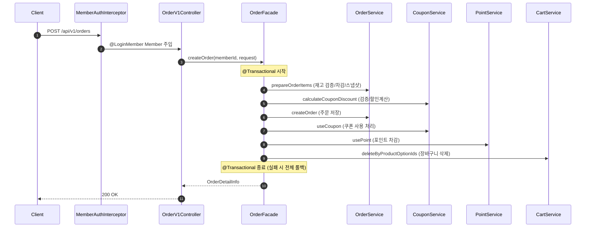

## 📌 Summary

- 배경: 2주차에 설계한 이커머스 도메인(브랜드, 상품, 좋아요, 장바구니, 쿠폰, 포인트, 주문)의 구현이 필요했다.
- 목표: 설계 문서를 기반으로 8개 도메인의 전 레이어(Domain → Infrastructure → Application → Interfaces)를 TDD로 구현하고, 단위/통합/E2E 테스트를 작성한다.
- 결과: 8개 도메인, 대고객 API 11개 + 어드민 API 12개 구현 완료. 전체 516개 테스트 통과.

## 💬 리뷰 포인트

1. **Domain Model + JPA Entity 통합**: 기존 Domain/Entity 분리 구조를 ExampleModel 패턴에 맞춰 통합했는데, DIP 관점에서 Domain 레이어에 JPA 어노테이션이 위치하는 트레이드오프가 적절한지
2. **Domain Service @Transactional 제거**: 트랜잭션 경계를 Facade로 올려 DIP를 준수했는데, Domain Service 단독 호출 시 트랜잭션 누락 가능성은 없는지
3. **쿠폰 할인 계산 로직 위치**: OrderFacade에서 CouponService로 이동한 판단이 적절한지, `calculateApplicableAmount`는 Facade에 유지한 근거가 타당한지
4. **ProductOption N+1 → IN절 배치 로딩**: fetch join 대신 IN절 + Application 단 조립 방식을 선택한 판단이 적절한지

## 🧭 Context & Decision

### 문제 정의
- 현재 동작/제약: 1~2주차에 회원 도메인 구현 및 전체 도메인 설계가 완료되어 있으며, Layered Architecture + DIP 패턴이 확립됨
- 문제(또는 리스크): 8개 도메인 간 협력 관계(주문 시 재고차감→쿠폰적용→포인트차감→장바구니삭제)가 복잡하여, 트랜잭션 경계와 레이어 간 책임 분리를 명확히 해야 함
- 성공 기준: 모든 비즈니스 규칙이 도메인 레이어에 캡슐화되고, Facade는 조율만 담당하며, 전체 테스트가 통과함

### 선택지와 결정

| 주제 | 선택지 | 결정 | 근거 |
|------|--------|------|------|
| Domain/Entity 구조 | A: 분리 유지 / B: 통합 | B (통합) | 필드 추가 시 3곳→1곳 수정, 변환 보일러플레이트 제거, ExampleModel 패턴 일관성 |
| @Transactional 위치 | A: Domain Service / B: Facade | B (Facade) | DIP 준수, 크로스 도메인 트랜잭션 롤백 보장, 트랜잭션 경계 명확화 |
| 쿠폰 할인 계산 | A: Facade에서 처리 / B: CouponService 위임 | B (CouponService) | 도메인 비즈니스 로직은 Service가 담당, 재사용성 확보 |
| N+1 쿼리 해결 | A: fetch join / B: IN절 배치 로딩 | B (IN절 배치) | 컬렉션 조인 페이징 문제 회피, default_batch_fetch_size 설정과 일관 |

- 트레이드오프: Domain에 JPA 어노테이션 의존 수용, Facade 없이 Service 단독 호출 시 트랜잭션 직접 관리 필요
- 추후 개선 여지: QueryDSL 기반 Product search/adminSearch 동적 쿼리 구현, Like findLikedProducts QueryDSL 구현, 주문 동시성 처리(비관적 락)

## 🏗️ Design Overview

### 변경 범위
- 영향 받는 모듈/도메인: commerce-api (인증, 브랜드, 상품, 좋아요, 장바구니, 쿠폰, 포인트, 주문), modules/jpa (BaseEntity)
- 신규 추가: 210개 파일 (Domain Model, Repository, Service, Facade, Controller, DTO, 테스트)
- 수정: BaseEntity id final 제거, WebMvcConfig 인터셉터 등록, Member/ExampleService 리팩토링
- 제거: MemberEntity.java (Domain Model로 통합)

### 주요 컴포넌트 책임

**Domain Layer**
- `Brand`, `Product`, `ProductOption`, `Like`, `CartItem`, `Order`, `OrderItem`, `Point`, `PointHistory`, `Coupon`, `MemberCoupon` — 비즈니스 규칙 캡슐화
- `BrandService`, `ProductService`, `LikeService`, `CartService`, `OrderService`, `PointService`, `CouponService` — 도메인 로직 조율

**Application Layer**
- `BrandFacade/AdminBrandFacade`, `ProductFacade/AdminProductFacade`, `CartFacade`, `CouponFacade/AdminCouponFacade`, `AdminPointFacade`, `OrderFacade` — 크로스 도메인 조율 + @Transactional 경계 + Domain→Info 변환

**Infrastructure Layer**
- 각 도메인별 `JpaRepository` + `RepositoryImpl` — DIP 구현체

**Interfaces Layer**
- 대고객 Controller 6개 + 어드민 Controller 4개 + Auth Interceptor/ArgumentResolver

### 테스트 전략

| 레이어 | 테스트 수 | 테스트 더블 |
|--------|----------|------------|
| Domain Model (Unit) | 11개 클래스 | 없음 |
| Domain Service (Unit) | 7개 클래스 | Mock (Repository) |
| Application Facade (Unit) | 10개 클래스 | Mock (Service) |
| Controller (MockMvc) | 10개 클래스 | MockBean |
| Integration (Testcontainers) | 7개 클래스 | 없음 |
| E2E (Testcontainers) | 9개 클래스 | 없음 |

## 🔁 Flow Diagram

### Main Flow (주문 생성 — 크로스 도메인 조율)

## ✅ Checklist

- [x] 상품 정보 객체는 브랜드 정보, 좋아요 수를 포함한다
- [x] 상품의 정렬 조건(latest, price_asc, likes_desc)을 고려한 조회 기능을 설계했다
- [x] 재고의 음수 방지 처리는 도메인 레벨에서 처리된다
- [x] 좋아요는 유저와 상품 간의 관계로 별도 도메인으로 분리했다
- [x] 주문은 여러 상품을 포함할 수 있으며, 각 상품의 수량을 명시한다
- [x] 재고 부족, 포인트 부족 등 예외 흐름을 고려해 설계되었다
- [x] 쿠폰 적용 범위(PRODUCT/BRAND/CART)에 따른 할인 금액 계산 로직이 구현되었다
- [x] 정액/정률 할인이 올바르게 계산되고, 최대 할인 금액 제한이 적용된다
- [x] 쿠폰 다운로드 시 수량 제한 및 중복 방지가 구현되었다
- [x] 실결제금액 = totalAmount - discountAmount - usedPoints 공식이 적용된다
- [x] 핵심 비즈니스 로직은 Entity, VO, Domain Service에 위치한다
- [x] Repository Interface는 Domain Layer에 정의되고, 구현체는 Infrastructure에 위치한다
- [x] 테스트는 외부 의존성을 분리하고, Mock/Stub을 사용해 단위 테스트가 가능하게 구성되었다

