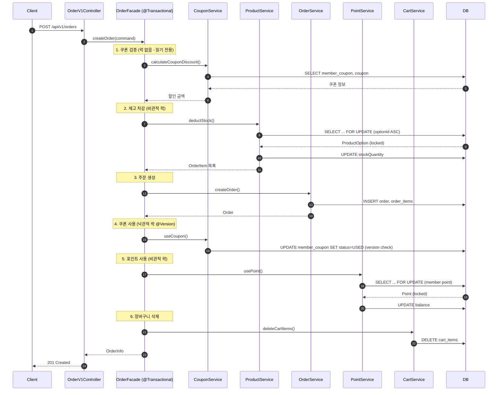
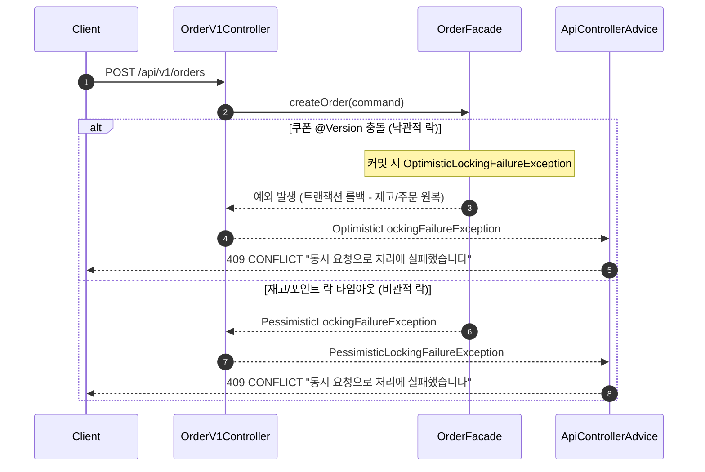

## 📌 Summary

- 배경: 주문 시 쿠폰 적용, 재고 차감, 포인트 사용 등 여러 도메인을 조율하는 과정에서 동시성 이슈(Lost Update, TOCTOU, 초과 판매)가 발생할 수 있는 구조였음. 또한 쿠폰 도메인의 어드민 CRUD와 대고객 API가 미완성 상태.
- 목표: 쿠폰 기능 완성(어드민 수정/삭제/발급내역 조회, 대고객 내 쿠폰 목록 조회), 주문 트랜잭션 원자성 보장, 도메인별 동시성 제어 전략 적용
- 결과: 비관적 락(재고, 포인트, 어드민 쿠폰), 낙관적 락(쿠폰 사용), Atomic UPDATE(좋아요), 원자적 UPSERT(장바구니) 적용 완료. 동시성 통합 테스트 7개 시나리오 모두 통과.

## 🧭 Context & Decision

### 문제 정의
- 현재 동작/제약: 주문 생성 시 재고 확인/차감, 쿠폰 검증/사용, 포인트 차감이 락 없이 수행되어 동시 요청 시 데이터 정합성이 깨질 수 있음
- 문제(또는 리스크):
  - 재고: 동시 주문 시 같은 재고를 읽고 각각 차감하여 초과 판매 발생
  - 쿠폰: TOCTOU 취약점으로 동일 쿠폰이 여러 주문에서 사용 가능
  - 포인트: 동시 사용 시 같은 잔액을 읽고 각각 차감하여 초과 사용
  - 좋아요: Read-Modify-Write 패턴에 락이 없어 카운트 유실
  - 장바구니: Read-then-Write 패턴으로 수량 Lost Update 또는 중복 INSERT 가능
- 성공 기준(완료 정의): 모든 동시성 테스트 통과, 주문 트랜잭션 원자성 보장, 쿠폰 CRUD 완성

### 선택지와 결정

#### 재고 차감 — 비관적 락(SELECT FOR UPDATE)
- 고려한 대안:
    - A: 낙관적 락(@Version) — 충돌 시 주문 전체 롤백 필요, 인기 상품은 경합 빈도 높아 재시도 비용 과대
    - B: 비관적 락(SELECT FOR UPDATE) — 순차 대기 후 처리, 초과 판매 확실히 차단
- 최종 결정: B (비관적 락)
- 트레이드오프: 행 잠금 대기 발생하나, 초과 판매는 치명적이므로 확실한 직렬화가 우선

#### 쿠폰 사용 — 낙관적 락(@Version)
- 고려한 대안:
    - A: 낙관적 락(@Version) — 경합 빈도 극히 낮음, fail-fast 적합, DB 행 잠금 미점유
    - B: 비관적 락 — 충돌 빈도가 낮은 시나리오에서 매번 행 잠금은 과도한 오버헤드
- 최종 결정: A (낙관적 락)
- 트레이드오프: 충돌 시 주문 전체 롤백되나, 동일 쿠폰 동시 사용 빈도가 극히 낮아 수용 가능

#### 포인트 — 비관적 락(SELECT FOR UPDATE)
- 고려한 대안:
    - A: 낙관적 락 — 충돌 시 주문 전체 롤백, 포인트만 재시도 불가 (Facade 트랜잭션 내)
    - B: 비관적 락 — 회원당 1 row라 다른 회원에 영향 없음, 잔액 충분 시 순차 성공
- 최종 결정: B (비관적 락)
- 트레이드오프: 행 잠금이 걸리나 회원당 1 row이므로 사실상 대기 오버헤드 없음

#### 좋아요 — Atomic UPDATE
- 고려한 대안:
    - A: 비관적/낙관적 락 — 단순 카운터 증감에 행 잠금은 과도
    - B: Atomic UPDATE (`UPDATE SET like_count = like_count + 1`) — DB 레벨 원자적 처리, 락 오버헤드 없음
- 최종 결정: B (Atomic UPDATE)

#### 장바구니 — 원자적 UPSERT + Hard Delete
- 고려한 대안:
    - A: 원자적 UPDATE + 조건부 INSERT 분리 — `@Modifying` 트랜잭션 충돌, 비직관적 코드
    - B: INSERT ... ON DUPLICATE KEY UPDATE — 단일 원자적 쿼리, Hard Delete + UNIQUE 제약 필요
- 최종 결정: B (UPSERT + Hard Delete)
- 트레이드오프: Soft Delete 이력 포기하나, 장바구니는 임시 데이터로 삭제 이력 불필요
- 추후 개선 여지: Redis 기반 장바구니로 전환 시 DB 부하 감소 가능

## 🏗️ Design Overview

### 변경 범위
- 영향 받는 모듈/도메인: Coupon, Order, Product(재고/좋아요), Point, Cart
- 신규 추가:
  - 어드민 쿠폰 수정/삭제/발급내역 조회 API
  - 대고객 내 쿠폰 목록 조회 URI 변경 (`/api/v1/users/me/coupons`)
  - `MemberCouponDetail` 도메인 레코드
  - 동시성 테스트 7개 (Like, CouponUsage, CouponDownload, StockDeduct, Point, Cart)
  - 낙관적/비관적 락 예외 글로벌 핸들러
- 제거/대체:
  - `GET /api/v1/coupons` 대고객 쿠폰 목록 조회 제거
  - 장바구니 Soft Delete → Hard Delete 전환
  - `CartItemResponse` DTO 제거 (UPSERT 후 void 반환)

### 주요 컴포넌트 책임
- `OrderFacade.createOrder()`: 주문 트랜잭션 경계 (`@Transactional`). 쿠폰 검증 → 재고 차감 → 주문 생성 → 쿠폰 사용 → 포인트 사용 → 장바구니 삭제 순서로 조율
- `CouponService`: 쿠폰 발급/검증/사용/할인 계산. 낙관적 락(`@Version`)으로 중복 사용 방지, 비관적 락으로 어드민 수정/삭제 보호
- `ProductService.deductStock()`: 비관적 락(`SELECT FOR UPDATE`)으로 재고 차감 직렬화. 옵션 ID 오름차순 정렬로 데드락 방지
- `PointService`: 비관적 락으로 포인트 잔액 보호. 충전/사용 동시 발생 시 순차 처리
- `LikeService`: Atomic UPDATE로 좋아요 카운트 원자적 처리. `Like` 엔티티 UNIQUE 제약으로 중복 방지
- `CartService`: 원자적 UPSERT로 장바구니 수량 처리. Hard Delete + UNIQUE 제약
- `ApiControllerAdvice`: `OptimisticLockingFailureException`, `PessimisticLockingFailureException`, `DataIntegrityViolationException` → 409 CONFLICT 응답

## 🔁 Flow Diagram

### Main Flow — 주문 생성

### 예외 흐름 — 동시성 충돌

### PR 요약

#### 개요
주문 생성 시 발생할 수 있는 동시성 이슈(초과 판매, 중복 쿠폰 사용, 포인트 초과 차감 등)를 해결하고, 미완성이었던 쿠폰 어드민/대고객 API를 완성했습니다.

#### 주요 변경 사항

**동시성 제어 전략 적용**
| 도메인 | 전략 | 선택 이유 |
|--------|------|----------|
| 재고 차감 | 비관적 락 (`SELECT FOR UPDATE`) | 초과 판매는 치명적 → 확실한 직렬화 우선 |
| 쿠폰 사용 | 낙관적 락 (`@Version`) | 동일 쿠폰 동시 사용 빈도 극히 낮음, fail-fast 적합 |
| 포인트 | 비관적 락 (`SELECT FOR UPDATE`) | 회원당 1 row, 대기 오버헤드 최소 |
| 좋아요 | Atomic UPDATE (`like_count + 1`) | 단순 카운터에 락은 과도 |
| 장바구니 | 원자적 UPSERT (`ON DUPLICATE KEY UPDATE`) | 단일 쿼리로 중복/Lost Update 방지 |

**주문 트랜잭션 설계**
- `OrderFacade.createOrder()`에서 `@Transactional`로 전체 원자성 보장
- 실행 순서: 쿠폰 검증(락 없음) → 재고 차감(비관적 락) → 주문 생성 → 쿠폰 사용(낙관적 락) → 포인트 차감(비관적 락) → 장바구니 삭제
- 쿠폰 검증을 재고 락 이전으로 배치하여 불필요한 락 대기 최소화

**쿠폰 기능 완성**
- 어드민: 쿠폰 수정/삭제/발급내역 조회 API 추가
- 대고객: 내 쿠폰 목록 조회 URI 변경 (`/api/v1/users/me/coupons`)

**기타 변경**
- 장바구니 Soft Delete → Hard Delete 전환 (UPSERT를 위한 UNIQUE 제약 필요)
- 낙관적/비관적 락 예외 → 409 CONFLICT 글로벌 핸들러 추가
- 동시성 통합 테스트 7개 시나리오 추가 (Like, CouponUsage, CouponDownload, StockDeduct, Point, Cart)

### 리뷰포인트

#### 1. 낙관적 락 예외 처리

`MemberCoupon`의 `@Version` 충돌 예외를 처리하는 방식이 고민이었습니다.
처음에는 `saveAndFlush()`로 Service에서 예외를 바로 잡으려 했는데, `flush()`가 영속성 컨텍스트 전체를 비워서 의도치 않은 쿼리까지 나가고 락 보유 시간도 길어질 것 같더라고요.
그래서 `save()`로 쓰기 지연을 유지하고, 커밋 시점에 터지는 예외를 글로벌 핸들러에서 409로 처리하는 방식을 선택했습니다.

다만 이렇게 하니 클라이언트에게 "쿠폰이 이미 사용되었습니다" 같은 구체적 메시지 대신 "동시 요청 실패"라는 범용 메시지만 나가게 되는데요,
실무에서도 성능이나 코드 구조를 위해 이 정도 Trade-off는 허용하는 편인가요? 아니면 쿠폰 로직만 트랜잭션을 분리하는 등 더 정교한 접근이 필요할까요?

#### 2. 한 트랜잭션 내 여러가지 락 전략

Facade의 `@Transactional` 안에서 재고(비관적 락) + 쿠폰(낙관적 락) + 포인트(비관적 락)를 혼합 사용했습니다.
낙관적 락 실패 시 트랜잭션 전체 롤백으로 원자성은 보장되지만, 한 가지 걱정되는 부분이 있습니다.
비관적 락으로 재고를 잡고 대기하던 다른 스레드들이 있을 때, 쿠폰의 낙관적 락이 실패해서 롤백되면 그 대기 시간이 낭비될 것 같은데, 이런 점이 실제로 문제가 될 수 있을까요?

낙관적 락(쿠폰 사용)을 제일 먼저 실행해볼까도 했는데, 쿠폰을 사용 처리한 후 재고 부족으로 예외가 발생하는 건 비즈니스 흐름상 맞지 않는 순서 같아서 현재 순서를 유지했습니다.
실무에서는 하나의 트랜잭션 안에서 락 전략을 통일하는 편인지, 아니면 이렇게 도메인별로 다르게 가져가는 것이 일반적인지 궁금합니다.

#### 3. 장바구니 Soft Delete → Hard Delete 전환

원자적 UPSERT(`INSERT ... ON DUPLICATE KEY UPDATE`)를 적용하려면 `(member_id, product_option_id)` UNIQUE 제약이 필요한데, MySQL이 partial unique index를 지원하지 않아 Soft Delete와 충돌했습니다.
장바구니는 주문 완료 후 삭제되는 임시 데이터라 이력 보존이 불필요하다고 판단해서 Hard Delete로 전환했는데, 이 결정이 적절할까요?

#### 4. 주문 트랜잭션 실행 순서 변경

쿠폰 검증을 재고 차감(비관적 락) 전으로 이동해서 락 보유 시간을 줄여봤습니다.
쿠폰 검증이 실패하면 재고 락을 잡지 않아 불필요한 대기를 방지할 수 있는데, 이를 위해 `OrderFacade`에 `ProductService` 의존을 추가하게 되었습니다. (쿠폰 적용 대상 금액 산정을 위해 상품 가격 조회가 필요해서요.)
순서 변경의 효과 대비 의존성이 늘어난 부분이 괜찮을지 의견 부탁드립니다.

#### 5. 주문의 `@Transactional` 범위

주문 생성은 재고 차감, 쿠폰 사용, 포인트 차감, 장바구니 삭제 등 4개 도메인 서비스를 조율하는데, 이 전체를 `OrderFacade.createOrder()`의 `@Transactional` 하나로 묶고 있습니다.
원자성 보장을 위해 Facade에 트랜잭션을 둔 건데, 그러다 보니 각 Domain Service에서는 `@Transactional`을 제거하게 되었습니다. 추후 Domain Service를 직접 호출할 경우 트랜잭션 없이 실행될 위험이 있을 것 같다는 생각이 듭니다.
또한 여러 도메인을 조율하다 보니 트랜잭션 범위가 넓어져 비관적 락 보유 시간도 길어지는데요, Facade에서 한 번에 묶는 것이 맞을까요? 아니면 트랜잭션을 더 작은 단위로 나누어야 할까요? 나누었을 때 각각의 트랜잭션에서 롤백이 발생하면 이전 트랜잭션은 어떻게 되돌려야 하는지도 궁금합니다.
