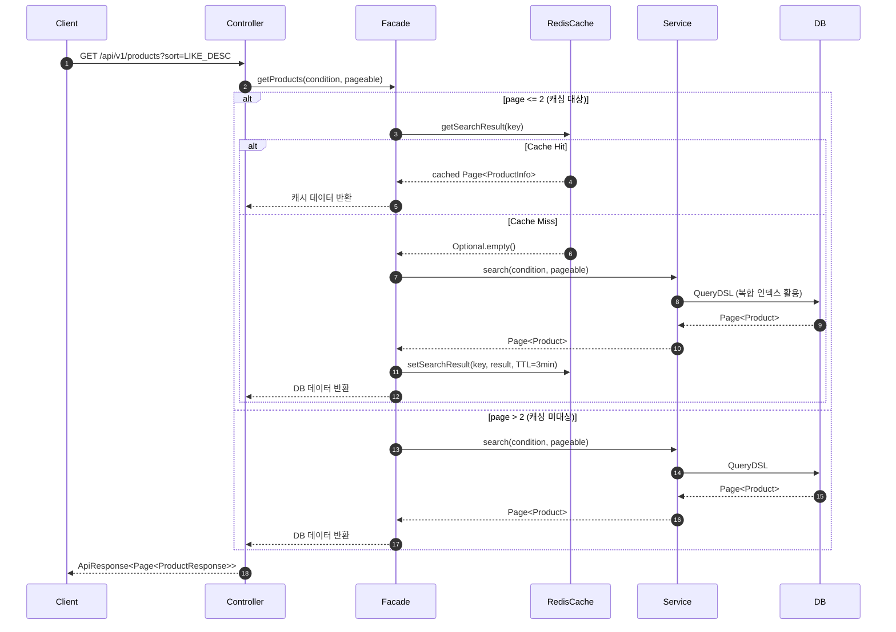
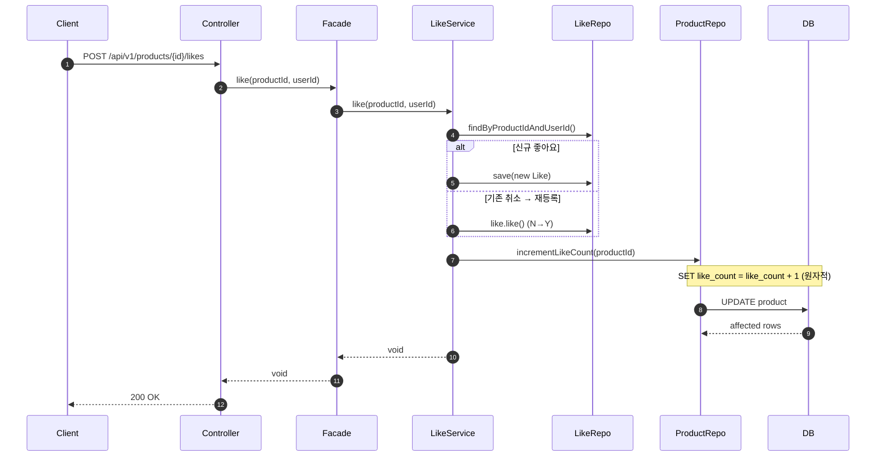
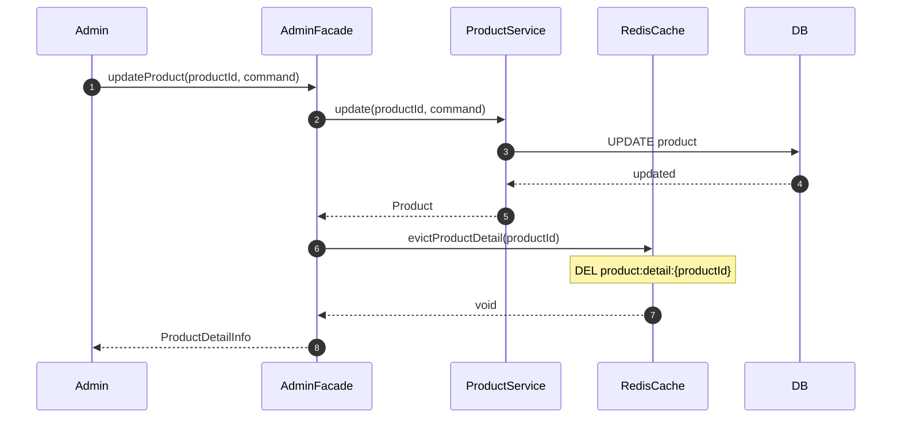

## 📌 Summary

- **배경**: 상품 목록 조회는 트래픽 비중이 가장 높은 API임에도, 조회 성능에 세 가지 구조적 병목이 존재했다. (1) 정렬 조건을 커버하는 인덱스 부재로 Full Table Scan + filesort 발생 (2) 좋아요 수가 Like 테이블에만 존재하여 정렬 시 집계 JOIN 불가피 (3) 캐시 레이어 부재로 모든 요청이 DB를 직접 조회
- **목표**: (1) 인덱스 최적화로 상품 목록 조회 쿼리 성능 개선 (2) 좋아요 수 정렬 구조를 비정규화로 진행 (3) Redis 캐시 적용으로 DB 부하 감소
- **결과**: 전체 조회 + 좋아요순 쿼리 62.3ms → 0.2ms (**약 300배 개선**), 비정규화 `likeCount` 도입으로 JOIN 없는 단일 테이블 정렬 구현, Redis Cache-Aside 패턴 적용으로 Cache Hit 시 DB 조회 대비 **약 2.1배** 응답 개선


## 🧭 Context & Decision

### 문제 정의
- **현재 동작/제약**: 상품 목록 조회 시 PK + FK(brand_id) 인덱스만 존재하여, 브랜드 필터 없는 전체 조회에서 10만건 Full Table Scan이 발생. 좋아요 수는 Like 테이블에서 매번 COUNT해야 하며, 캐시가 없어 모든 요청이 DB 직접 조회
- **문제(또는 리스크)**: 데이터가 늘어날수록 전체 조회 성능이 악화. 좋아요순 정렬에 Like 테이블 JOIN 시 복합 인덱스로 필터+정렬 동시 최적화 불가. 트래픽 증가 시 DB가 병목
- **성공 기준(완료 정의)**: 정렬 조건에서 인덱스 활용한 0.2ms 이내 응답, 좋아요 등록/취소 시 like_count 반영, Redis 캐시 적용으로 캐시 존재할 때 DB 미접근

### 선택지와 결정
- 선택지와 결정을 위한 테스트 결과는 블로그에 기록 : https://velog.io/@jsj1215/조회-최적화-인덱스-캐시
#### 인덱스 전략: 단일 인덱스 vs 복합 인덱스
- 고려한 대안:
    - **A: 정렬 컬럼별 단일 인덱스 3개** (`like_count`, `created_at`, `price`): 현재 데이터 분포(ON_SALE 85%, Y 90%)에서는 옵티마이저가 잘 선택하지만, 데이터 분포 변화(시즌 종료, 재고 소진 등)에 취약
    - **B: `(status, display_yn, 정렬컬럼)` 복합 인덱스 3개**: 필터+정렬을 하나의 인덱스에서 처리하여 filesort 제거 + LIMIT 조기 종료 가능
- **최종 결정**: 옵션 B — `status` 선두 복합 인덱스 3개 + 기존 FK(`brand_id`) 인덱스 활용
- **트레이드오프**: 인덱스 3개 추가로 INSERT/UPDATE 쓰기 비용 증가. 단, 상품 등록/수정 빈도 대비 조회 빈도가 압도적으로 높아 조회 최적화가 우선
- **추후 개선 여지**: 인덱스 0개 vs 4개 상태에서 대량 INSERT 성능 정량 비교, 데이터 100만건 이상 스케일 테스트

#### 좋아요 수 구조: 비정규화 vs Materialized View
- 고려한 대안:
    - **A: 비정규화 (`Product.likeCount`)**: 원자적 UPDATE로 즉시 반영, 복합 인덱스 활용 가능
    - **B: Materialized View (summary 테이블)**: Like 테이블 집계를 별도 테이블에 저장, 주기적 배치 갱신
- **최종 결정**: 옵션 A — 비정규화
- **트레이드오프**: Hot Row 경합 가능성(인기 상품에 좋아요 몰림), 버그/장애 시 실제 Like 수와 불일치 가능. 단, MySQL 8.0 네이티브 MV 미지원으로 MV도 결국 "비정규화 테이블의 주기적 갱신"이며, 인덱스 설계와의 시너지(같은 테이블에 필터+정렬 컬럼 배치)가 핵심 선택 근거
- **추후 개선 여지**: 트래픽 증가 시 Redis 카운터 + 비동기 DB 반영 전략으로 Hot Row 문제 해소

#### 캐시 전략: Local Cache (Caffeine) vs Redis Cache
- 고려한 대안:
    - **A: Local Cache (Caffeine)**: Cache Hit ~1ms, 직렬화 불필요, 네트워크 장애 무관
    - **B: Redis Cache**: Cache Hit ~4-6ms, 서버 간 캐시 공유, 명시적 무효화 가능
- **최종 결정**: 옵션 B — Redis Cache (기본 전략) + Local Cache (비교 학습용 별도 API)
- **트레이드오프**: Local 대비 약 4배 느린 Cache Hit 속도. 단, 사용자 체감 차이(4ms vs 1ms) 미미하고, 다중 서버 환경에서의 데이터 일관성(가격/재고 불일치 방지)과 운영 안정성(배포 시 Cold Start 방지)이 더 중요
- **추후 개선 여지**: 트래픽 극단적 증가 시 L1(Caffeine) → L2(Redis) → DB 2계층 캐시 구조로 확장


## 🏗️ Design Overview

### 변경 범위
- **영향 받는 모듈/도메인**: `commerce-api` — Product, Like 도메인
- **신규 추가**:
    - `ProductRedisCache` — Redis Cache-Aside 패턴 구현체
    - `LocalCacheConfig` — Caffeine 로컬 캐시 설정 (비교 학습용)
    - `ProductLikeSummary` — MV 비교 실험용 엔티티
    - E2E/통합 테스트 6개 클래스 추가
- **제거/대체**: 없음 (기존 API 동작 유지, Redis 캐시가 투명하게 적용)

### 주요 컴포넌트 책임
- `ProductRedisCache`: Redis 조회/저장/삭제를 try-catch로 감싸 장애 시 DB fallback 보장. TTL(목록 3분, 상세 10분), 페이지 제한(0~2페이지), 캐시 키 생성을 관리
- `ProductFacade`: Cache-Aside 패턴의 분기 로직 — Cache Hit 시 캐시 반환, Miss 시 DB 조회 후 Redis 저장. 로컬 캐시는 `@Cacheable` 어노테이션으로 별도 구현
- `AdminProductFacade`: 상품 수정/삭제 시 `evictProductDetail()` 호출로 즉시 캐시 무효화
- `LikeService`: 좋아요 등록/취소 시 `productRepository.incrementLikeCount()` / `decrementLikeCount()`로 원자적 카운트 동기화
- `Product` (Entity): `likeCount` 필드 + 복합 인덱스 `(status, display_yn, like_count DESC)` 등 3개 정의
- `ProductRepositoryImpl`: QueryDSL 기반 검색 쿼리 — 비정규화 `likeCount` 직접 정렬 + MV 방식 비교용 `searchWithMaterializedView()` 구현

### 구현 기능

#### 1. 인덱스 적용 — `Product`

> [`Product.java#L24-L30`](https://github.com/jsj1215/loop-pack-be-l2-vol3-java/blob/jsj1215/volume-5/apps/commerce-api/src/main/java/com/loopers/domain/product/Product.java#L24-L30)

```java
@Table(name = "product", indexes = {
        @Index(name = "idx_product_brand_id", columnList = "brand_id"),
        @Index(name = "idx_product_status_display_like", columnList = "status, display_yn, like_count DESC"),
        @Index(name = "idx_product_status_display_created", columnList = "status, display_yn, created_at DESC"),
        @Index(name = "idx_product_status_display_price", columnList = "status, display_yn, price")
})
```

`brand_id`는 FK가 아닌 의미적 레퍼런스 ID이므로 단일 인덱스를 직접 추가하여 브랜드 필터 조회 시 1~2ms 유지. `status` 선두 복합 인덱스 3개로 전체 조회 + 정렬 시 filesort 제거 및 LIMIT 조기 종료 달성.

---

#### 2. 비정규화 `likeCount` 필드 — `Product`

> [`Product.java#L52-L53`](https://github.com/jsj1215/loop-pack-be-l2-vol3-java/blob/jsj1215/volume-5/apps/commerce-api/src/main/java/com/loopers/domain/product/Product.java#L52-L53)

Product 엔티티에 `likeCount` 컬럼을 추가하여 Like 테이블 JOIN 없이 단일 테이블에서 좋아요순 정렬 가능. 복합 인덱스 `(status, display_yn, like_count DESC)`와 결합하여 0.2ms 정렬 달성.

---

#### 3. 원자적 좋아요 카운트 동기화 — `LikeService`

> [`LikeService.java#L22-L52`](https://github.com/jsj1215/loop-pack-be-l2-vol3-java/blob/jsj1215/volume-5/apps/commerce-api/src/main/java/com/loopers/domain/like/LikeService.java#L22-L52)

좋아요 등록/취소 시 `SET like_count = like_count + 1` 원자적 UPDATE로 Lost Update 방지. `likeCount > 0` 조건으로 음수 방지.

---

#### 4. Redis Cache-Aside 패턴 — `ProductRedisCache`

> [`ProductRedisCache.java#L41-L90`](https://github.com/jsj1215/loop-pack-be-l2-vol3-java/blob/jsj1215/volume-5/apps/commerce-api/src/main/java/com/loopers/application/product/ProductRedisCache.java#L41-L90)

모든 Redis 조회/저장/삭제를 try-catch로 감싸 장애 시 DB fallback 보장. 상품 상세 TTL 10분(evict 안전망), 목록 TTL 3분(유일한 갱신 수단), 3페이지(page 0~2)까지만 캐싱.

---

#### 5. Facade 캐시 분기 로직 — `ProductFacade`

> [`ProductFacade.java#L38-L68`](https://github.com/jsj1215/loop-pack-be-l2-vol3-java/blob/jsj1215/volume-5/apps/commerce-api/src/main/java/com/loopers/application/product/ProductFacade.java#L38-L68)

목록 조회: 캐싱 가능 페이지 → Redis 조회 → Hit 시 반환 / Miss 시 DB 조회 + Redis 저장. 4페이지(page=3) 이상 조회 시 캐시 미사용으로 Redis 메모리 절약.

---

#### 6. 관리자 수정/삭제 시 캐시 무효화 — `AdminProductFacade`

> [`AdminProductFacade.java#L50-L70`](https://github.com/jsj1215/loop-pack-be-l2-vol3-java/blob/jsj1215/volume-5/apps/commerce-api/src/main/java/com/loopers/application/product/AdminProductFacade.java#L50-L70)

상품 수정/삭제 시 `evictProductDetail(productId)` 호출로 Redis에서 해당 상세 캐시 즉시 삭제. 모든 서버에서 다음 요청 시 최신 데이터 조회 보장.

---

#### 7. 로컬 캐시 (Caffeine) 비교용 API — `LocalCacheConfig` + `ProductFacade`

> [`LocalCacheConfig.java#L22-L33`](https://github.com/jsj1215/loop-pack-be-l2-vol3-java/blob/jsj1215/volume-5/apps/commerce-api/src/main/java/com/loopers/config/LocalCacheConfig.java#L22-L33)

> [`ProductFacade.java#L76-L88`](https://github.com/jsj1215/loop-pack-be-l2-vol3-java/blob/jsj1215/volume-5/apps/commerce-api/src/main/java/com/loopers/application/product/ProductFacade.java#L76-L88)

Caffeine 로컬 캐시를 `@Cacheable`로 적용한 별도 API 엔드포인트. Redis와의 정량적 성능 비교(응답속도, Cache Miss 비용, Evict 후 재조회)를 위해 구현.

---

#### 8. 상품 검색 QueryDSL — `ProductRepositoryImpl`

> [`ProductRepositoryImpl.java#L110-L148`](https://github.com/jsj1215/loop-pack-be-l2-vol3-java/blob/jsj1215/volume-5/apps/commerce-api/src/main/java/com/loopers/infrastructure/product/ProductRepositoryImpl.java#L110-L148)

비정규화 `product.likeCount`를 직접 정렬에 사용하여 JOIN 없는 단일 테이블 쿼리 구현. MV 방식 비교용 `searchWithMaterializedView()`도 함께 구현.

---

#### 9. REST API 엔드포인트 — `ProductV1Controller`

> [`ProductV1Controller.java#L38-L93`](https://github.com/jsj1215/loop-pack-be-l2-vol3-java/blob/jsj1215/volume-5/apps/commerce-api/src/main/java/com/loopers/interfaces/api/product/ProductV1Controller.java#L38-L93)

| 메서드 | 엔드포인트 | 설명 |
|--------|-----------|------|
| GET | `/api/v1/products` | 상품 목록 조회 (Redis 캐시) |
| GET | `/api/v1/products/local-cache` | 상품 목록 조회 (로컬 캐시, 비교용) |
| GET | `/api/v1/products/{id}` | 상품 상세 조회 (Redis 캐시) |
| GET | `/api/v1/products/{id}/local-cache` | 상품 상세 조회 (로컬 캐시, 비교용) |
| POST | `/api/v1/products/{id}/likes` | 좋아요 등록 |
| PUT | `/api/v1/products/{id}/likes` | 좋아요 취소 |


## 🔁 Flow Diagram

### Main Flow — 상품 목록 조회 (Redis Cache-Aside)


### 좋아요 등록 + 카운트 동기화 Flow


### 관리자 상품 수정 + 캐시 무효화 Flow



## ✅ 과제 체크리스트

| 구분 | 요건 | 충족 |
|------|------|------|
| **Index** | 상품 목록 API에서 brandId 기반 검색, 좋아요 순 정렬 처리 | ✅ |
| **Index** | 조회 필터, 정렬 조건별 유즈케이스 분석 후 인덱스 적용 + 전후 성능비교 | ✅ |
| **Structure** | 좋아요 수 조회 및 좋아요 순 정렬 가능하도록 구조 개선 | ✅ |
| **Structure** | 좋아요 적용/해제 시 상품 좋아요 수 정상 동기화 | ✅ |
| **Cache** | Redis 캐시 적용 + TTL 또는 무효화 전략 적용 | ✅ |
| **Cache** | 캐시 미스 상황에서도 서비스 정상 동작 | ✅ |


## 📊 성능 개선 전후 비교

### 인덱스 — 10만건 데이터 기준

| 쿼리 | Before (인덱스 없음) | After (복합 인덱스) | 개선 |
|------|---------------------|-------------------|------|
| 전체 + 좋아요순 | **62.3ms** (Full Scan 100K) | **0.201ms** (Index, 20건 스캔) | **~300배** |
| 전체 + 최신순 | ~62ms (Full Scan) | **0.185ms** (Index) | **~300배** |
| 전체 + 가격순 | ~62ms (Full Scan) | **0.156ms** (Index) | **~300배** |
| 브랜드 + 좋아요순 | 1.81ms (FK Index) | 1.68ms (FK Index) | 유지 |
| 브랜드 + 최신순 | 1.72ms (FK Index) | 1.92ms (FK Index) | 유지 |

### 캐시 — E2E 환경 측정 (50회 반복 평균)

| 구분 | No Cache | Redis Cache Hit | Local Cache Hit |
|------|----------|----------------|-----------------|
| 상품 목록 평균 | 12.37ms | **5.83ms** (2.1배) | **1.39ms** (8.9배) |
| 상품 목록 p99 | 29.18ms | 18.24ms | 2.46ms |
| 상품 상세 평균 | 9.42ms | **3.77ms** (2.5배) | **0.87ms** (10.8배) |
| 상품 상세 p99 | 15.57ms | 5.57ms | 2.67ms |

### Cache Miss 비용 — 첫 요청 시 (캐시 비어있는 상태)

| 구분 | No Cache | Redis Cache Miss | Local Cache Miss |
|------|----------|-----------------|-----------------|
| 상품 목록 | 12.37ms | **39.86ms** (DB + JSON 직렬화 + Redis SET) | 16.37ms |
| 상품 상세 | 9.42ms | 유사 수준 | 유사 수준 |

Redis Cache Miss 시 No Cache 대비 약 3배 느린 이유: DB 조회 비용에 JSON 직렬화 + Redis SET 네트워크 왕복 비용이 추가되기 때문. 단, 이후 반복 호출은 Cache Hit(5.83ms)으로 빠르게 응답하므로 첫 요청의 추가 비용은 후속 Hit으로 상쇄된다.


## 🧪 테스트

| 분류 | 테스트 클래스 | 테스트 수 | 검증 범위 |
|------|-------------|----------|----------|
| E2E | `ProductLocalCacheApiE2ETest` | 8개 | 로컬 캐시 API 정상 동작, Hit/Miss, 페이지 제한, 캐시 키 분리 |
| E2E | `ProductRedisCacheApiE2ETest` | 7개 | Redis 캐시 저장/조회, Hit/Miss, 페이지 제한, 에러 처리 |
| E2E | `CachePerformanceComparisonTest` | 5개 시나리오 | Redis vs Local 정량 비교 (평균/p50/p95/p99) |
| 통합 | `ProductSearchIntegrationTest` | 6개 | 모든 정렬×필터 조합 DB 쿼리 검증 (Q1~Q6) |
| 통합 | `ProductLikeSummaryIntegrationTest` | - | MV 방식 집계 정합성 검증 |
| 통합 | `LikeCountQueryPerformanceTest` | - | 비정규화 vs MV 쿼리 성능 비교 |
| 단위 | `ProductFacadeTest` | 7개 (5개 추가) | Cache-Aside 분기 로직, 페이지 제한, Hit/Miss |
| 단위 | `AdminProductFacadeTest` | 3개 (2개 추가) | 상품 수정/삭제 시 캐시 evict 호출 검증 |


### 리뷰포인트

### 1. 좋아요 수 정렬 — 비정규화 vs Materialized View
좋아요순 정렬을 위해 비정규화와 MV를 비교했습니다. EXPLAIN으로 직접 확인해보니 MV 방식에서는 약 49,518건을 스캔하고 filesort가 발생했는데, 비정규화에서는 복합 인덱스 덕분에 20건만 읽고 0.2ms에 끝나서 차이가 컸습니다.
MV를 선택했을 때 필터 조건들은 product 테이블에 있고 정렬 기준(`like_count`)은 MV테이블에 있어서 하나의 복합 인덱스로 같이 처리할 수가 없어서 두 방식에 성능차이가 존재하는 것 같습니다.
그래서 인덱스 설계와 잘 맞는 비정규화를 선택했는데, 이 판단이 괜찮은 선택이었는지 궁금합니다. 그리고 실무에서 MV를 실제로 많이 사용하는 편인지, 사용한다면 어떤 경우에 쓰는지도 여쭤보고 싶습니다.

### 2. Redis 캐시 TTL — 목록 3분, 상세 10분으로 설정
상품 목록 캐시는 키 조합이 검색어-정렬-브랜드ID-page-size로 너무 많아서 명시적으로 삭제하기가 어려워서, TTL(3분) 만료에만 의존하고 있습니다.
반면 상품 상세 캐시는 `product:detail:{id}`로 키가 명확해서 수정/삭제 시 바로 삭제할 수 있으니까 TTL을 길게(10분) 잡아서 히트율을 높이는 방향으로 했습니다.
이렇게 하면 관리자가 상품 가격을 수정했을 때, 상세 페이지는 바로 반영되지만 목록에서는 3분간 변경전 가격이 보일 수 있는데, 이 정도 지연이 실무에서 허용 가능한 수준인지, 아니면 성능 이슈가 있더라도 목록 캐시도 명시적으로 삭제해야 하는 상황이 있는지 궁금합니다!
TTL 설정에 대한 경험이 없다보니 이 값이 적절한지 궁금합니다. 실무에서는 이런 TTL 값을 처음 정할 때 어떤 기준으로 접근하시는지 조언 부탁드립니다!

### 3. Redis Cache Miss 비용 증가에 대한 대응
Cache Hit 시에는 확실히 응답이 빨라지지만, Cache Miss 시에는 DB 조회에 JSON 직렬화 + Redis SET 비용이 추가되어 캐시가 없을 때보다 오히려 느려지는 구간이 존재합니다.
이후 반복 요청의 Cache Hit으로 상쇄된다고 판단했지만, TTL 만료 시점에 동시 다발적으로 Cache Miss가 발생하는 상황(Cache Stampede)이 우려됩니다.
실무에서 이런 Cache Miss 비용 증가를 감수하는 편인지, 캐시 워밍이나 비동기 저장 같은 별도 대응을 하는 편인지 궁금합니다!

