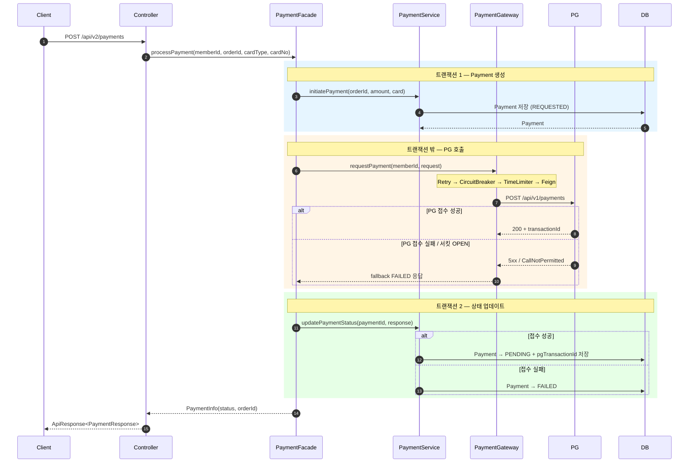
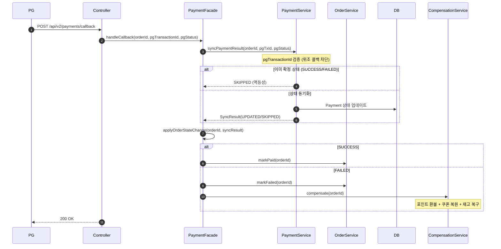
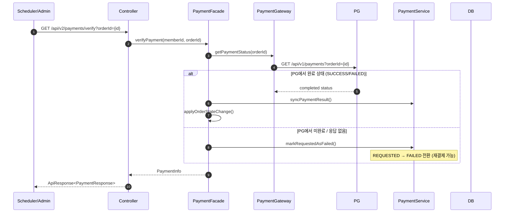
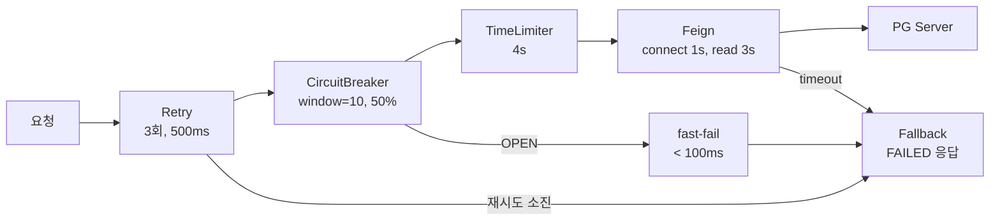

## 📌 Summary

- **배경**: 주문 기능은 구현되어 있으나 결제 연동이 없어, 외부 PG 시스템과의 통합 및 장애 대응 전략이 부재했다. PG Simulator는 요청 성공률 60%, 비동기 결제(요청과 처리 분리), 처리 지연 1~5초로 다양한 장애 시나리오가 발생할 수 있는 환경이다.
- **목표**: (1) PG 연동 결제 API 구현 (2) Resilience4j 기반 Timeout + Retry + CircuitBreaker + Fallback 4개 Resilience 패턴 적용으로 장애 전파 방지 (3) 콜백 + Verify API를 통한 비동기 결제 상태 동기화 및 보상 메커니즘 구현
- **결과**: 120 VUs 극한 부하에서도 **5xx 에러 0건** 달성, 서킷 OPEN으로 PG 불필요 호출 **24,354건 차단**, 모든 장애 시나리오에서 사용자에게 의미 있는 응답(FAILED/UNKNOWN/PENDING) 반환

## 🧭 Context & Decision

### 문제 정의
- **현재 동작/제약**: 주문 생성 시 포인트/쿠폰/재고 차감만 처리되고 결제가 없는 상태. 외부 PG 시스템은 비동기 결제 방식으로 요청 성공률 60%, 처리 결과는 콜백으로 전달됨
- **문제(또는 리스크)**: PG 지연/장애 시 DB 커넥션 고갈로 전체 서비스 마비 가능. 타임아웃 발생 시 PG에서는 결제가 됐지만 우리 시스템은 실패로 처리하는 상태 불일치 발생 가능. 콜백 유실 시 결제 상태가 영구히 미확정 상태로 남을 위험
- **성공 기준(완료 정의)**: 어떤 PG 장애 상황에서도 5xx 에러가 사용자에게 노출되지 않을 것, 타임아웃/콜백 유실 시에도 verify API로 PG와 상태 동기화 가능할 것, 극한 부하에서 서킷 브레이커가 정상 동작하여 장애 확산을 차단할 것

### 선택지와 결정

#### HTTP 클라이언트: RestTemplate vs OpenFeign
- 고려한 대안:
    - **A: RestTemplate** — 별도 의존성 없이 사용 가능하지만, 보일러플레이트가 많고 Spring 5.0부터 maintenance mode
    - **B: OpenFeign** — 인터페이스 선언만으로 HTTP 호출 정의, Resilience4j와의 조합이 자연스러움
- **최종 결정**: 옵션 B — OpenFeign
- **트레이드오프**: Spring Cloud 의존성 필요, 프록시 기반이라 디버깅 시 한 단계 더 들어가야 함
- **선택 근거**: DIP와 자연스럽게 맞아떨어짐(인터페이스 기반 `@MockBean` 목킹), `FeignException.status()`로 HTTP 상태 코드별 재시도 판단이 용이, `Retryer.NEVER_RETRY`로 내장 재시도를 비활성화하고 Resilience4j에 제어 위임 가능

#### 트랜잭션 경계: PG 호출을 트랜잭션 안에 vs 밖에
- 고려한 대안:
    - **A: 하나의 @Transactional 안에서 PG 호출** — 원자성 보장이 쉬우나 PG 지연(1~5초) 동안 DB 커넥션 점유 → HikariCP 풀 고갈 위험
    - **B: 트랜잭션 분리** — 주문/결제 저장(트랜잭션1) → PG 호출(트랜잭션 밖) → 상태 업데이트(트랜잭션2)
- **최종 결정**: 옵션 B — 트랜잭션 분리
- **트레이드오프**: PG 성공 후 주문 상태 업데이트 실패 시 불일치 가능 → verify API로 보상
- **추후 개선 여지**: 이벤트 기반 비동기 분리로 도메인 간 결합도 추가 감소

#### Payment orderId 관계: 1:N vs 1:1
- 고려한 대안:
    - **A: 1:N (한 주문에 여러 Payment)** — 결제 실패 시 새 Payment를 매번 생성. `findByOrderId`가 여러 건 반환되어 어떤 Payment가 유효한지 판단 어려움
    - **B: 1:1 (unique 제약 + 재사용)** — `orderId`에 unique 제약, FAILED 상태의 기존 Payment를 `resetForRetry()`로 재사용
- **최종 결정**: 옵션 B — 1:1 관계 + `resetForRetry()`
- **선택 근거**: `findByOrderId` 결과가 항상 유일하므로 콜백/verify 시 정합성 보장. Payment 이력이 필요하면 별도 히스토리 테이블로 분리하는 것이 적절

#### 동시 상태 변경 방지: 비관적 락 vs 낙관적 락
- 고려한 대안:
    - **A: 비관적 락 (`@Lock(PESSIMISTIC_WRITE)`)** — 확실한 동시성 제어, 하지만 모든 조회에 SELECT FOR UPDATE 필요
    - **B: 낙관적 락 (`@Version`)** — 충돌 빈도가 낮은 경우에 효율적, 충돌 시 `OptimisticLockException` 발생
- **최종 결정**: 옵션 B — `@Version` 낙관적 락
- **선택 근거**: PG 콜백과 `updatePaymentStatus`의 동시 도착은 드문 케이스이므로 낙관적 락이 적합. 충돌 시 나중 트랜잭션이 실패하고 이후 verify 시 `isFinalized()=true`로 SKIPPED 처리됨

## 🏗️ Design Overview

### 변경 범위
- **영향 받는 모듈/도메인**: `commerce-api` — Order, Payment(신규) 도메인
- **신규 추가**:
    - Payment 도메인 전체 (Entity, Service, Repository, Gateway 인터페이스)
    - PG 연동 Infrastructure (FeignClient, PgApiClient, Resilience4j PaymentGateway)
    - 결제 API Controller (V2)
    - AbstractPaymentFacade, PaymentFacade
    - OrderPaymentFacade, OrderPlacementService, OrderCompensationService
    - Grafana 대시보드 프로비저닝 (JVM + HTTP + Resilience4j)
- **제거/대체**: 없음 (기존 주문 API 동작 유지)

### 주요 컴포넌트 책임
- `PaymentGateway`: PG 호출 추상화 인터페이스 — Infrastructure 레이어에서 `Resilience4jPaymentGateway`가 구현 (DIP)
- `PgApiClient`: Resilience4j 어노테이션(`@TimeLimiter` → `@CircuitBreaker` → `@Retry`) 적용, fallback 메서드로 장애 시 FAILED 응답 반환, 전용 스레드풀(`pg-executor`)로 Bulkhead 격리
- `AbstractPaymentFacade`: 결제 처리, 콜백 핸들링, verify, 주문 상태 반영 공통 로직 추상 클래스
- `PaymentService`: Payment 생성/상태 동기화/PG 트랜잭션 ID 검증/REQUESTED 상태 복구 등 비즈니스 로직 담당
- `OrderPaymentFacade`: 주문 생성 + 결제 요청을 단일 Use Case로 조율, 트랜잭션을 분리하여 PG 호출은 트랜잭션 밖에서 수행
- `OrderCompensationService`: 결제 실패 시 포인트/쿠폰/재고 보상 트랜잭션 처리

### 구현 기능

#### 1. PgFeignClient — 선언적 PG HTTP 클라이언트

> [`PgFeignClient.java`](https://github.com/jsj1215/loop-pack-be-l2-vol3-java/blob/jsj1215/volume-6/apps/commerce-api/src/main/java/com/loopers/infrastructure/payment/PgFeignClient.java)

OpenFeign 인터페이스로 PG API 스펙을 선언. `PgFeignConfig`에서 connect 1s / read 3s 타임아웃, `Retryer.NEVER_RETRY`로 내장 재시도 비활성화.

---

#### 2. OrderPaymentFacade — 주문+결제 통합 Use Case

> [`OrderPaymentFacade.java`](https://github.com/jsj1215/loop-pack-be-l2-vol3-java/blob/jsj1215/volume-6/apps/commerce-api/src/main/java/com/loopers/application/order/OrderPaymentFacade.java)

주문 생성(OrderPlacementService, 트랜잭션1) → PG 결제 요청(트랜잭션 밖) → 결과 반영(트랜잭션2). PG 호출이 트랜잭션 밖에서 수행되어 DB 커넥션 점유 방지.

---

#### 3. OrderCompensationService — 결제 실패 보상

> [`OrderCompensationService.java`](https://github.com/jsj1215/loop-pack-be-l2-vol3-java/blob/jsj1215/volume-6/apps/commerce-api/src/main/java/com/loopers/application/order/OrderCompensationService.java)

결제 실패(또는 망취소) 시 포인트 환불(`PointType.RESTORE`), 쿠폰 상태 원복(`UPDATE` 원자적 쿼리 수행), 재고 증감 복구를 하나의 보상 트랜잭션으로 묶어 처리함으로써 데이터 일관성을 회복.

---

#### 4. PaymentService — 결제 비즈니스 로직

> [`PaymentService.java`](https://github.com/jsj1215/loop-pack-be-l2-vol3-java/blob/jsj1215/volume-6/apps/commerce-api/src/main/java/com/loopers/domain/payment/PaymentService.java)

`initiatePayment()`: 기존 FAILED Payment가 있으면 `resetForRetry()`로 재사용, 없으면 신규 생성. `syncPaymentResult()`: PG 트랜잭션 ID 검증 후 상태 동기화, 멱등성 보장(이미 확정 상태면 SKIPPED). `updatePaymentStatus()`: 3곳에 중복되던 PG 응답 해석 로직을 통합. `markRequestedAsFailed()`: REQUESTED 상태 복구 경로.

---

#### 5. 결제 API 엔드포인트 — V2 컨트롤러

> [`PaymentV2Controller.java`](https://github.com/jsj1215/loop-pack-be-l2-vol3-java/blob/jsj1215/volume-6/apps/commerce-api/src/main/java/com/loopers/interfaces/api/payment/PaymentV2Controller.java)

| 메서드 | 엔드포인트 | 설명 |
|--------|-----------|------|
| POST | `/api/v2/payments` | 결제 요청 (Resilience4j) |
| POST | `/api/v2/payments/callback` | PG 콜백 수신 |
| GET | `/api/v2/payments/verify` | 결제 상태 동기화 (운영자/스케줄러 호출) |

---

## 🔁 Flow Diagram

### Main Flow — 결제 요청 (트랜잭션 분리)

### 콜백 수신 + 주문 상태 반영 Flow

### Verify (상태 동기화) Flow

### Resilience4j 패턴 실행 순서 (Decorator)

## 🧪 테스트

### 단위/통합/E2E 테스트

| 분류 | 테스트 클래스 | 검증 범위 |
|------|-------------|----------|
| 단위 | `PaymentServiceTest` | 결제 생성, 상태 동기화, 멱등성, pgTxId 검증, REQUESTED 복구 |
| 단위 | `PaymentFacadeTest` | 트랜잭션 분리 확인, 반환값 검증 |
| 단위 | `OrderPaymentFacadeTest` | 주문+결제 통합 흐름, 보상 호출 |
| 단위 | `OrderPlacementServiceTest` | 주문 배치 로직 |
| 단위 | `OrderCompensationServiceTest` | 포인트/쿠폰/재고 보상 |
| 통합 | `PaymentServiceIntegrationTest` | 실제 DB 연동 9개 시나리오 (생성, 재시도, 중복, 콜백, 멱등성, txId 거부, REQUESTED 복구) |
| 통합 | `PgApiClientIntegrationTest` | Resilience4j AOP 프록시 실제 동작 검증 (fallback, 4xx 미재시도) |
| 통합 | `OrderPaymentIntegrationTest` | 주문+결제 전체 흐름 통합 검증 |
| E2E | `PaymentV2ApiE2ETest` | V2 결제 API 실제 HTTP 호출 E2E |
| E2E | `OrderV1ApiE2ETest` | 주문 API E2E (PG Mock 추가) |

### k6 부하 테스트

| 시나리오 | 부하 | 핵심 결과 |
|---------|------|----------|
| Timeout 증명 | 5→50 VUs, 85초 | 100% 응답이 4초 이내, TimeLimiter 타임아웃 0건 |
| Retry 증명 | 15 VUs, 60초 | 재시도 5건 탐지, `http_req_failed` 0.39% |
| CircuitBreaker 증명 | 3→60 VUs, 2분 | fast-fail 93건(< 100ms), 5xx 에러 0건 |
| Fallback 증명 | 10→100 VUs, 1분 45초 | 5xx 에러 0건, 97.77% graceful 응답 |
| 종합 Resilience | 5→120 VUs, 2분 30초 | 시스템 안정성 97.45%, 서킷 차단 677건 |

> 상세 테스트 결과: [report.md](./report.md)

## ✅ 과제 체크리스트

| 구분 | 요건 | 충족 |
|------|------|------|
| **PG 연동** | FeignClient로 외부 시스템 호출 | ✅ |
| **PG 연동** | 응답 지연에 대한 타임아웃 설정 + 실패 시 예외 처리 | ✅ |
| **PG 연동** | 결제 실패 응답에 대한 시스템 연동 | ✅ |
| **PG 연동** | 콜백 + 결제 상태 확인 API로 시스템 연동 | ✅ |
| **Resilience** | 서킷 브레이커 / 재시도 정책으로 장애 확산 방지 | ✅ |
| **Resilience** | 외부 장애 시에도 내부 시스템 정상 응답 보호 | ✅ |
| **Resilience** | 콜백 미수신 시 Verify API(운영자/스케줄러 호출)로 상태 동기화 가능 | ✅ |
| **Resilience** | 타임아웃 실패 시에도 PG 결제 정보 확인하여 정상 반영 | ✅ |

## 📊 리뷰포인트

### 1. Payment 재시도 시 이전 PG 트랜잭션 ID 초기화 문제
주문:결제를 1:1로 유지하려고 `orderId`에 unique 제약을 걸고, 결제 실패 시 기존 Payment를 `resetForRetry()`로 재사용하는 구조를 선택했습니다.
그런데 리셋할 때 이전 PG 트랜잭션 ID도 null로 초기화되는데, 콜백 수신 시 트랜잭션 ID 일치 여부를 검증하는 로직이 있어서 리셋 직후에는 이 검증이 무력화됩니다. 즉, 이전 실패 건의 지연 콜백이 리셋 이후에 도착하면 새 결제 시도의 상태를 덮어쓸 수 있는 구간이 생깁니다.
이전 트랜잭션 ID를 별도 필드로 보존해서 해당 ID의 콜백을 거부해야 하는지, 아니면 현재 구조의 최종 상태 체크 + 낙관적 락만으로 실질적으로 충분한지 궁금합니다!

### 2. 연결 실패(ConnectException)도 재시도 대상에 포함해도 되는지
처음에는 Feign 예외 전체를 재시도했는데 4xx까지 재시도되는 문제가 있어서, 5xx 서버 에러 4종만 명시적으로 지정하는 방식으로 변경했습니다.
여기에 연결 실패 예외(`RetryableException`)도 포함했는데, 연결 자체가 안 되면 PG가 완전히 다운된 상황일 가능성이 높아서 500ms 간격으로 3번 시도해도 결국 다 실패할 것 같습니다. 반면 순간적인 네트워크 끊김이라면 재시도가 유효하고요.
연결 실패는 재시도에서 빼고 서킷브레이커 실패 카운트에만 반영하는 게 나을지, 아니면 현재처럼 포함하되 고정 간격 대신 exponential backoff로 바꾸는 게 나을지 조언 부탁드립니다!

### 3. verify 시 PENDING/UNKNOWN 상태가 영구 미확정으로 남는 문제
PG 호출을 트랜잭션 밖으로 분리하면서 상태 불일치 구간이 생기는데, 이를 (1) PG 콜백, (2) Verify API, (3) REQUESTED → FAILED 강제 전환 — 세 경로로 보상하고 있습니다.
그런데 강제 FAILED 전환은 REQUESTED 상태에만 적용해서, PG에 접수는 됐지만 콜백이 유실된 경우(PENDING)나 타임아웃으로 결과를 모르는 경우(UNKNOWN)는 PG 재조회가 실패하면 계속 미확정 상태로 남게 됩니다.
PENDING/UNKNOWN도 일정 시간 후 PG 재조회 → 실패 시 FAILED 처리하는 로직을 추가해야 하는지, 아니면 PG에서 실제로 결제가 완료됐을 수도 있으니 자동 처리보다 운영자 알림으로 수동 개입하는 게 더 안전한지 궁금합니다!
