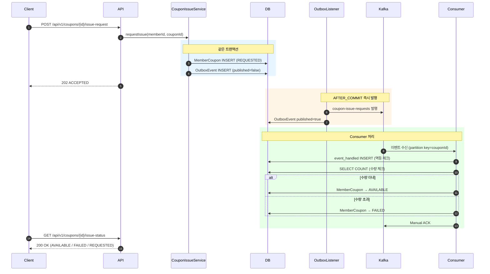
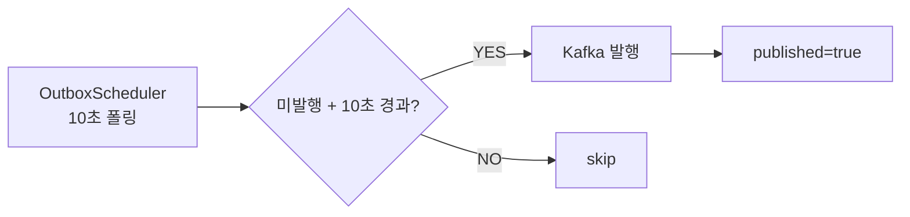
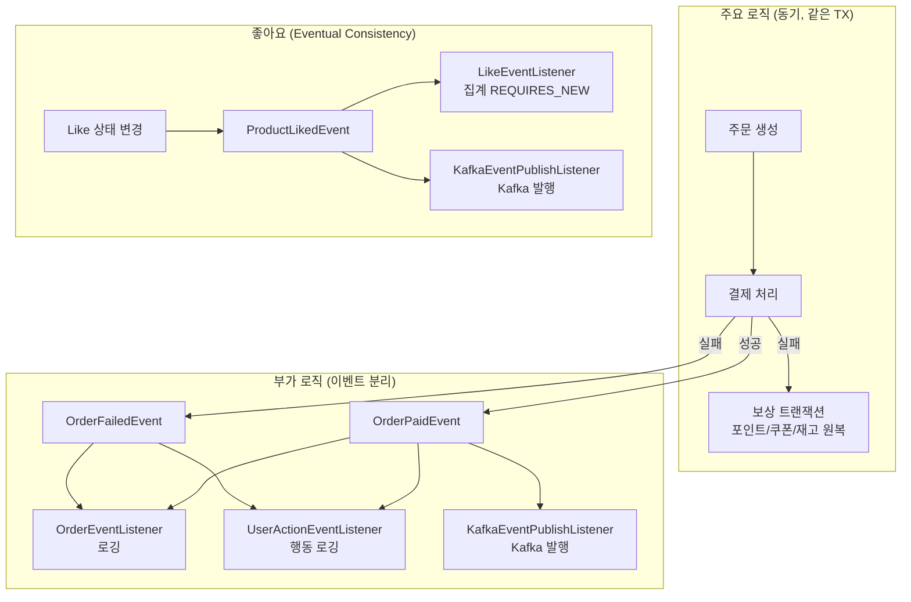

## Summary

- **배경**: 주문-결제 플로우에 부가 로직(로깅, 집계, 알림)이 Facade에 직접 결합되어 있어, 부가 로직 실패 시 주요 로직까지 롤백되는 구조였다. 또한 시스템 간 이벤트 전파 수단이 없어 commerce-streamer에서 집계/발급 처리가 불가능했다.
- **목표**: (1) ApplicationEvent로 주요/부가 로직 경계 분리 (2) Kafka 이벤트 파이프라인 구축 + Transactional Outbox Pattern으로 At Least Once 보장 (3) Kafka 기반 선착순 쿠폰 발급 및 동시성 제어
- **결과**: 137개 신규 테스트 ALL PASS, 동시성 테스트로 Kafka 파티션 순서 보장 기반 수량 제어 실증, Outbox Pattern으로 유실 불허 이벤트의 원자적 발행 보장


## Context & Decision

### 문제 정의
- **현재 동작/제약**: Facade가 주문 생성, 결제, 로깅, 알림을 모두 직접 호출하는 구조. 부가 로직 추가 시마다 Facade 수정이 필요하고, 로깅 실패가 주문 롤백을 유발할 수 있음. commerce-streamer는 이벤트 수신 수단이 없어 집계 처리 불가
- **문제(또는 리스크)**: (1) 부가 로직 장애가 핵심 비즈니스 로직에 전파 (2) ApplicationEvent만으로는 시스템 간 전파와 이벤트 내구성 보장 불가 (3) 선착순 쿠폰 발급 시 동시성 제어 없이는 수량 초과 발급 가능
- **성공 기준(완료 정의)**: 부가 로직 실패와 무관하게 주요 로직 성공 보장, Kafka를 통한 시스템 간 이벤트 파이프라인 동작, 선착순 쿠폰에서 수량 초과가 발생하지 않을 것

### 선택지와 결정

#### 1. 이벤트 분리 경계: 무조건 이벤트 분리 vs 선별적 분리
- 고려한 대안:
    - **A: 모든 후속 처리를 이벤트로 분리** — 보상 트랜잭션(포인트/쿠폰/재고 원복) 포함하여 전부 이벤트 기반
    - **B: 주요/부가 로직 판단 후 선별적 분리** — "이 로직이 실패해도 주요 로직이 성공이어야 하는가?"를 기준으로 판단
- **최종 결정**: 옵션 B — 선별적 분리
- **트레이드오프**: 보상 트랜잭션(`OrderCompensationService`)은 이벤트로 분리하지 않음. 결제 실패 시 재고/쿠폰/포인트 원복이 반드시 동기적으로 보장되어야 하기 때문
- **판단 근거**: 로깅, 집계는 실패해도 비즈니스에 치명적이지 않지만, 보상 트랜잭션 실패 시 데이터 불일치가 발생. 이벤트 유실 가능성까지 고려하면 보상 로직은 동기 호출이 안전함

#### 2. @TransactionalEventListener fallbackExecution: 일괄 true vs 선택적 적용
- 고려한 대안:
    - **A: 모든 리스너에 fallbackExecution=true** — 트랜잭션 없이 발행되어도 항상 실행
    - **B: 이벤트 발행 컨텍스트에 따라 선택적 적용** — 트랜잭션 안에서만 발행되어야 하는 이벤트는 false
- **최종 결정**: 옵션 B — 선택적 적용
- **선택 근거**: 좋아요 집계 이벤트(`ProductLikedEvent`)는 반드시 `@Transactional` 안에서 발행되어야 함. `fallbackExecution=false`로 두면 트랜잭션 없이 발행하는 버그를 즉시 감지 가능. 반면 결제 후 이벤트(`OrderPaidEvent`)는 PG 호출이 트랜잭션 밖에서 일어나므로 `fallbackExecution=true`가 필요

#### 3. Kafka 발행 전략: 모든 이벤트에 Outbox vs 선별적 Outbox
- 고려한 대안:
    - **A: 모든 Kafka 이벤트에 Outbox Pattern 적용** — 일관된 구조, At Least Once 보장
    - **B: 유실 불허 이벤트만 Outbox, 통계성 이벤트는 AFTER_COMMIT 직접 발행** — DB 쓰기 부하 최소화
- **최종 결정**: 옵션 B — 선별적 Outbox
- **선택 근거**: Outbox는 비즈니스 TX마다 DB에 추가 INSERT가 발생함. 좋아요 집계, 조회수처럼 유실돼도 배치로 보정 가능한 통계성 이벤트까지 Outbox로 처리하면 DB 쓰기 부하만 증가. "이 이벤트가 유실되면 비즈니스에 어떤 영향이 있는가?"를 기준으로 쿠폰 발급 요청에만 Outbox 적용
- **추후 개선 여지**: DLQ 구성으로 직접 발행 실패 이벤트 격리 및 재처리

#### 4. 선착순 쿠폰 동시성 제어: Redis INCR vs Kafka 파티션 순서 보장
- 고려한 대안:
    - **A: Redis `INCR` + `DECR`** — 즉시 응답 가능, 원자적 카운터
    - **B: Kafka partition key=couponId로 순차 처리** — Consumer 단에서 race condition 제거
- **최종 결정**: 옵션 B — Kafka 파티션 순서 보장
- **트레이드오프**: 비동기라 즉시 결과를 줄 수 없음 → Polling API(`GET /issue-status`)로 결과 확인 구조
- **선택 근거**: 같은 couponId의 메시지가 동일 파티션에서 순차 처리되므로 `SELECT COUNT` → `UPDATE` 사이의 race condition이 원천 차단됨. 동시성 테스트로 실증 — Kafka 없이 10스레드 동시 처리 시 100장 한정에 109장 발급(초과), 순차 처리 시 정확히 수량 제한 준수


## Design Overview

### 변경 범위
- **영향 받는 모듈/도메인**: `commerce-api` — Order, Coupon, Product, Outbox(신규) 도메인 / `commerce-streamer` — Metrics(신규), Coupon(신규), Event(신규) 도메인
- **신규 추가**:
    - 도메인 이벤트 정의 (`OrderPaidEvent`, `OrderFailedEvent`, `ProductLikedEvent`, `ProductViewedEvent`)
    - 이벤트 리스너 (`LikeEventListener`, `OrderEventListener`, `UserActionEventListener`, `KafkaEventPublishListener`)
    - Transactional Outbox Pattern (`OutboxEvent`, `OutboxEventListener`, `OutboxScheduler`, `KafkaOutboxEventPublisher`)
    - 선착순 쿠폰 발급 (`CouponIssueService`, `CouponIssueFacade`, `CouponIssueV1Controller`)
    - commerce-streamer Consumer (`CatalogEventConsumer`, `OrderEventConsumer`, `CouponIssueConsumer`)
    - commerce-streamer 서비스 (`MetricsEventService`, `CouponIssueEventService`)
    - `OrderTransactionService` — Outbox 없는 순수 트랜잭션 래핑
- **제거/대체**: 없음 (기존 주문/결제 API 동작 유지)

### 주요 컴포넌트 책임

#### Step 1 — ApplicationEvent 경계 분리

- [`OrderPaidEvent` / `OrderFailedEvent`](https://github.com/jsj1215/loop-pack-be-l2-vol3-java/blob/jsj1215/volume-7/apps/commerce-api/src/main/java/com/loopers/domain/event) — 주문 결제 성공/실패 시 발행되는 도메인 이벤트. 로깅, Kafka 발행, 집계의 트리거
- [`ProductLikedEvent` / `ProductViewedEvent`](https://github.com/jsj1215/loop-pack-be-l2-vol3-java/blob/jsj1215/volume-7/apps/commerce-api/src/main/java/com/loopers/domain/event) — 상품 좋아요/조회 시 발행. 집계와 통계 수집의 트리거
- [`LikeEventListener`](https://github.com/jsj1215/loop-pack-be-l2-vol3-java/blob/jsj1215/volume-7/apps/commerce-api/src/main/java/com/loopers/application/event/LikeEventListener.java) — `@TransactionalEventListener(AFTER_COMMIT)` + `REQUIRES_NEW`로 좋아요 집계. 집계 실패 시 try-catch로 예외 삼킴 (Eventual Consistency)
- [`OrderEventListener`](https://github.com/jsj1215/loop-pack-be-l2-vol3-java/blob/jsj1215/volume-7/apps/commerce-api/src/main/java/com/loopers/application/event/OrderEventListener.java) — 주문 결제 성공/실패 로깅 전용. `fallbackExecution=true`로 트랜잭션 밖 이벤트도 수신
- [`UserActionEventListener`](https://github.com/jsj1215/loop-pack-be-l2-vol3-java/blob/jsj1215/volume-7/apps/commerce-api/src/main/java/com/loopers/application/event/UserActionEventListener.java) — 모든 유저 행동(주문, 좋아요, 조회)을 통합 로깅

---

#### Step 2 — Kafka 이벤트 파이프라인 + Transactional Outbox


- [`KafkaEventPublishListener`](https://github.com/jsj1215/loop-pack-be-l2-vol3-java/blob/jsj1215/volume-7/apps/commerce-api/src/main/java/com/loopers/application/event/KafkaEventPublishListener.java) — 통계성 이벤트(`ProductLikedEvent`, `ProductViewedEvent`, `OrderPaidEvent`)를 AFTER_COMMIT에서 Kafka 직접 발행. Outbox 없이 경량 처리
- [`OutboxEvent`](https://github.com/jsj1215/loop-pack-be-l2-vol3-java/blob/jsj1215/volume-7/apps/commerce-api/src/main/java/com/loopers/domain/outbox/OutboxEvent.java) — Outbox 엔티티. 비즈니스 TX와 같은 트랜잭션에 INSERT되어 원자성 보장
- [`OutboxEventListener`](https://github.com/jsj1215/loop-pack-be-l2-vol3-java/blob/jsj1215/volume-7/apps/commerce-api/src/main/java/com/loopers/application/outbox/OutboxEventListener.java) — AFTER_COMMIT에서 즉시 Kafka 발행 시도. 실패 시 OutboxScheduler가 재시도
- [`OutboxScheduler`](https://github.com/jsj1215/loop-pack-be-l2-vol3-java/blob/jsj1215/volume-7/apps/commerce-api/src/main/java/com/loopers/application/outbox/OutboxScheduler.java) — 10초 폴링으로 미발행 Outbox 이벤트 재시도 (LIMIT 100). Outbox의 안전망 역할
- [`OrderTransactionService`](https://github.com/jsj1215/loop-pack-be-l2-vol3-java/blob/jsj1215/volume-7/apps/commerce-api/src/main/java/com/loopers/application/order/OrderTransactionService.java) — 주문 상태 변경과 이벤트 발행을 하나의 트랜잭션으로 래핑. Outbox 없이 TX 경계만 명확히 분리

---

#### Step 3 — 선착순 쿠폰 발급

- [`CouponIssueService`](https://github.com/jsj1215/loop-pack-be-l2-vol3-java/blob/jsj1215/volume-7/apps/commerce-api/src/main/java/com/loopers/domain/coupon/CouponIssueService.java) — 발급 요청 생성 (MemberCoupon INSERT + OutboxEvent INSERT를 같은 TX). FAILED 상태 재요청 시 `retryRequest()`로 기존 레코드 재사용 (UK 위반 방지)
- [`CouponIssueFacade`](https://github.com/jsj1215/loop-pack-be-l2-vol3-java/blob/jsj1215/volume-7/apps/commerce-api/src/main/java/com/loopers/application/coupon/CouponIssueFacade.java) — 발급 요청 Use Case 조율. 중복 체크 → 서비스 호출 → 202 ACCEPTED 반환
- [`CouponIssueV1Controller`](https://github.com/jsj1215/loop-pack-be-l2-vol3-java/blob/jsj1215/volume-7/apps/commerce-api/src/main/java/com/loopers/interfaces/api/coupon/CouponIssueV1Controller.java) — `POST /api/v1/coupons/{couponId}/issue-request` (발급 요청), `GET /api/v1/coupons/{couponId}/issue-status` (Polling 결과 확인)
- [`CouponIssueConsumer`](https://github.com/jsj1215/loop-pack-be-l2-vol3-java/blob/jsj1215/volume-7/apps/commerce-streamer/src/main/java/com/loopers/interfaces/consumer/CouponIssueConsumer.java) — Kafka Consumer. partition key=couponId로 순차 처리하여 동시성 제어. `event_handled` 기반 멱등 처리 + Manual ACK
- [`CouponIssueEventService`](https://github.com/jsj1215/loop-pack-be-l2-vol3-java/blob/jsj1215/volume-7/apps/commerce-streamer/src/main/java/com/loopers/application/coupon/CouponIssueEventService.java) — Consumer 측 발급 로직. 수량 체크(`SELECT COUNT`) → REQUESTED → AVAILABLE/FAILED 상태 전환

---

#### commerce-streamer Consumer 공통

- [`CatalogEventConsumer`](https://github.com/jsj1215/loop-pack-be-l2-vol3-java/blob/jsj1215/volume-7/apps/commerce-streamer/src/main/java/com/loopers/interfaces/consumer/CatalogEventConsumer.java) — `catalog-events` 토픽 소비. 좋아요/조회 이벤트 → `product_metrics` upsert
- [`OrderEventConsumer`](https://github.com/jsj1215/loop-pack-be-l2-vol3-java/blob/jsj1215/volume-7/apps/commerce-streamer/src/main/java/com/loopers/interfaces/consumer/OrderEventConsumer.java) — `order-events` 토픽 소비. 주문 완료 이벤트 → 상품별 order_count 집계
- [`MetricsEventService`](https://github.com/jsj1215/loop-pack-be-l2-vol3-java/blob/jsj1215/volume-7/apps/commerce-streamer/src/main/java/com/loopers/application/metrics/MetricsEventService.java) — `product_metrics` upsert 로직. `getOrCreateMetrics()`로 없는 상품은 새 레코드 생성, 있으면 증감

### 구현 기능

#### 1. LikeEventListener — 좋아요 집계 (Eventual Consistency)

> [`LikeEventListener.java`](https://github.com/jsj1215/loop-pack-be-l2-vol3-java/blob/jsj1215/volume-7/apps/commerce-api/src/main/java/com/loopers/application/event/LikeEventListener.java)

`@TransactionalEventListener(AFTER_COMMIT)` + `REQUIRES_NEW`로 별도 트랜잭션에서 좋아요 집계. 집계 실패 시 try-catch로 예외 삼킴 — 집계가 실패해도 좋아요 자체는 성공.

---

#### 2. KafkaEventPublishListener — 통계성 이벤트 Kafka 직접 발행

> [`KafkaEventPublishListener.java`](https://github.com/jsj1215/loop-pack-be-l2-vol3-java/blob/jsj1215/volume-7/apps/commerce-api/src/main/java/com/loopers/application/event/KafkaEventPublishListener.java)

통계성 이벤트를 AFTER_COMMIT에서 Kafka 직접 발행. Outbox 없이 경량 처리. 토픽별 partition key(`productId`, `orderId`) 지정으로 순서 보장.

---

#### 3. OutboxEvent + OutboxScheduler — Transactional Outbox Pattern

> [`OutboxEvent.java`](https://github.com/jsj1215/loop-pack-be-l2-vol3-java/blob/jsj1215/volume-7/apps/commerce-api/src/main/java/com/loopers/domain/outbox/OutboxEvent.java) | [`OutboxScheduler.java`](https://github.com/jsj1215/loop-pack-be-l2-vol3-java/blob/jsj1215/volume-7/apps/commerce-api/src/main/java/com/loopers/application/outbox/OutboxScheduler.java)

비즈니스 TX와 같은 트랜잭션에 OutboxEvent INSERT → 커밋 후 즉시 Kafka 발행 시도 → 실패 시 `OutboxScheduler`(10초 폴링, LIMIT 100)가 재시도하는 안전망 구조.

---

#### 4. CouponIssueService — 선착순 쿠폰 발급 요청

> [`CouponIssueService.java`](https://github.com/jsj1215/loop-pack-be-l2-vol3-java/blob/jsj1215/volume-7/apps/commerce-api/src/main/java/com/loopers/domain/coupon/CouponIssueService.java)

MemberCoupon INSERT + OutboxEvent INSERT를 같은 TX에서 처리. FAILED 상태 재요청 시 `retryRequest()`로 기존 레코드를 REQUESTED로 상태 전환하여 UK(member_id, coupon_id) 위반 방지.

---

#### 5. CouponIssueV1Controller — 선착순 쿠폰 API 엔드포인트

> [`CouponIssueV1Controller.java`](https://github.com/jsj1215/loop-pack-be-l2-vol3-java/blob/jsj1215/volume-7/apps/commerce-api/src/main/java/com/loopers/interfaces/api/coupon/CouponIssueV1Controller.java)

| 메서드 | 엔드포인트 | 설명 |
|--------|-----------|------|
| POST | `/api/v1/coupons/{couponId}/issue-request` | 발급 요청 (202 ACCEPTED) |
| GET | `/api/v1/coupons/{couponId}/issue-status` | Polling으로 발급 결과 확인 |

---

#### 6. CouponIssueConsumer + CouponIssueEventService — Consumer 측 선착순 발급

> [`CouponIssueConsumer.java`](https://github.com/jsj1215/loop-pack-be-l2-vol3-java/blob/jsj1215/volume-7/apps/commerce-streamer/src/main/java/com/loopers/interfaces/consumer/CouponIssueConsumer.java) | [`CouponIssueEventService.java`](https://github.com/jsj1215/loop-pack-be-l2-vol3-java/blob/jsj1215/volume-7/apps/commerce-streamer/src/main/java/com/loopers/application/coupon/CouponIssueEventService.java)

partition key=couponId로 순차 처리하여 동시성 제어. 수량 체크(`SELECT COUNT`) → REQUESTED → AVAILABLE/FAILED 상태 전환. `event_handled` INSERT와 같은 TX로 멱등성 보장 + Manual ACK.

---

#### 7. MetricsEventService — 상품 메트릭스 집계

> [`MetricsEventService.java`](https://github.com/jsj1215/loop-pack-be-l2-vol3-java/blob/jsj1215/volume-7/apps/commerce-streamer/src/main/java/com/loopers/application/metrics/MetricsEventService.java)

`product_metrics` upsert 로직. `getOrCreateMetrics()`로 없는 상품은 새 레코드 생성, 있으면 like_count/view_count/order_count 증감. `event_handled`와 같은 TX.

---

*** Kafka UI에서 이벤트가 정상적으로 토픽에 발행되고 있는지 확인한 결과입니다.


---

## Flow Diagram

### Main Flow — Kafka 이벤트 파이프라인 (Outbox 포함)


### Outbox 안전망 — Scheduler 재시도


### ApplicationEvent 분리 구조



## 테스트

### 신규 테스트 요약 (137건 ALL PASS)

| # | 테스트 클래스 | 유형 | 모듈 | 건수 | 검증 범위 |
|---|-------------|------|------|------|----------|
| 1 | [`CouponIssueConcurrencyTest`](https://github.com/jsj1215/loop-pack-be-l2-vol3-java/blob/jsj1215/volume-7/apps/commerce-streamer/src/test/java/com/loopers/application/coupon/CouponIssueConcurrencyTest.java) | 동시성 + Integration | streamer | 3 | 수량 초과 방지, 순차/동시 비교, 멱등 처리 |
| 2 | [`LikeEventListenerTest`](https://github.com/jsj1215/loop-pack-be-l2-vol3-java/blob/jsj1215/volume-7/apps/commerce-api/src/test/java/com/loopers/application/event/LikeEventListenerTest.java) | Unit | api | 3 | 좋아요 집계, 예외 삼킴 검증 |
| 3 | [`OrderEventListenerTest`](https://github.com/jsj1215/loop-pack-be-l2-vol3-java/blob/jsj1215/volume-7/apps/commerce-api/src/test/java/com/loopers/application/event/OrderEventListenerTest.java) | Unit | api | 2 | 주문 이벤트 로깅 |
| 4 | [`UserActionEventListenerTest`](https://github.com/jsj1215/loop-pack-be-l2-vol3-java/blob/jsj1215/volume-7/apps/commerce-api/src/test/java/com/loopers/application/event/UserActionEventListenerTest.java) | Unit | api | 6 | 유저 행동 통합 로깅, null memberId 안전성 |
| 5 | [`CouponIssueServiceIntegrationTest`](https://github.com/jsj1215/loop-pack-be-l2-vol3-java/blob/jsj1215/volume-7/apps/commerce-api/src/test/java/com/loopers/domain/coupon/CouponIssueServiceIntegrationTest.java) | Integration | api | 7 | UK 제약, FAILED 재요청, 상태 조회 |
| 6 | [`OutboxEventRepositoryIntegrationTest`](https://github.com/jsj1215/loop-pack-be-l2-vol3-java/blob/jsj1215/volume-7/apps/commerce-api/src/test/java/com/loopers/infrastructure/outbox/OutboxEventRepositoryIntegrationTest.java) | Integration | api | 5 | 미발행 조회, LIMIT, createdAt 불변 |
| 7 | [`CouponIssueEventServiceIntegrationTest`](https://github.com/jsj1215/loop-pack-be-l2-vol3-java/blob/jsj1215/volume-7/apps/commerce-streamer/src/test/java/com/loopers/application/coupon/CouponIssueEventServiceIntegrationTest.java) | Integration | streamer | 4 | 승인/거절, 멱등, 미존재 방어 |
| 8 | [`MetricsEventServiceIntegrationTest`](https://github.com/jsj1215/loop-pack-be-l2-vol3-java/blob/jsj1215/volume-7/apps/commerce-streamer/src/test/java/com/loopers/application/metrics/MetricsEventServiceIntegrationTest.java) | Integration | streamer | 6 | upsert, 중복 skip, 상품별 집계 |
| 9 | [`CouponIssueV1ApiE2ETest`](https://github.com/jsj1215/loop-pack-be-l2-vol3-java/blob/jsj1215/volume-7/apps/commerce-api/src/test/java/com/loopers/interfaces/api/CouponIssueV1ApiE2ETest.java) | E2E | api | 6 | HTTP 전체 흐름 (202, 401, 409, 404) |
| 10 | [`MemberCouponIssueTest`](https://github.com/jsj1215/loop-pack-be-l2-vol3-java/blob/jsj1215/volume-7/apps/commerce-api/src/test/java/com/loopers/domain/coupon/MemberCouponIssueTest.java) | Unit (Domain) | api | 8 | MemberCoupon 상태 전환, retryRequest |
| 11 | [`CouponIssueServiceTest`](https://github.com/jsj1215/loop-pack-be-l2-vol3-java/blob/jsj1215/volume-7/apps/commerce-api/src/test/java/com/loopers/domain/coupon/CouponIssueServiceTest.java) | Unit (Service) | api | 9 | 발급 요청 생성, 중복/만료/비선착순 검증 |
| 12 | [`CouponIssueFacadeTest`](https://github.com/jsj1215/loop-pack-be-l2-vol3-java/blob/jsj1215/volume-7/apps/commerce-api/src/test/java/com/loopers/application/coupon/CouponIssueFacadeTest.java) | Unit (Facade) | api | 5 | Use Case 조율, 반환값 검증 |
| 13 | [`CouponIssueV1ControllerTest`](https://github.com/jsj1215/loop-pack-be-l2-vol3-java/blob/jsj1215/volume-7/apps/commerce-api/src/test/java/com/loopers/interfaces/api/coupon/CouponIssueV1ControllerTest.java) | Unit (Controller) | api | 10 | HTTP 상태 코드, 인증, DTO 구조 |
| 14 | [`CouponIssueEventServiceTest`](https://github.com/jsj1215/loop-pack-be-l2-vol3-java/blob/jsj1215/volume-7/apps/commerce-streamer/src/test/java/com/loopers/application/coupon/CouponIssueEventServiceTest.java) | Unit (Service) | streamer | 8 | Consumer 측 발급 로직 |
| 15 | [`CouponIssueConsumerTest`](https://github.com/jsj1215/loop-pack-be-l2-vol3-java/blob/jsj1215/volume-7/apps/commerce-streamer/src/test/java/com/loopers/interfaces/consumer/CouponIssueConsumerTest.java) | Unit (Consumer) | streamer | 5 | Consumer 이벤트 수신, 파싱, ACK |
| 16 | [`CouponIssueRequestConcurrencyTest`](https://github.com/jsj1215/loop-pack-be-l2-vol3-java/blob/jsj1215/volume-7/apps/commerce-api/src/test/java/com/loopers/domain/coupon/CouponIssueRequestConcurrencyTest.java) | 동시성 + Integration | api | 2 | API 레벨 중복 요청 방어 |
| 17 | [`KafkaEventPublishListenerTest`](https://github.com/jsj1215/loop-pack-be-l2-vol3-java/blob/jsj1215/volume-7/apps/commerce-api/src/test/java/com/loopers/application/event/KafkaEventPublishListenerTest.java) | Unit | api | 6 | Kafka 직접 발행 리스너 |
| 18 | [`OrderTransactionServiceTest`](https://github.com/jsj1215/loop-pack-be-l2-vol3-java/blob/jsj1215/volume-7/apps/commerce-api/src/test/java/com/loopers/application/order/OrderTransactionServiceTest.java) | Unit | api | 4 | 트랜잭션 래핑, 이벤트 발행 |
| 19 | [`OutboxSchedulerTest`](https://github.com/jsj1215/loop-pack-be-l2-vol3-java/blob/jsj1215/volume-7/apps/commerce-api/src/test/java/com/loopers/application/outbox/OutboxSchedulerTest.java) | Unit | api | 6 | 미발행 재시도, 발행 실패 처리 |
| 20 | [`KafkaOutboxEventPublisherTest`](https://github.com/jsj1215/loop-pack-be-l2-vol3-java/blob/jsj1215/volume-7/apps/commerce-api/src/test/java/com/loopers/infrastructure/outbox/KafkaOutboxEventPublisherTest.java) | Unit | api | 4 | Kafka 발행 + published 마킹 |
| 21 | [`OutboxEventListenerTest`](https://github.com/jsj1215/loop-pack-be-l2-vol3-java/blob/jsj1215/volume-7/apps/commerce-api/src/test/java/com/loopers/application/outbox/OutboxEventListenerTest.java) | Unit | api | 2 | AFTER_COMMIT 즉시 발행 |
| 22 | [`OutboxEventTest`](https://github.com/jsj1215/loop-pack-be-l2-vol3-java/blob/jsj1215/volume-7/apps/commerce-api/src/test/java/com/loopers/domain/outbox/OutboxEventTest.java) | Unit (Domain) | api | 5 | Outbox 엔티티 상태 관리 |
| 23 | [`MetricsEventServiceTest`](https://github.com/jsj1215/loop-pack-be-l2-vol3-java/blob/jsj1215/volume-7/apps/commerce-streamer/src/test/java/com/loopers/application/metrics/MetricsEventServiceTest.java) | Unit (Service) | streamer | 8 | 집계 로직 단위 테스트 |
| 24 | [`ProductMetricsTest`](https://github.com/jsj1215/loop-pack-be-l2-vol3-java/blob/jsj1215/volume-7/apps/commerce-streamer/src/test/java/com/loopers/domain/metrics/ProductMetricsTest.java) | Unit (Domain) | streamer | 5 | ProductMetrics 증감 로직 |
| 25 | [`CatalogEventConsumerTest`](https://github.com/jsj1215/loop-pack-be-l2-vol3-java/blob/jsj1215/volume-7/apps/commerce-streamer/src/test/java/com/loopers/interfaces/consumer/CatalogEventConsumerTest.java) | Unit (Consumer) | streamer | 4 | catalog 이벤트 수신, 파싱 |
| 26 | [`OrderEventConsumerTest`](https://github.com/jsj1215/loop-pack-be-l2-vol3-java/blob/jsj1215/volume-7/apps/commerce-streamer/src/test/java/com/loopers/interfaces/consumer/OrderEventConsumerTest.java) | Unit (Consumer) | streamer | 2 | order 이벤트 수신, 파싱 |

### 아키텍처 변경으로 보강된 기존 테스트

| 파일 | 추가된 검증 | 이유 |
|------|-----------|------|
| `ProductFacadeTest` | `getProduct()` 시 `ProductViewedEvent` 발행 검증 | 이벤트 발행이 유일한 Kafka 연결점이므로 회귀 방지 |
| `OrderPaymentFacadeTest` | 전액 할인/결제 성공 시 `OrderPaidEvent`, 실패 시 `OrderFailedEvent` 발행 검증 | 이벤트 누락은 통계 파이프라인 단절을 의미 |

### 동시성 테스트 결과

```
동시 처리 결과 (Kafka 없이, 10 스레드):
  AVAILABLE: 109 (maxIssueCount=100 대비 9장 초과)
  FAILED:     41

순차 처리 결과 (Kafka 파티션 순서 시뮬레이션):
  AVAILABLE: 10 (정확히 maxIssueCount)
  FAILED:    20 (정확히 totalRequests - maxIssueCount)
```


## Checklist

| 구분 | 요건 | 충족 |
|------|------|------|
| **Step 1** | 주문-결제 플로우에서 부가 로직을 이벤트 기반으로 분리 | O |
| **Step 1** | 좋아요 처리와 집계를 이벤트 기반으로 분리 (Eventual Consistency) | O |
| **Step 1** | 유저 행동 로깅을 이벤트로 처리 | O |
| **Step 1** | 트랜잭션 간 연관관계 고민 (fallbackExecution 선택적 적용) | O |
| **Step 2** | ApplicationEvent 중 시스템 간 전파 필요 이벤트를 Kafka로 발행 | O |
| **Step 2** | acks=all, idempotence=true 설정 | O |
| **Step 2** | Transactional Outbox Pattern 구현 (쿠폰 발급 요청) | O |
| **Step 2** | PartitionKey 기반 이벤트 순서 보장 | O |
| **Step 2** | Consumer에서 product_metrics upsert 처리 | O |
| **Step 2** | event_handled 테이블 기반 멱등 처리 | O |
| **Step 2** | Manual ACK 처리 | O |
| **Step 3** | 쿠폰 발급 요청 API → Kafka 발행 (비동기) | O |
| **Step 3** | Consumer에서 선착순 수량 제한 + 중복 발급 방지 | O |
| **Step 3** | 발급 결과 확인 구조 (Polling API) | O |
| **Step 3** | 동시성 테스트 — 수량 초과 발급 미발생 검증 | O |


## 리뷰포인트

### 1. 모든 이벤트에 Outbox를 적용하지 않은 판단

Outbox Pattern을 쿠폰 발급 요청에만 적용하고, 좋아요/조회/주문 통계 이벤트는 AFTER_COMMIT에서 Kafka로 바로 쏘는 방식을 선택했습니다.

이유는 단순한데, Outbox를 쓰면 매 트랜잭션마다 DB INSERT가 하나 더 생겨서, 좋아요 누를 때마다 outbox 테이블에 한 줄씩 쌓이는 건 부담이라고 생각했고, 좋아요 수나 조회수는 하나 빠져도 나중에 배치로 보정할 수 있는 데이터라 유실을 허용했습니다. 반면 쿠폰 발급은 유실되면 요청했는데 아무 일도 안 일어나는 상황이 되니까 Outbox가 반드시 필요했습니다.

다만 직접 발행은 Kafka 브로커 장애 시 이벤트가 그냥 사라집니다. 통계 데이터의 유실을 어디까지 허용해도 되는 건지, 실무에서는 이런 경우에 DLQ 같은 보완책을 두는지 궁금합니다.

### 2. fallbackExecution을 리스너마다 다르게 설정한 이유

`@TransactionalEventListener`에는 `fallbackExecution`이라는 옵션이 있는데, 트랜잭션 없이 이벤트가 발행됐을 때 리스너를 실행할지 말지를 정합니다. 이걸 리스너마다 다르게 설정했습니다.

- `LikeEventListener` → `false` (기본값): 좋아요는 항상 `@Transactional` 안에서 일어나야 하는데, 만약 트랜잭션 없이 이벤트가 발행됐다면 그건 버그입니다. `false`로 두면 리스너가 조용히 무시되니까 "어? 집계가 안 되네?" → 버그를 빨리 발견할 수 있습니다.
- `OrderEventListener`, `KafkaEventPublishListener` → `true`: 결제 후 이벤트는 PG 호출이 트랜잭션 밖에서 일어나는 구조라, 이벤트 발행 시점에 트랜잭션이 없을 수 있습니다. `true`로 안 해두면 로깅이나 Kafka 발행이 아예 안 돌아갑니다.

설정값 하나로 이 이벤트가 어떤 맥락에서 발행되는지를 표현할 수 있다고 생각했는데, 리스너마다 다르면 나중에 헷갈릴 수 있을 것 같아서 이 방식이 괜찮은지 여쭤보고 싶습니다.

### 3. 선착순 쿠폰 동시성을 Kafka 순서 보장에만 맡겨도 되는지

DB 락 대신 Kafka partition key=couponId를 사용해서 같은 쿠폰 요청이 하나의 파티션에서 순차 처리되도록 했습니다.

실제로 테스트해보니, Kafka 없이 10개 스레드로 동시 처리하면 `SELECT COUNT` → `UPDATE` 사이에 다른 스레드가 끼어들어서 100장 한정 쿠폰이 109장 발급되었습니다. 반면 순차 처리하면 정확히 수량을 지켰습니다. DB의 read-committed 격리 수준에서는 COUNT 조회 시점과 UPDATE 시점 사이의 차이를 막을 수 없고, Kafka 파티션이 이 gap을 없애주는 구조입니다.

다만 이 설계는 "같은 couponId는 반드시 같은 파티션 → 같은 Consumer가 처리"라는 전제에 의존합니다. 파티션 수를 늘리거나 rebalancing이 일어나는 운영 상황에서 혹시 순서가 깨질 수 있는 건 아닌지, DB 비관적 락을 2차 안전망으로 추가하는 게 좋을지 의견이 궁금합니다.

### 4. 쿠폰 발급 상태를 별도 테이블로 분리할지, 기존 MemberCoupon에 상태를 추가할지

선착순 쿠폰은 API가 요청만 접수하고 실제 발급은 Kafka Consumer가 비동기로 처리하는 구조입니다. 그래서 유저가 "내 쿠폰 발급됐나?" 확인할 수 있으려면 중간 상태를 어딘가에 저장해야 했습니다.

처음에는 `coupon_issue_request` 같은 별도 테이블을 만들까 고민했습니다. 요청 상태(대기/성공/실패)를 따로 관리하면 기존 `MemberCoupon` 엔티티를 건드리지 않아도 되니까요. 하지만 결국 발급이 완료되면 `MemberCoupon` 레코드가 필요한 건 똑같고, 별도 테이블을 두면 "request 테이블은 성공인데 member_coupon은 안 만들어진" 불일치가 생길 수 있겠다고 생각했습니다.

그래서 기존 `MemberCoupon` 엔티티의 상태에 `REQUESTED`(비동기 처리 대기)와 `FAILED`(발급 거절)를 추가하는 방향을 선택했습니다. API에서 요청 접수 시 `REQUESTED` 상태로 INSERT하고, Consumer가 수량 체크 후 `AVAILABLE` 또는 `FAILED`로 전환하는 흐름입니다. 테이블이 하나니까 상태 조회도 `MemberCoupon`만 보면 되고, 데이터 정합성 걱정도 줄어들었습니다.

다만 원래 `MemberCoupon`은 "발급된 쿠폰"을 표현하는 엔티티였는데, `REQUESTED`나 `FAILED`는 아직 발급이 안 된 상태라 엔티티의 의미가 좀 넓어진 느낌이 있습니다. 기존 엔티티를 확장하는 게 실무에서도 자연스러운 선택인지, 아니면 역할이 달라진 만큼 테이블을 분리하는 게 더 깔끔할지 조언 부탁드립니다.
